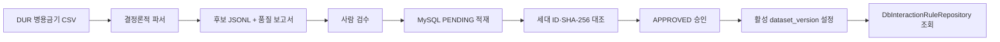
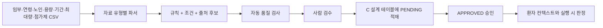
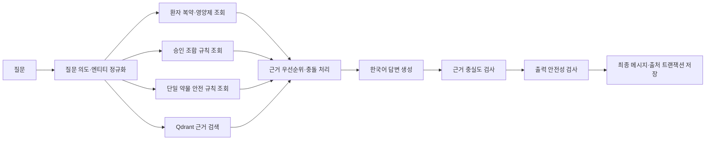

# AI Worker DB 테이블·컬럼 사용설명서

> 기준: DB 설계 선택지 C  
> 작성일: 2026-09-01  
> 대상: RAG·LLM·CHAT·의약품/영양제 상호작용을 담당하는 AI Worker 개발자

## 1. 문서 목적

이 문서는 AI Worker가 MySQL에서 어떤 테이블과 컬럼을 읽고 쓰는지, 각 데이터가 무엇을 의미하는지 설명한다.

선택지 C의 핵심은 다음 두 종류의 규칙을 서로 다른 테이블에 저장하는 것이다.

- **두 대상의 조합 규칙**: 약–약, 약–영양제, 영양제–영양제, 약–음식 → `interaction_rules`
- **한 약에 적용되는 안전 규칙**: 임부금기, 연령금기, 노인주의, 용량주의, 투여기간, 1일 최대 투여량, 첨가제주의 → `medication_safety_rules`

두 규칙을 한 테이블에 섞지 않는다. 조합 규칙은 항상 왼쪽·오른쪽 두 엔티티가 필요하지만, 단일 약물 안전 규칙은 한 엔티티와 적용 조건이 필요하기 때문이다.

## 2. 상태 표기

| 표시 | 의미 |
|---|---|
| **현재 구현** | 현재 ORM과 마이그레이션에 존재하는 테이블 |
| **참조 전용** | 다른 팀 파트가 소유하며 AI Worker는 필요한 컬럼만 조회 |

> 구현 상태: Aerich migration `16_20260901112353_add_medication_safety_rules.py`가 로컬 MySQL에 적용되었다. 신규 안전 규칙 데이터 적재와 런타임 조건 평가기는 후속 범위다.

## 3. 전체 관계

```mermaid
erDiagram
    USER ||--o{ CARE_EPISODES : owns
    CARE_EPISODES ||--o{ MEDICATIONS : contains
    USER ||--o{ USER_SUPPL_NUTRIENT : registers
    SUPPLEMENT_NUTRIENTS ||--o{ USER_SUPPL_NUTRIENT : selected_product

    MEDICATIONS ||--o| MEDICATION_INTERACTION_MAPPINGS : mapping_state
    MEDICATIONS ||--o{ MEDICATION_INTERACTION_ENTITIES : maps
    SUPPLEMENT_NUTRIENTS ||--o{ SUPPLEMENT_INTERACTION_ENTITIES : maps

    INTERACTION_ENTITIES ||--o{ INTERACTION_ENTITY_ALIASES : has
    INTERACTION_ENTITIES ||--o{ INTERACTION_ENTITY_IDENTIFIERS : has
    INTERACTION_ENTITIES ||--o{ MEDICATION_INTERACTION_ENTITIES : identifies
    INTERACTION_ENTITIES ||--o{ SUPPLEMENT_INTERACTION_ENTITIES : identifies

    INTERACTION_ENTITIES ||--o{ INTERACTION_RULES : left_entity
    INTERACTION_ENTITIES ||--o{ INTERACTION_RULES : right_entity
    INTERACTION_RULES ||--o{ INTERACTION_RULE_SOURCES : supported_by
    INTERACTION_RULE_SOURCES ||--o{ INTERACTION_RULE_EVIDENCE_CHUNKS : links

    INTERACTION_ENTITIES ||--o{ MEDICATION_SAFETY_RULES : target_drug
    MEDICATION_SAFETY_RULES ||--o{ MEDICATION_SAFETY_RULE_CONDITIONS : applies_when
    MEDICATION_SAFETY_RULES ||--o{ MEDICATION_SAFETY_RULE_SOURCES : supported_by

    USER ||--o{ CHAT_SESSIONS : owns
    CARE_EPISODES ||--o{ CHAT_SESSIONS : optional_context
    CHAT_SESSIONS ||--o{ CHAT_MESSAGES : contains
    CHAT_MESSAGES ||--o{ CHAT_MESSAGE_SOURCES : cites
    INTERACTION_RULES ||--o{ CHAT_MESSAGE_SOURCES : cited_rule
    MEDICATION_SAFETY_RULES ||--o{ CHAT_MESSAGE_SOURCES : cited_safety_rule
```



## 4. 테이블 책임 요약

| 그룹 | 테이블 | 상태 | 한 행의 의미 |
|---|---|---|---|
| 환자 컨텍스트 | `user` | 참조 전용 | 사용자 한 명 |
| 환자 컨텍스트 | `care_episodes` | 참조 전용 | 지속해서 관리하는 진료·케어 단위 한 건 |
| 환자 컨텍스트 | `medications` | 참조 전용 | 사용자가 확인한 처방약 한 건 |
| 영양제 | `supplement_nutrients` | 참조 전용 | 영양제 제품 또는 영양성분 기준 데이터 한 건 |
| 영양제 | `user_suppl_nutrient` | 참조 전용 | 사용자가 등록한 영양제 복용 한 건 |
| 의약품 안내 | `medication_product_guides` | 현재 구현 | e약은요 품목 한 건의 공식 안내 |
| 정규화 | `interaction_entities` | 현재 구현 | 상호작용 판정에 쓰는 표준 약·영양제·음식 한 개 |
| 정규화 | `interaction_entity_aliases` | 현재 구현 | 표준 엔티티의 제품명·통칭·동의어 한 개 |
| 정규화 | `interaction_entity_identifiers` | 현재 구현 | 외부 자료 코드와 표준 엔티티의 연결 한 개 |
| 정규화 | `medication_interaction_mappings` | 현재 구현 | 환자 약 한 건의 매핑 작업 상태 |
| 정규화 | `medication_interaction_entities` | 현재 구현 | 환자 약과 표준 엔티티의 연결 한 개 |
| 정규화 | `supplement_interaction_entities` | 현재 구현 | 영양제 성분과 표준 엔티티의 연결 한 개 |
| 조합 규칙 | `interaction_rules` | 현재 구현 | 두 엔티티 조합의 검수된 상호작용 규칙 한 개 |
| 조합 규칙 | `interaction_rule_sources` | 현재 구현 | 조합 규칙을 뒷받침하는 원본 레코드 한 개 |
| 조합 규칙 | `interaction_rule_evidence_chunks` | 현재 구현 | 규칙 출처와 Qdrant 청크의 연결 한 개 |
| 단일 안전 규칙 | `medication_safety_rules` | 현재 구현 | 약 하나에 대한 안전 규칙 한 개 |
| 단일 안전 규칙 | `medication_safety_rule_conditions` | 현재 구현 | 안전 규칙의 적용 조건 한 개 |
| 단일 안전 규칙 | `medication_safety_rule_sources` | 현재 구현 | 안전 규칙을 뒷받침하는 원본 레코드 한 개 |
| 채팅 | `chat_sessions` | 현재 구현 | 사용자 채팅방 한 개 |
| 채팅 | `chat_messages` | 현재 구현 | 사용자 질문 또는 AI 답변 한 개 |
| 채팅 | `chat_message_sources` | 현재 구현 | AI 답변에 실제 사용한 근거 한 개 |

---

# 5. 환자 컨텍스트 참조 테이블

## 5.1 `user` — 참조 전용

AI Worker는 사용자 인증 정보를 수정하지 않는다. 안전 규칙 판정에 필요한 최소 정보만 읽는다.

| 컬럼 | 의미 | AI Worker 사용법 |
|---|---|---|
| `id` | 사용자 ID | 모든 환자 컨텍스트의 소유자 검증 |
| `birth_date` | 생년월일 | 특정 연령대 금기 및 노인주의 판정 |
| `gender` | 성별 | 자료가 성별 조건을 명시할 때만 참고 |
| `status` | 계정 상태 | 비활성 사용자 접근 차단은 FastAPI 인증 계층에서 처리 |

### 사용 규칙

- `birth_date IS NULL`이면 연령 조건을 **안전하다고 통과시키지 않는다**.
- 임신·수유 여부는 `gender`로 추론하지 않는다.
- 임부금기 자동 판정에는 별도의 명시적 임신 상태 데이터가 필요하다.

## 5.2 `care_episodes` — 참조 전용

한 번의 처방 ID가 아니라, 관련된 진료와 복약을 지속해서 관리하는 케어 단위다.

| 컬럼 | 의미 | AI Worker 사용법 |
|---|---|---|
| `id` | 케어 에피소드 ID | 약·채팅·출처를 같은 관리 단위로 연결 |
| `user_id` | 소유 사용자 | 요청 사용자와 소유자 일치 검증 |
| `status` | 관리 상태 | 활성 컨텍스트 조회 조건 |
| `diagnosis` | 사용자가 확인한 진단 정보 | 환자 확정정보로만 사용하며 새 진단 생성 금지 |
| `confirmation_hash` | 확정 컨텍스트 해시 | 답변 생성 시 사용한 환자 정보 버전 확인 |
| `confirmed_at` | 사용자 확정 시각 | 미확정 OCR 결과와 확정정보 구분 |
| `medication_start_date` | 복약 시작일 | 현재 복용 여부 계산 보조 |
| `planned_end_at` | 예정 종료 시각 | 활성 복약 범위 계산 보조 |

## 5.3 `medications` — 참조 전용

사용자가 OCR 결과를 확인·수정한 뒤 저장한 처방약 한 건이다.

| 컬럼 | 타입/NULL | 의미 | 사용 예 |
|---|---|---|---|
| `id` | BIGINT, NOT NULL | 환자 약 ID | 상호작용 매핑 FK |
| `care_episode_id` | BIGINT, NOT NULL | 소속 케어 에피소드 | 환자 소유권·현재 컨텍스트 판정 |
| `name` | VARCHAR(255), NOT NULL | 사용자가 확인한 약 이름 | `타이레놀정500mg` |
| `dose` | VARCHAR(100), NULL | OCR/사용자 확인 복용량 원문 | `1정`, `500mg` |
| `efficacy` | VARCHAR(500), NULL | 확인된 효능 메모 | 환자 확정정보 우선 출력 |
| `administration` | VARCHAR(500), NULL | 확인된 복용법 | `1일 3회 식후` |
| `precautions` | VARCHAR(500), NULL | 확인된 주의사항 | 개인 등록 정보 안내 |
| `times_per_day` | INT, NULL | 하루 복용 횟수 | 1~6 |
| `note` | VARCHAR(500), NULL | 추가 복약 메모 | `아침 식후` |
| `days` | INT, NULL | 처방 일수 | 1~365 |
| `prescribed_at` | DATE, NULL | 처방 시작 기준일 | 복용 종료일 계산 |
| `source_ocr_job_id` | BIGINT, NULL | 원본 OCR 작업 | 추적용, OCR 파트 소유 |
| `created_at` | DATETIME | 생성 시각 | 감사·정렬 |
| `updated_at` | DATETIME, NULL | 수정 시각 | 최신 정보 확인 |

### 사용 규칙

- `dose`는 자유문자열이므로 숫자·단위 파싱이 성공했을 때만 용량 규칙과 비교한다.
- 파싱 실패 시 `INSUFFICIENT_CONTEXT`로 처리하고 임의 환산하지 않는다.
- `days`와 `prescribed_at`이 모두 있어야 자동 종료일을 신뢰할 수 있다.
- 약 이름은 곧바로 규칙 검색에 사용하지 않고 표준 엔티티로 매핑한다.

## 5.4 `supplement_nutrients` — 참조 전용

팀원이 관리하는 영양제/영양성분 기준 테이블이다. AI Worker는 제품 전체 영양성분표를 복제하지 않고 상호작용 판정에 필요한 엔티티 연결만 사용한다.

| 컬럼 | 의미 | AI Worker 사용법 |
|---|---|---|
| `id` | 영양제 기준 ID | `supplement_interaction_entities` 연결 |
| `food_code` | 원천 데이터 코드 | 정확한 엔티티 식별 보조 |
| `name` | 영양제·제품 이름 | 화면 표시 및 정규화 입력 |
| 영양성분 컬럼 | 칼슘·철·비타민 등 함량 | 성분 매핑·함량 표시의 원본 |
| `basis_qty` | 영양성분 기준량 | 함량 해석 기준 |
| `serving_desc`, `serving_size`, `daily_freq` | 섭취 기준 | 사용자 안내 보조 |

## 5.5 `user_suppl_nutrient` — 참조 전용

사용자가 실제 복용 중이라고 등록한 영양제 한 건이다.

| 컬럼 | 의미 | AI Worker 사용법 |
|---|---|---|
| `id` | 사용자 영양제 ID | 채팅 출처·활성 컨텍스트 식별 |
| `user_id` | 소유 사용자 | 접근 권한 검증 |
| `supplement_nutrient_id` | 기준 영양제 ID | 성분 엔티티 조회 |
| `dose_amount` | 복용량 숫자 | 함량 기반 규칙이 있을 때 사용 |
| `dose_unit` | 복용량 단위 | 단위 변환 가능 여부 확인 |
| `start_date` | 복용 시작일 | 활성 여부 계산 |
| `end_date` | 복용 종료일 | NULL이면 종료일 미정 |
| `status` | 복용 상태 | `ACTIVE`만 현재 복용 목록에 포함 |
| `note` | 사용자 메모 | 확정정보 표시 보조 |

---

# 6. 의약품 기본 안내

## 6.1 `medication_product_guides` — 현재 구현

e약은요 자료에서 품목별 공식 안내를 저장한다. 상호작용 판정 규칙이 아니라 제품 안내 원문이다.

| 컬럼 | 타입/제약 | 의미 |
|---|---|---|
| `id` | BIGINT PK | 내부 식별자 |
| `item_seq` | VARCHAR(20), UNIQUE | 공공데이터 품목일련번호 |
| `product_name` | VARCHAR(255), INDEX | 제품명 |
| `manufacturer_name` | VARCHAR(255) | 업체명 |
| `efficacy` | TEXT | 이 약의 효능 |
| `usage_instructions` | TEXT | 사용·복용 방법 |
| `pre_use_warning` | TEXT | 사용 전 반드시 알아야 할 내용 |
| `precautions` | TEXT | 사용상 주의사항 |
| `drug_food_interactions` | TEXT | 함께 주의할 약 또는 음식 |
| `adverse_reactions` | TEXT | 가능한 이상반응 |
| `storage_instructions` | TEXT | 보관 방법 |
| `item_image_url` | TEXT, NULL | e약은요 낱알이미지 URL. 원본 값이 없으면 `NULL` |
| `created_at`, `updated_at` | DATETIME | 적재·갱신 시각 |

### 사용 규칙

- 제품명이 정확히 일치하면 해당 품목을 안내한다.
- `타이레놀`처럼 통칭만 입력되어 여러 품목이 검색되면 제품 선택을 요청하거나 성분 기준 안내로 전환한다.
- 빈 항목은 출력하지 않는다.
- 공식 안내를 근거로 사용하더라도 복용 시작·중단·증량·감량 결정을 대신하지 않는다.

---

# 7. 표준 엔티티와 환자 등록정보 매핑

## 7.1 `interaction_entities` — 현재 구현

제품명과 자료별 표기를 하나의 표준 대상에 모으는 기준 테이블이다.

| 컬럼 | 의미 |
|---|---|
| `id` | 표준 엔티티 ID |
| `entity_kind` | `DRUG`, `SUPPLEMENT`, `FOOD` |
| `canonical_name` | 사용자에게 보여줄 대표 이름 |
| `normalized_name` | NFKC·공백 정리·casefold를 적용한 검색 이름 |
| `created_at`, `updated_at` | 생성·수정 시각 |

제약: `(entity_kind, normalized_name)`은 유일해야 한다.

예시:

| entity_kind | canonical_name | normalized_name |
|---|---|---|
| `DRUG` | 아세트아미노펜 | 아세트아미노펜 |
| `SUPPLEMENT` | 비타민 K | 비타민 k |
| `FOOD` | 자몽주스 | 자몽주스 |

## 7.2 `interaction_entity_aliases` — 현재 구현

표준 엔티티의 제품명·통칭·동의어를 저장한다.

| 컬럼 | 의미 |
|---|---|
| `id` | 별칭 ID |
| `interaction_entity_id` | 연결할 표준 엔티티 |
| `alias_type` | `INGREDIENT_NAME`, `PRODUCT_NAME`, `SYNONYM`, `SOURCE_NAME` |
| `alias` | 원래 표시 문자열 |
| `normalized_alias` | 검색용 정규화 문자열 |
| `is_preferred` | 여러 별칭 중 우선 표시 여부 |
| `created_at` | 생성 시각 |

예: `타이레놀`과 `타이레놀정500mg`을 아세트아미노펜 엔티티에 연결한다.

제약: 같은 엔티티 안에서 `normalized_alias`는 중복될 수 없다.

## 7.3 `interaction_entity_identifiers` — 현재 구현

식약처·DUR 등 외부 자료의 코드와 표준 엔티티를 연결한다.

| 컬럼 | 의미 |
|---|---|
| `id` | 식별자 연결 ID |
| `interaction_entity_id` | 표준 엔티티 |
| `source_id` | 원천 데이터 종류. 예: `MFDS_DUR` |
| `source_code` | 원천 데이터의 성분·품목 코드 |
| `created_at` | 생성 시각 |

제약: `(source_id, source_code)`는 시스템 전체에서 유일해야 한다.

## 7.4 `medication_interaction_mappings` — 현재 구현

환자 약 한 건의 엔티티 매핑 작업 상태를 저장한다.

| 컬럼 | 의미 |
|---|---|
| `id` | 매핑 작업 ID |
| `medication_id` | 환자 약 ID, 1:1 |
| `mapping_status` | `PENDING`, `MATCHED`, `FAILED` |
| `error_code` | 실패 이유 코드 |
| `mapped_at` | 매핑 완료 시각 |
| `created_at`, `updated_at` | 생성·수정 시각 |

`FAILED`를 미상호작용으로 해석하지 않는다. 이는 이름 매핑에 실패했다는 뜻이다.

## 7.5 `medication_interaction_entities` — 현재 구현

환자 약 한 건과 표준 엔티티의 연결 결과다.

| 컬럼 | 의미 |
|---|---|
| `id` | 연결 ID |
| `medication_id` | 환자 약 ID |
| `interaction_entity_id` | 표준 약 엔티티 ID |
| `match_method` | `SOURCE_CODE`, `EXACT_NAME`, `ALIAS`, `MANUAL` |
| `match_confidence` | 0~1 매핑 신뢰도, NULL 가능 |
| `matched_source_text` | 실제 매칭에 사용한 약 이름 |
| `reviewed_at` | 사람이 확인한 시각 |
| `created_at` | 생성 시각 |

제약: `(medication_id, interaction_entity_id)`는 유일하다.

## 7.6 `supplement_interaction_entities` — 현재 구현

영양제 기준 데이터와 상호작용 표준 엔티티의 연결이다.

| 컬럼 | 의미 |
|---|---|
| `id` | 연결 ID |
| `supplement_nutrient_id` | 영양제 기준 ID |
| `interaction_entity_id` | 표준 영양제 엔티티 ID |
| `amount` | 해당 성분 함량, NULL 가능 |
| `unit` | 함량 단위 |
| `source_field` | 원본에서 사용한 성분 컬럼 |
| `match_method` | 매핑 방식 |
| `created_at` | 생성 시각 |

제약: `(supplement_nutrient_id, interaction_entity_id)`는 유일하다.

---

# 8. 두 대상의 상호작용 규칙

## 8.1 `interaction_rules` — 현재 구현

약–약, 약–영양제, 영양제–영양제, 약–음식 조합의 구조화된 판정 규칙이다.

| 컬럼 | 타입/제약 | 의미 |
|---|---|---|
| `id` | BIGINT PK | 규칙 ID |
| `pair_key` | CHAR/VARCHAR(64) | 두 엔티티의 종류·정규화 이름을 정렬한 뒤 만든 SHA-256 |
| `pair_type` | ENUM | `DRUG_DRUG`, `DRUG_SUPPLEMENT`, `SUPPLEMENT_SUPPLEMENT`, `DRUG_FOOD` |
| `left_entity_id` | FK, RESTRICT | 첫 번째 표준 엔티티 |
| `right_entity_id` | FK, RESTRICT | 두 번째 표준 엔티티 |
| `risk_level` | ENUM | `CONTRAINDICATED`, `HIGH_CAUTION`, `CAUTION`, `INFORMATIONAL`, `UNKNOWN` |
| `review_status` | ENUM | `PENDING`, `APPROVED`, `REJECTED` |
| `rule_dataset_version` | VARCHAR(100) | 규칙 릴리스 버전 |
| `extraction_method` | ENUM | `DETERMINISTIC_STRUCTURED`, `MANUAL_ANNOTATION` |
| `approved_at` | DATETIME, NULL | 승인 시각 |
| `created_at`, `updated_at` | DATETIME | 생성·수정 시각 |

### 핵심 제약

- `(pair_key, rule_dataset_version)` 유일
- 같은 조합도 `v1`, `v2`처럼 버전별로 함께 저장 가능
- `left_entity_id`와 `right_entity_id`는 달라야 함
- 실행 시에는 `review_status=APPROVED`이면서 설정의 활성 버전과 일치하는 규칙만 조회

### `pair_key`를 직접 입력하면 안 되는 이유

엔티티 순서가 바뀌어도 같은 조합이 같은 키를 가져야 한다. 애플리케이션의 `build_interaction_pair_key()`를 사용한다.

```text
정렬 전: DRUG:와파린 + SUPPLEMENT:비타민 k
정렬 후: DRUG:와파린|SUPPLEMENT:비타민 k
pair_key: SHA-256(정렬된 문자열)
```

## 8.2 `interaction_rule_sources` — 현재 구현

규칙의 근거가 된 DUR 또는 검수 자료의 원본 행을 보존한다.

| 컬럼 | 의미 |
|---|---|
| `id` | 출처 ID |
| `interaction_rule_id` | 대상 규칙 |
| `source_id` | 원천 데이터 종류 |
| `document_id` | 원본 파일·문서 식별자 |
| `record_id` | 원본 행의 고유 식별자 |
| `raw_effect_text` | 원문 금기·주의 내용 |
| `source_published_at` | 원천 공개일, 없으면 NULL |
| `source_url` | 원천 링크, 없으면 NULL |
| `created_at` | 생성 시각 |

제약: `(interaction_rule_id, source_id, document_id, record_id)`는 유일하다.

## 8.3 `interaction_rule_evidence_chunks` — 현재 구현

MySQL의 결정론적 규칙과 Qdrant의 상세 설명 청크를 연결한다.

| 컬럼 | 의미 |
|---|---|
| `id` | 연결 ID |
| `interaction_rule_source_id` | 규칙 출처 ID |
| `dataset_key` | 지식베이스 종류 |
| `dataset_version` | Qdrant 데이터셋 버전 |
| `vector_chunk_id` | SHA-256 기반 Qdrant 청크 ID |
| `created_at` | 생성 시각 |

이 테이블의 연결이 없더라도 승인된 MySQL 규칙은 판정에 사용할 수 있다. Qdrant 청크는 추가 설명과 출처 제시에 사용한다.

---

# 9. 선택지 C: 단일 약물 안전 규칙

## 9.1 적용할 자료

| 규칙 유형 | 원천 자료 | 자동 판정 조건 |
|---|---|---|
| `PREGNANCY_CONTRAINDICATION` | DUR 임부금기 | 명시적인 임신 상태 필요 |
| `AGE_CONTRAINDICATION` | DUR 특정 연령대 금기 | `birth_date` 필요 |
| `ELDERLY_CAUTION` | DUR 노인주의 | `birth_date` 필요 |
| `DOSE_CAUTION` | DUR 용량주의 | 파싱된 용량·단위·횟수 필요 |
| `DURATION_CAUTION` | DUR 투여기간주의 | 처방일수 또는 계산 가능한 기간 필요 |
| `DAILY_MAX_DOSE` | 1일 최대 투여량 | 1일 총량·제형·투여경로가 필요할 수 있음 |
| `EXCIPIENT_CAUTION` | DUR 첨가제주의 | 제품–첨가제 매핑과 환자 위험 조건 필요 |

## 9.2 `medication_safety_rules` — 현재 구현

약 한 종류에 적용되는 안전 규칙의 본체다.

| 컬럼 | 권장 타입/제약 | 의미 |
|---|---|---|
| `id` | BIGINT PK | 안전 규칙 ID |
| `rule_key` | CHAR(64), NOT NULL | 대상·규칙 유형·정규화 조건을 기반으로 만든 SHA-256 |
| `interaction_entity_id` | BIGINT FK, RESTRICT | 규칙 대상 표준 약 엔티티 |
| `rule_type` | ENUM, NOT NULL | 임부·연령·노인·용량·기간·최대량·첨가제 구분 |
| `risk_level` | ENUM, NOT NULL | 기존 `InteractionRiskLevel` 재사용 |
| `guidance_text` | TEXT, NOT NULL | 검수된 한국어 주의 안내 |
| `review_status` | ENUM, NOT NULL | `PENDING`, `APPROVED`, `REJECTED` |
| `rule_dataset_version` | VARCHAR(100), NOT NULL | 규칙 데이터셋 버전 |
| `extraction_method` | ENUM, NOT NULL | 결정론적 추출 또는 수동 주석 |
| `approved_at` | DATETIME, NULL | 승인 시각 |
| `created_at` | DATETIME, NOT NULL | 생성 시각 |
| `updated_at` | DATETIME, NULL | 수정 시각 |

### 적용된 제약

- UNIQUE `(rule_key, rule_dataset_version)`
- INDEX `(interaction_entity_id, rule_type, review_status)`
- INDEX `(rule_dataset_version, review_status)`
- `APPROVED`일 때만 `approved_at` 필수
- 활성 버전의 `APPROVED` 규칙만 챗봇에서 사용

## 9.3 `medication_safety_rule_conditions` — 현재 구현

안전 규칙이 언제 적용되는지 구조화한다. 원문 전체를 문자열 비교하지 않는다.

| 컬럼 | 권장 타입/제약 | 의미 |
|---|---|---|
| `id` | BIGINT PK | 조건 ID |
| `medication_safety_rule_id` | BIGINT FK, CASCADE | 대상 안전 규칙 |
| `condition_group_no` | SMALLINT, NOT NULL | OR로 연결할 조건 그룹 번호 |
| `condition_order` | SMALLINT, NOT NULL | 그룹 안 표시·평가 순서 |
| `condition_kind` | ENUM, NOT NULL | `PREGNANCY_STATUS`, `AGE_DAYS`, `AGE_YEARS`, `DAILY_DOSE`, `DURATION_DAYS`, `DOSAGE_FORM`, `ADMINISTRATION_ROUTE`, `EXCIPIENT_PRESENT` 등 |
| `comparison_operator` | ENUM, NOT NULL | `EQ`, `LT`, `LTE`, `GT`, `GTE`, `BETWEEN`, `PRESENT` |
| `value_min` | DECIMAL(14,4), NULL | 숫자 조건의 최소·단일 값 |
| `value_max` | DECIMAL(14,4), NULL | `BETWEEN`의 최대값 |
| `value_text` | VARCHAR(255), NULL | 임신 상태·제형·경로·첨가제명 등 문자열 값 |
| `unit` | VARCHAR(30), NULL | `mg`, `mg/day`, `day`, `year` 등 |
| `created_at` | DATETIME, NOT NULL | 생성 시각 |

### 조건 결합 규칙

- 같은 `condition_group_no`의 조건은 **AND**로 평가한다.
- 서로 다른 그룹은 **OR**로 평가한다.
- 필요한 환자 정보가 없으면 결과는 `INSUFFICIENT_CONTEXT`다.
- 조건을 만족하지 않으면 `NOT_APPLICABLE`이다.
- 모든 필수 조건이 확인되어 만족할 때만 `MATCHED`다.

예시:

```text
규칙: 65세 이상이면서 하루 20mg을 초과하면 고위험 주의

group 1 / order 1: AGE_YEARS GTE 65
group 1 / order 2: DAILY_DOSE GT 20 mg/day
```

## 9.4 `medication_safety_rule_sources` — 현재 구현

단일 약물 안전 규칙의 원본 행을 저장한다.

| 컬럼 | 권장 타입/제약 | 의미 |
|---|---|---|
| `id` | BIGINT PK | 출처 ID |
| `medication_safety_rule_id` | BIGINT FK, CASCADE | 대상 안전 규칙 |
| `source_id` | VARCHAR(100), NOT NULL | 예: `MFDS_DUR_PREGNANCY` |
| `document_id` | VARCHAR(150), NOT NULL | 원본 파일·문서 식별자 |
| `record_id` | VARCHAR(150), NOT NULL | 원본 행 ID |
| `raw_effect_text` | TEXT, NOT NULL | 원문 주의·금기 내용 |
| `source_published_at` | DATE, NULL | 공개·기준일 |
| `source_url` | TEXT, NULL | 공식 링크 |
| `created_at` | DATETIME, NOT NULL | 생성 시각 |

제약: `(medication_safety_rule_id, source_id, document_id, record_id)`는 유일해야 한다.

## 9.5 단일 안전 규칙 판정 결과

판정 결과는 규칙 테이블에 저장하지 않고 실행 시 계산한다.

| 상태 | 의미 | 답변 정책 |
|---|---|---|
| `MATCHED` | 필요한 조건이 확인되었고 규칙에 해당 | 주의·금기 안내 및 의료진 상담 권고 |
| `NOT_APPLICABLE` | 필요한 값이 확인되었고 조건에 해당하지 않음 | 해당 규칙은 출력하지 않음 |
| `INSUFFICIENT_CONTEXT` | 판단에 필요한 값이 없음 | 안전하다고 말하지 않고 필요한 정보 안내 |

---

# 10. 채팅 저장과 출처 추적

## 10.1 `chat_sessions` — 현재 구현

| 컬럼 | 의미 |
|---|---|
| `id` | 채팅 세션 ID |
| `user_id` | 세션 소유 사용자 |
| `care_episode_id` | 선택 연결된 케어 에피소드, 일반 질문이면 NULL 가능 |
| `status` | `ACTIVE` 등 세션 상태 |
| `last_message_at` | 최근 메시지 시각 |
| `deleted_at` | 소프트 삭제 시각 |
| `created_at`, `updated_at` | 생성·수정 시각 |

`deleted_at`이 있으면 일반 조회에서 제외한다. 실제 행 삭제가 아니라 복구·감사를 위한 소프트 삭제다.

## 10.2 `chat_messages` — 현재 구현

| 컬럼 | 의미 |
|---|---|
| `id` | 메시지 ID |
| `chat_session_id` | 소속 세션 |
| `reply_to_message_id` | 답변 대상 사용자 메시지 |
| `guide_id` | 기존 가이드 연결, 없으면 NULL |
| `request_id` | API 멱등성·추적 ID |
| `sequence_no` | 세션 안 메시지 순서 |
| `role` | USER 또는 ASSISTANT |
| `content` | 질문 또는 검증을 통과한 최종 답변 |
| `status` | 생성 처리 상태 |
| `route_type` | 질문 분류 결과 경로 |
| `safety_status` | 출력 안전성 검사 결과 |
| `safety_reason_code` | 제한·차단 이유 |
| `verification_status` | 근거 검증 상태 |
| `conflict_status` | 환자정보·공공자료 충돌 상태 |
| `model_name`, `model_version` | 사용 모델 정보 |
| `prompt_version` | 프롬프트 버전 |
| `schema_version` | 응답 스키마 버전 |
| `patient_context_hash` | 답변 당시 환자 컨텍스트 해시 |
| `langsmith_trace_id` | LangSmith Trace 연결 ID |
| `error_code` | 실패 코드 |
| `duration_ms` | 전체 처리 시간 |
| `started_at`, `completed_at` | 처리 시작·완료 시각 |
| `created_at`, `updated_at` | 행 생성·수정 시각 |

제약: `(chat_session_id, sequence_no)`는 유일하다.

### 저장 원칙

- 사용자 질문은 먼저 저장한다.
- AI 답변은 전체 생성과 근거·안전성 검사가 끝난 뒤 최종 내용만 저장한다.
- 차단 전 위험한 LLM 원문을 `content`에 저장하거나 스트리밍하지 않는다.
- 실패 시 `status`, `error_code`, `completed_at`, `duration_ms`를 남긴다.

## 10.3 `chat_message_sources` — 현재 구현

AI 답변 한 건에 실제로 사용된 근거만 저장한다.

| 컬럼 그룹 | 컬럼 | 의미 |
|---|---|---|
| 공통 | `id`, `chat_message_id`, `citation_order` | 출처 ID·답변·표시 순서 |
| 유형 | `source_type` | 환자 확정정보, 공공 RAG, 영양제, 상호작용 규칙 |
| 환자정보 | `patient_source_kind`, `patient_field` | 환자 확정정보 종류와 필드 |
| 환자 FK | `care_episode_id`, `medication_id`, `care_advice_id`, `follow_up_visit_id` | 실제 사용한 환자 레코드 |
| 영양제 FK | `user_suppl_nutrient_id` | 실제 사용한 사용자 영양제 |
| 규칙 FK | `interaction_rule_id` | 실제 사용한 승인 상호작용 규칙 |
| RAG | `public_dataset_key`, `dataset_version`, `vector_chunk_id` | Qdrant 출처 식별자 |
| 원천 | `source_record_key`, `source_field`, `chunk_type` | 원본 레코드·필드·청크 유형 |
| 표시 | `source_title`, `source_organization`, `source_url`, `source_page_number`, `source_license` | 사용자에게 표시할 출처 정보 |
| 검색 | `similarity_score` | 검색 당시 유사도 점수 |
| 감사 | `created_at` | 생성 시각 |

제약: `(chat_message_id, citation_order)`는 유일하다.

### `source_type`별 필수 연결

| source_type | 필수 또는 권장 컬럼 |
|---|---|
| `PATIENT_SAVED_FIELD` | 환자 관련 FK 중 하나와 `patient_source_kind` |
| `USER_SUPPLEMENT` | `user_suppl_nutrient_id` |
| `INTERACTION_RULE` | `interaction_rule_id` |
| `PUBLIC_RAG_CHUNK` | `public_dataset_key`, `dataset_version`, `vector_chunk_id` |

---

# 11. 데이터 적재·조회 흐름

## 11.1 DUR 병용금기



조회 조건:

```sql
SELECT *
FROM interaction_rules
WHERE review_status = 'APPROVED'
  AND rule_dataset_version = :active_dataset_version;
```

## 11.2 나머지 단일 약물 안전자료



현재 구현된 staging·적재 명령은 다음과 같다.

```bash
uv run --group ai --group app \
  python -m scripts.build_medication_safety_staging \
  --dataset-version medication-safety-v2

uv run --group ai --group app \
  python -m scripts.import_medication_safety_staging \
  --marker data/knowledge/processed/staging/medication-safety-v2/current.json \
  --allow-pending \
  --dry-run

uv run --group ai --group app \
  python -m scripts.import_medication_safety_staging \
  --marker data/knowledge/processed/staging/medication-safety-v2/current.json \
  --allow-pending
```

`--allow-pending`은 자동 승인 옵션이 아니다. 사람이 아직 승인하지 않은 후보를
MySQL에 `PENDING` 상태로 적재할 것을 명시하는 안전장치다. 같은 generation을
다시 적재해도 신규 레코드는 생성되지 않는다.

`medication-safety-v2`는 복합 성분·주기 표현처럼 수치가 둘 이상인 용량 문자열을
임의의 단일 임계값으로 해석하지 않고 `AMBIGUOUS_DOSE_EXPRESSION`으로 격리한다.
초기 `medication-safety-v1` 후보는 이 검사가 적용되기 전에 생성되었으므로 승인하지
않고, v2 후보만 사람 검수 대상으로 사용한다.

## 11.3 챗봇 답변



---

# 12. 운영 규칙

## 12.1 반드시 지킬 규칙

1. `PENDING`과 `REJECTED` 규칙은 챗봇 답변에 사용하지 않는다.
2. 활성 데이터셋 버전과 일치하는 `APPROVED` 규칙만 조회한다.
3. 새 데이터는 기존 버전을 덮어쓰지 않고 새 `rule_dataset_version`으로 적재한다.
4. `pair_key`와 `rule_key`는 애플리케이션 함수로 생성하고 사람이 직접 작성하지 않는다.
5. 환자 정보가 없으면 `안전`이 아니라 `판단 정보 부족`으로 처리한다.
6. 검색 결과가 없다는 이유로 상호작용이 없다고 단정하지 않는다.
7. MySQL의 승인 규칙과 Qdrant 설명이 충돌하면 승인 규칙을 우선한다.
8. 답변에 사용한 근거는 `chat_message_sources`에 저장한다.
9. 환자 원문·LLM의 차단 전 위험 출력은 Qdrant나 규칙 테이블에 저장하지 않는다.
10. 복용 시작·중단·증량·감량을 시스템이 결정하지 않는다.

## 12.2 근거 우선순위

```text
승인된 DUR 구조화 규칙
> 공식 제품 안내
> 식약처 공식 가이드
> 체계적 문헌고찰·임상시험
> 관찰연구
> 사례보고
> 동물·세포 연구
```

하위 근거가 상위 근거를 임의로 뒤집지 않는다. 서로 충돌하면 보수적 안내와 의료진·약사 상담 권고로 전환한다.

## 12.3 버전 활성화

현재 조합 규칙 활성 버전은 환경변수로 선택한다.

```dotenv
INTERACTION_RULE_DATASET_VERSION=interaction-pilot-v1
```

단일 안전 규칙은 다음 별도 설정으로 활성 버전을 선택한다.

```dotenv
MEDICATION_SAFETY_RULE_DATASET_VERSION=medication-safety-v1
```

두 버전을 분리하면 조합 규칙과 단일 안전 규칙을 독립적으로 배포·롤백할 수 있다.

---

# 13. 점검용 SQL

## 13.1 상호작용 규칙 상태·버전별 건수

```sql
SELECT
    rule_dataset_version,
    review_status,
    COUNT(*) AS rule_count
FROM interaction_rules
GROUP BY rule_dataset_version, review_status
ORDER BY rule_dataset_version, review_status;
```

## 13.2 실제 활성 규칙과 출처 확인

```sql
SELECT
    r.id,
    r.pair_type,
    l.canonical_name AS left_name,
    rr.canonical_name AS right_name,
    r.risk_level,
    s.document_id,
    s.raw_effect_text
FROM interaction_rules AS r
JOIN interaction_entities AS l ON l.id = r.left_entity_id
JOIN interaction_entities AS rr ON rr.id = r.right_entity_id
LEFT JOIN interaction_rule_sources AS s ON s.interaction_rule_id = r.id
WHERE r.review_status = 'APPROVED'
  AND r.rule_dataset_version = 'interaction-pilot-v1'
ORDER BY r.id, s.id;
```

## 13.3 환자 약의 엔티티 매핑 확인

```sql
SELECT
    m.id AS medication_id,
    m.name AS medication_name,
    e.entity_kind,
    e.canonical_name,
    me.match_method,
    me.match_confidence
FROM medications AS m
LEFT JOIN medication_interaction_entities AS me
    ON me.medication_id = m.id
LEFT JOIN interaction_entities AS e
    ON e.id = me.interaction_entity_id
WHERE m.care_episode_id = :care_episode_id;
```

## 13.4 답변과 출처 확인

```sql
SELECT
    m.id AS message_id,
    m.route_type,
    m.safety_status,
    m.langsmith_trace_id,
    m.duration_ms,
    s.citation_order,
    s.source_type,
    s.source_title,
    s.interaction_rule_id,
    s.medication_safety_rule_id,
    s.vector_chunk_id
FROM chat_messages AS m
LEFT JOIN chat_message_sources AS s
    ON s.chat_message_id = m.id
WHERE m.request_id = :request_id
ORDER BY m.id, s.citation_order;
```

## 13.5 단일 약물 안전 규칙 상태·유형별 건수

```sql
SELECT
    rule_dataset_version,
    review_status,
    rule_type,
    COUNT(*) AS rule_count
FROM medication_safety_rules
GROUP BY rule_dataset_version, review_status, rule_type
ORDER BY rule_dataset_version, review_status, rule_type;
```

---

# 14. 구현 체크리스트

## 현재 사용 가능

- [x] 의약품 제품 안내 조회
- [x] 표준 엔티티·별칭·외부 코드 구조
- [x] 환자 약·영양제 엔티티 연결 구조
- [x] 버전별 조합 상호작용 규칙 저장
- [x] PENDING → APPROVED 승인 흐름
- [x] 활성 버전의 승인 규칙 조회
- [x] 채팅 메시지·안전성·출처·LangSmith Trace 저장

## 선택지 C 구현 완료

- [x] `MedicationSafetyRuleType` 등 enum 추가
- [x] `medication_safety_rules` ORM·마이그레이션
- [x] `medication_safety_rule_conditions` ORM·마이그레이션
- [x] `medication_safety_rule_sources` ORM·마이그레이션
- [x] 활성 데이터셋 버전 설정
- [x] `chat_message_sources.medication_safety_rule_id` nullable FK

## 후속 구현

- [x] 자료 유형별 CSV 파서
- [x] 후보 JSONL·자동 품질 검사
- [x] SHA-256·건수 검증 후 트랜잭션 PENDING 적재
- [ ] 후보 사람 검수·승인·감사 로그
- [ ] 환자 컨텍스트 조건 평가기
- [ ] `MATCHED`, `NOT_APPLICABLE`, `INSUFFICIENT_CONTEXT` 테스트

## 15. 채팅 출처 연결 결정

`chat_message_sources`에는 `medication_safety_rule_id` nullable FK를 추가했다. `source_type=MEDICATION_SAFETY_RULE`일 때 이 FK만 사용하며, 기존 환자 정보·Qdrant·조합 규칙 출처 FK와 동시에 사용하지 못하도록 MySQL 체크 제약을 적용했다.

이 방식은 기존 조합 규칙 구조를 변경하지 않고 단일 안전 규칙 근거를 명시적으로 추적하며, 이미 저장된 채팅 출처 행은 nullable 컬럼 추가로 그대로 보존한다.
