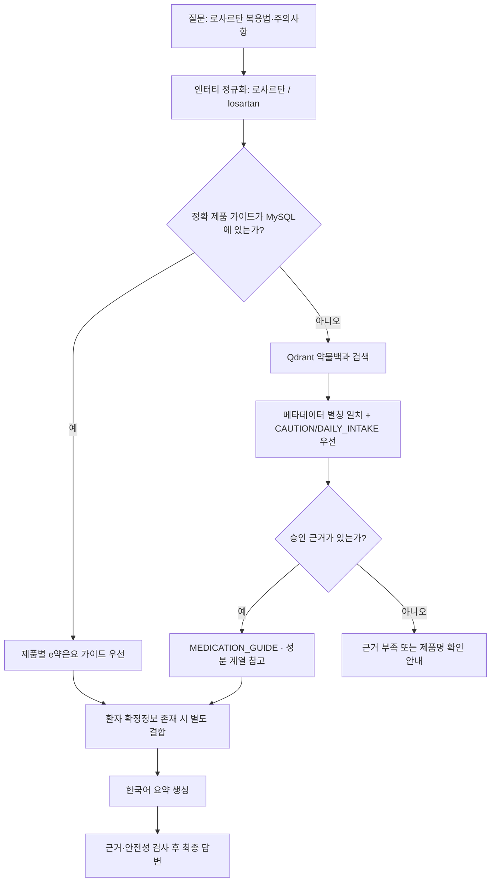

# fix: 로사르탄 제품·성분 계열 조회 개선

## Goal Capsule

**Objective:** 사용자가 정확한 제품명이 아닌 성분명 `로사르탄`으로 효능·복용법·주의사항을 질문해도, 보유한 약물백과 근거를 찾아 제품 정보와 성분 계열 정보를 구분하여 안전하게 안내한다.

**Means:** 괄호 안 영문명을 포함한 약물 메타데이터를 동일 성분 별칭으로 정규화하고, 약물백과 근거를 의약품 가이드 경로로 승격하며, 약물백과의 붙어 있는 제목을 올바른 섹션으로 전처리한다. (KTD1–KTD4)

**Stop conditions:** 로사르탄 근거가 실제 컬렉션에 없거나, 단일제와 복합제의 차이를 구분하지 못한 채 제품별 용량을 확정적으로 안내하게 되는 경우에는 구현을 중단하고 근거·표현 계약을 다시 검토한다.

## Product Contract

### Summary

현재 `로사르탄` 질문은 정규화에는 성공하지만 `GENERAL_GUIDANCE`로 끝나며 근거가 0건이다. MySQL의 `medication_product_guides`에는 로사르탄 품목이 없지만, 전체 지식 코퍼스에는 `로사르탄(losartan)` 약물백과 문서 15개 청크가 존재한다. 따라서 이번 릴리스의 목표를 **공개 성분 계열 정보 fallback 복구**로 한정한다. 제품 가이드 테이블에 없는 성분 계열 질문은 Qdrant 약물백과를 근거로 답하되, 사용자에게 처방된 정확한 제품·함량·복용법으로 오인되지 않도록 출처와 표현을 분리한다. 활성 복약정보와의 개인화 결합은 해당 데이터가 준비된 후 별도 완료 조건으로 검증한다.

### Problem Frame

- 질문 엔터티는 `로사르탄`, 청크 메타데이터는 `로사르탄(losartan)`이어서 정확 일치 보너스를 받지 못한다.
- 관측된 최고 원시 유사도는 약 `0.5668`로, 포함 일치 보너스만 적용하면 현재 승인 기준 `0.65`에 미세하게 미달한다.
- 약물백과 원문에는 `용법`, `경고`, `금기`, `주의사항`이 있지만 일부 제목이 본문과 붙어 있어 여러 청크가 `FUNCTION`으로 잘못 분류됐다.
- 근거가 검색되더라도 현재 라우팅은 제품 RDB 가이드가 없으면 일반 안내로 떨어지며, 공공 약물백과 근거만으로 `MEDICATION_GUIDE`를 선택하지 않는다.
- 평가 질문에는 “복용 중인 로사르탄”이 등록되어 있다는 전제가 있으나 현재 로컬 사용자 데이터에는 활성 복약정보가 없다. OCR·복약 등록이 복구되기 전에는 `PATIENT_MEDICATION` 출처 충족 여부와 공개 약물 근거 검색 여부를 분리해 평가해야 한다.

### Requirements

**별칭·검색 승인**

- **R1.** `로사르탄`, `losartan`, `로사르탄(losartan)`을 동일 성분 계열의 검색 별칭으로 판정한다.
- **R2.** 별칭 판정은 `DRUG_ENCYCLOPEDIA`의 검증된 제목·약물명 메타데이터에서만 한글·영문 병기와 공백·대소문자 차이를 일반 규칙으로 처리한다. 임의 괄호 표현에는 적용하지 않으며 로사르탄 전용 하드코딩 목록도 만들지 않는다.
- **R3.** 질문 엔터티와 약물백과 메타데이터의 성분 계열이 일치하면 전역 유사도 기준을 낮추지 않고 정확 엔터티 보너스와 섹션 적합도로 승인 여부를 판단한다.

**라우팅·답변 안전성**

- **R4.** 제품 RDB 가이드가 없더라도 `DRUG_ENCYCLOPEDIA` 근거가 승인되면 최종 경로를 `MEDICATION_GUIDE`로 결정한다.
- **R5.** 성분 계열 답변은 단일제의 일반 정보임을 표시하고, 복합제·제품별 함량·용법이 다를 수 있음을 명시한다.
- **R6.** 활성 복약정보가 있으면 환자 확정정보를 먼저 표시하고, 없으면 등록된 약처럼 표현하지 않는다.
- **R7.** 정확한 제품명이 e약은요 RDB에 존재하는 경우 기존 제품 조회가 계속 우선한다.
- **R9.** 근거가 없거나 단일제·복합제를 구분할 수 없으면 복용량을 추측하지 않고 정확한 제품명 확인을 요청한다.
- **R11.** 효능·복용법·주의사항을 함께 묻는 복합 의도 질문은 하위 의도별 승인 근거가 있는 내용만 답하고, 근거가 없는 항목은 확인하지 못했다고 표시한다.
- **R12.** 정확 제품 RDB와 성분 약물백과가 충돌하면 제품 RDB가 효능·용법·금기·주의사항 주장의 권위 출처이며, Qdrant는 충돌하지 않는 일반 배경만 보충한다.

**전처리·관측성**

- **R8.** 전처리 시 약물백과의 `용법`, `경고`, `금기`, `주의사항`, `부작용` 경계를 복원하여 질문 의도에 맞는 섹션을 우선 검색한다.
- **R10.** LangSmith 진단에는 정규화 엔터티, 검색 후보·승인 건수, 문서 유형, 최종 경로, 안전성 상태가 남아야 한다.

### Acceptance Examples

- **AE1.** `로사르탄의 효능과 주의사항을 알려줘` → `MEDICATION_GUIDE`, 약물백과 1건 이상, `SAFE`, 단일제 일반 정보와 제품별 차이 안내.
- **AE2.** `losartan 주의사항` → AE1과 같은 성분 계열 문서를 찾되 영어 원문을 그대로 노출하지 않고 한국어로 요약.
- **AE3.** 정확한 e약은요 품목명을 질문 → 기존 `MedicationProductGuide`의 제품별 효능·사용법·주의사항을 그대로 우선.
- **AE4.** `내가 복용 중인 로사르탄`이지만 활성 복약정보가 없음 → 환자 등록 근거를 꾸며내지 않고 공공 성분 계열 정보로만 답변.
- **AE5.** 활성 복약정보에 로사르탄 제품이 있음 → `PATIENT_MEDICATION`과 `PUBLIC_KNOWLEDGE`를 구분하여 함께 표시.
- **AE6.** 로사르탄 복합제의 정확한 복용량을 성분명만으로 질문 → 단일제 일반 용법을 개인 처방처럼 확정하지 않고 정확한 제품명 확인 안내.
- **AE7.** `로사르탄은 일반적으로 어떻게 복용하나요` → `DAILY_INTAKE` 근거가 있을 때만 단일제의 일반 복용 정보를 한국어로 요약하고, 개인 처방·확정 용량이 아니라는 점과 정확 제품 확인 필요성을 함께 안내.
- **AE8.** 정확 제품 RDB 용법과 성분 약물백과의 일반 용법이 다름 → 제품 RDB 용법만 제품별 주장으로 사용하고 충돌하는 성분 일반 용법은 출력하지 않음.

### Scope Boundaries

**In scope**

- 약물 성분명/영문 병기 별칭 정규화
- 약물백과 메타데이터·섹션 전처리 보완
- Qdrant 검색 보정과 의약품 가이드 경로 결정
- 답변의 성분 계열/제품별 정보 구분
- 단위·통합·평가 테스트와 LangSmith 검증 기준

**Deferred to Follow-Up Work**

- OCR 및 활성 복약정보 등록 기능 수정
- `medication_product_guides`에 성분 컬럼이나 품목-성분 매핑 테이블 추가
- 전체 약물 별칭 사전의 수동 구축
- 로사르탄 외 모든 문서를 다시 임베딩하는 전체 컬렉션 릴리스는 전처리 검증 후 별도 승인

## Planning Contract

### Key Technical Decisions

- **KTD1 — 검증된 약물백과 병기만 별칭으로 계산한다.** `DRUG_ENCYCLOPEDIA` 제목·약물명 메타데이터의 `한글(영문)` 형식에서만 전체 표기·괄호 밖 한글·괄호 안 영문을 별칭으로 만들며, 괄호 안이 용량·제형·설명인 일반 문자열에는 적용하지 않는다. 로사르탄 전용 조건문은 추가하지 않는다. Governs R1–R3.
- **KTD2 — 전역 유사도 기준은 유지하고 승인 하한을 검증한다.** 점수 `0.65`를 낮추지 않고 정확 별칭 일치와 의도 섹션 일치에만 제한된 보너스를 준다. 기존 보정 여백이 허용하는 원시 점수 하한 `0.55` 아래 후보는 별칭이 맞아도 거부하며, 이름은 같지만 질문 의도가 다른 하드 네거티브에서 오승인 0건을 요구한다. Governs R3, R9.
- **KTD3 — 제품 RDB와 성분 계열 Qdrant의 주장 권위를 분리한다.** 정확 품목의 효능·용법·금기·주의사항은 MySQL을 우선하고, 성분 약물백과는 충돌하지 않는 일반 배경만 보충한다. Qdrant 내용을 환자 처방으로 승격하지 않는다. Governs R4–R7, R12.
- **KTD4 — 잘못된 섹션 메타데이터는 원천 전처리에서 바로잡는다.** 런타임에서 본문 키워드만으로 영구 보정하는 방식은 임시 회귀 방어로만 사용하고, 최종 컬렉션은 올바른 `CAUTION`, `DAILY_INTAKE`, `ADVERSE_EVENT` 메타데이터를 가진다. Governs R8.
- **KTD5 — 활성 복약 전제와 검색 품질을 분리 평가한다.** OCR 의존 상태에서는 공공 근거 검색을 먼저 PASS/FAIL로 판정하고, 환자 출처 결합은 데이터가 준비된 뒤 별도 통합 검증한다. Governs R6, R10.

### High-Level Technical Design

### Implementation Constraints

- 기존 3-2 펙소페나딘–과일주스 검색 변경과 같은 파일을 수정하므로 해당 변경을 보존한 상태에서 작업한다.
- MySQL 스키마와 Aerich 마이그레이션은 이번 범위에서 변경하지 않는다.
- 새 Qdrant 릴리스 컬렉션 생성과 OpenAI 재임베딩은 별도 사용자 승인 후 수행한다.
- DEMO_RESTRICTED 문서는 기존 접근 제한·출처 노출 정책을 유지한다.

## Implementation Units

### U1. 약물 성분 계열 별칭 정규화

**Goal:** 질문의 성분명과 `한글(영문)` 형태의 약물백과 메타데이터를 동일 엔터티로 비교한다.

**Requirements:** R1–R3, R7, R9

**Dependencies:** 없음

**Files:**

- `ai_worker/rag/query_builders/medication_knowledge_query_builder.py`
- `ai_worker/rag/retrievers/medication_knowledge_retriever.py`
- `ai_worker/tests/rag/query_builders/test_medication_knowledge_query_builder.py`
- `ai_worker/tests/rag/retrievers/test_medication_knowledge_retriever.py`

**Approach:**

1. 제품명·성분명 비교용 정규화에서 전체 표기, 괄호 밖 이름, 괄호 안 이름을 별칭 집합으로 만든다.
2. 질문 엔터티와 청크의 `drug_names`, `ingredient_names`, 제목을 같은 별칭 규칙으로 비교한다.
3. 정확 별칭 교집합에는 기존 정확 일치 보너스를 적용하고, 단순 부분 문자열 일치는 기존 포함 보너스로 유지한다.
4. 상호작용 쌍 검색에서 사용하는 “모든 엔터티 동시 포함” 계약은 훼손하지 않는다.
5. 약물백과 외 문서 유형과 괄호 안 용량·제형·설명에는 별칭 승격을 적용하지 않는다.

**Patterns to follow:** 기존 `_normalize_name`, `_entity_match_bonus`, 펙소페나딘–과일주스의 제한적 점수 보정 패턴.

**Test scenarios:**

- Covers AE1. 질문 `로사르탄`과 메타데이터 `로사르탄(losartan)`이 정확 계열 일치 보너스를 받는다.
- Covers AE2. 질문 `losartan`도 같은 청크를 승인한다.
- `로사르탄`과 이름이 비슷하지만 다른 성분인 청크는 통과하지 않는다.
- 괄호 안이 용량·제형·설명인 제목은 성분 별칭으로 분해하지 않는다.
- 원시 유사도 `0.55` 미만 후보는 별칭 일치만으로 승인하지 않는다.
- 이름은 일치하지만 질문 의도 섹션이 다른 하드 네거티브는 승인하지 않는다.
- 두 성분 상호작용 질문은 한쪽 성분만 포함한 청크를 계속 거부한다.
- 기존 마그네슘, 칼슘–철분, 펙소페나딘–과일주스 회귀 테스트가 유지된다.

**Verification:** 로사르탄 청크의 원시 점수가 전역 기준보다 낮더라도 정확 별칭 일치로 제한적으로 승인되고, 관련 없는 저점수 청크는 계속 거부된다.

### U2. 약물백과 섹션 경계와 메타데이터 복원

**Goal:** 로사르탄 약물백과의 용법·경고·금기·주의사항이 `FUNCTION`에 섞이지 않고 질문 의도에 맞는 섹션으로 분리된다.

**Requirements:** R3, R8, R9

**Dependencies:** U1

**Files:**

- `ai_worker/rag/splitters/knowledge_splitter.py`
- `ai_worker/rag/metadata/knowledge_entity_extractor.py`
- `ai_worker/tests/rag/splitters/test_knowledge_splitter.py`
- `ai_worker/tests/rag/metadata/test_knowledge_entity_extractor.py`

**Approach:**

1. 약학정보원 약물백과에 본문과 붙어 나타나는 `용법`, `경고`, `금기`, `주의사항`, `부작용`을 허용된 제목 경계로 추가한다.
2. 제목을 각각 `DAILY_INTAKE`, `CAUTION`, `ADVERSE_EVENT`에 매핑한다.
3. `로사르탄(losartan)` 메타데이터에는 표시명과 검색용 별칭을 일관되게 생성하되, 사용자에게 표시하는 원문 제목은 보존한다.
4. 대표 로사르탄 문서를 다시 전처리해 청크 수·페이지 범위·섹션 순서·자동 품질 상태를 확인한다.
5. 전체 약물백과 코퍼스 dry-run에서 섹션 수·경계·순서 변화를 비교하고, 경계 변경 문서를 표본 검수한 뒤에만 새 규칙을 활성화한다.

**Execution note:** 전체 재임베딩 전에 대표 문서의 전처리 결과를 사람이 먼저 검수한다.

**Test scenarios:**

- `주의사항로사르탄 단일제...`가 `CAUTION` 섹션으로 시작한다.
- `용법로사르탄 단일제...`가 `DAILY_INTAKE` 섹션으로 분리된다.
- `경고`, `금기`는 `CAUTION`, `부작용`은 `ADVERSE_EVENT`로 분리된다.
- 문장 중간의 일반 명사 “주의사항”은 잘못된 제목 경계로 분리되지 않는다.
- `로사르탄(losartan)`의 검색 별칭에 `로사르탄`과 `losartan`이 포함된다.
- 여러 약물백과 문서의 표·목록·본문에서 같은 제목 단어가 등장해도 오분리되지 않는다.

**Verification:** 대표 문서의 복용법·주의사항 질문이 의미상 맞는 섹션 청크를 우선 후보로 만들며, 페이지와 출처 정보가 원문과 일치한다.

### U3. 공공 약물 근거 기반 의약품 경로와 답변 계약

**Goal:** RDB 제품 가이드가 없어도 승인된 약물백과 근거가 있으면 의약품 가이드 답변을 생성한다.

**Requirements:** R4–R7, R9, R10

**Dependencies:** U1

**Files:**

- `ai_worker/use_cases/answer_medication_question.py`
- `ai_worker/llm/assemblers/medication_answer_assembler.py`
- `ai_worker/llm/prompts/medication_chat_prompt.py`
- `ai_worker/tests/use_cases/test_answer_medication_question.py`
- `ai_worker/tests/llm/assemblers/test_medication_answer_assembler.py`
- `ai_worker/tests/llm/prompts/test_medication_chat_prompt.py`

**Approach:**

1. 승인 청크 중 `DRUG_ENCYCLOPEDIA`가 질문 약물 계열과 일치하면 `MEDICATION_GUIDE`로 라우팅한다.
2. RDB 제품 가이드가 있으면 기존 제품별 안내를 우선하고, Qdrant 약물백과는 추가 근거로만 사용한다.
3. 정확 제품 RDB의 효능·용법·금기·주의사항과 충돌하는 성분 일반 주장은 답변 후보에서 제외한다.
4. 성분 계열 답변에는 “단일제 일반 정보”와 “제품·복합제별 차이”를 명시하고, 질문에 정확 제품 단서가 없으면 용량을 개인 처방처럼 표현하지 않는다.
5. 복합 의도 질문은 각 요청 섹션별 근거 커버리지를 확인하고, 근거가 없는 항목을 생성하지 않는다.
6. 활성 복약정보가 있으면 환자 확정정보를 공공 근거보다 먼저 표시하고, 없을 때는 “복용 중인 약”이라는 사용자 표현만으로 `PATIENT_MEDICATION` 출처를 만들지 않는다.
7. LangSmith span에 약물백과 근거 존재 여부와 제품/성분 계열 응답 유형을 기록한다.

**Test scenarios:**

- Covers AE1. 제품 RDB 결과가 없고 로사르탄 약물백과 근거가 있으면 `MEDICATION_GUIDE`와 `PUBLIC_KNOWLEDGE` 출처를 반환한다.
- Covers AE3. 정확 제품 RDB 가이드가 있으면 기존 제품별 답변과 출처가 우선한다.
- Covers AE4. 활성 복약정보가 없으면 환자 확정정보를 출력하지 않는다.
- Covers AE2. `losartan 주의사항`의 최종 답변은 영어 원문을 그대로 노출하지 않고 한국어 핵심 요약을 출력한다.
- Covers AE5. 활성 복약정보가 있으면 `PATIENT_MEDICATION` 섹션·출처가 `PUBLIC_KNOWLEDGE`보다 먼저 출력된다.
- Covers AE6. 성분명만 있는 정확 용량 질문에는 개인별 처방을 확정하지 않고 정확한 제품명을 요청한다.
- Covers AE7. 일반 복용법 질문은 `DAILY_INTAKE` 근거가 있을 때만 비개인화된 일반 정보를 출력한다.
- Covers AE8. 제품 RDB와 성분 일반 자료가 충돌하면 제품 RDB 주장만 제품 정보로 출력한다.
- 효능과 주의사항 중 한 섹션만 근거가 있는 경우, 근거가 없는 항목을 생성하지 않고 미확인으로 표시한다.
- 안전성 검사에서 근거 없는 추가 주장과 임의 복용 변경 지시는 계속 차단된다.

**Verification:** 로사르탄 질문의 경로·출처·표현이 제품 RDB 유무와 활성 복약정보 유무에 따라 계약대로 달라진다.

### U4. 평가 기준선 갱신과 통합 검증

**Goal:** 로사르탄 개선 효과를 기존 실패 결과와 정량·정성 비교하고 회귀를 막는다.

**Requirements:** R1–R10

**Dependencies:** U1, U2, U3

**Files:**

- `data/knowledge/evaluation/chat_representative_queries.yaml`
- `data/knowledge/evaluation/CHAT_INTERACTION_INTENT_V1_RESULTS.md`
- `ai_worker/tests/evaluation/test_chat_evaluator.py`

**Approach:**

1. OCR 의존 평가와 공개 근거 검색 평가를 별도 사례로 분리한다.
2. 공개 근거 사례는 `MEDICATION_GUIDE`, `PUBLIC_KNOWLEDGE`, `SAFE`, 한국어 핵심 요약을 필수로 둔다.
3. 활성 복약 결합 사례는 사전조건이 충족된 환경에서만 `PATIENT_MEDICATION`을 요구한다.
4. LangSmith에서 정규화 엔터티, 원시·승인 후보 수, 문서 유형, 최종 경로, 안전성, 전체 시간을 수집한다.
5. 대표 문서 전처리 검수 후 새 불변 컬렉션을 만들 때만 데이터셋 버전을 갱신하고 이전 컬렉션은 활성 전환 전까지 유지한다.
6. 별칭 양성 사례와 이름 일치·의도 불일치 하드 네거티브를 함께 평가하며, 하드 네거티브 오승인 0건을 활성화 조건으로 둔다.

**Test scenarios:**

- 기존 실패 기준선 `GENERAL_GUIDANCE / 근거 0건 / 약 275ms`와 개선 결과를 비교한다.
- 로사르탄 공개 근거만 있는 환경에서 검색·경로·안전성 기대값을 충족한다.
- 활성 복약정보가 있는 환경에서 환자 출처와 공개 출처를 모두 충족한다.
- 타이레놀, 마그오캡슐, 마그네슘, 펙소페나딘–과일주스 대표 질문이 회귀하지 않는다.
- Qdrant 장애 시 근거가 없는 내용을 생성하지 않고 기존 안전 대체 응답을 유지한다.

**Verification:** 평가 보고서에 이전/이후 경로, 근거 수, 안전성, 응답 시간, Trace ID와 판정이 남고 로사르탄 공개 근거 사례가 PASS한다.

## Verification Contract

- 변경 파일의 Ruff 검사와 포맷 검사가 모두 통과한다.
- 쿼리 빌더·검색기·전처리기·유스케이스·조립기 대상 테스트가 통과한다.
- `ai_worker/tests` 전체 테스트가 기존 통과 수보다 감소하지 않는다.
- 대표 로사르탄 전처리 결과에서 제목·본문 순서, 페이지 범위, 섹션 유형을 사람이 확인한다.
- 프론트에서 로사르탄 대표 질문을 실행하고 LangSmith `chat-team-eval-content`에서 `query.plan`, `rag.retrieve`, `medication_guide.lookup`, 최종 route, safety span을 확인한다.
- 별칭·점수 보정은 원시 점수 `0.55` 하한을 유지하고 고정 하드 네거티브 평가 세트에서 오승인 0건이어야 한다.
- 전체 약물백과 전처리 dry-run의 변경 문서를 표본 검수하고 제목 경계 오분리가 없음을 확인한다.
- 새 컬렉션이 필요한 경우 임베딩 전 명시적 승인을 받고, 새 컬렉션 검증 후에만 환경변수의 활성 컬렉션을 전환한다.

## Definition of Done

- `로사르탄`과 `losartan` 질문이 같은 약물백과 문서를 찾는다.
- 로사르탄 공개 근거가 있으면 `MEDICATION_GUIDE`와 `PUBLIC_KNOWLEDGE` 출처가 반환된다.
- 답변은 한국어 핵심 요약이며, 단일제 일반 정보와 제품·복합제별 차이를 구분한다.
- 정확 제품 RDB 조회와 기존 상호작용·영양제 검색 테스트가 회귀하지 않는다.
- 활성 복약정보가 없는 환경에서는 환자 확정정보를 꾸며내지 않는다.
- 전역 유사도 기준은 유지되고 관련 없는 저점수 문서가 새로 통과하지 않는다.
- LangSmith에서 검색 진단·경로·안전성 결과를 재현할 수 있다.
- 실패한 실험 코드, 임시 로사르탄 전용 조건문, 불필요한 생성 산출물이 최종 diff에 남지 않는다.

## Appendix

### Grounding Evidence

- `medication_product_guides`에서 제품명·가이드 본문에 `로사르탄`을 포함한 행: 0건.
- `data/knowledge/processed/full/chunks/kpicia_drug_encyclopedia-5fe155bd6066b3c6.jsonl`: 로사르탄 약물백과 15개 청크, 메타데이터 `drug_names=["로사르탄(losartan)"]`.
- 전체 처리된 약물백과 중 제목이 괄호 병기를 포함한 문서가 161개여서, 별칭 규칙은 로사르탄 한 건이 아니라 반복되는 메타데이터 형태를 대상으로 한다.
- 기존 평가 관측: 정규화 `로사르탄`, 경로 `GENERAL_GUIDANCE`, 승인 근거 0건, 최고 원시 유사도 약 `0.5668`, `SAFE`.
- 현재 분할 결과에서 `용법`, `경고`, `금기`, `주의사항` 일부가 `FUNCTION` 섹션에 포함되어 있음.

### Deferred Implementation Question

- 대표 문서 재전처리 결과가 기존 컬렉션의 메타데이터만 갱신해도 충분한지, 전체 불변 컬렉션 버전 교체가 필요한지는 U2 검수 결과에서 결정한다. 이 질문은 구현을 막지 않지만 실제 재임베딩 범위와 비용을 결정한다.
