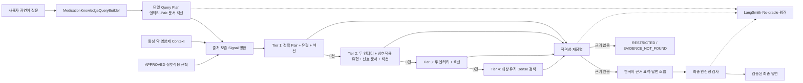

# Natural-Language Medication Retrieval Signal Propagation

## Goal Capsule

사용자의 자연어 질문에서 추출한 제품명·통칭·성분명·음식·상호작용 조합·요청 섹션을 하나의 `MedicationKnowledgeQueryPlan`으로 만들고, 이 신호가 규칙 조회와 Qdrant 검색, 안전성 검사, LangSmith 관측, 평가까지 동일하게 전달되도록 고친다.

현재 `medication_knowledge_full_v2`는 정답 필터를 미리 넣는 구조화 평가에서 14/14를 통과한다. 반면 실제 자연어 경로에서는 과민성대장증후군, 칼슘–철분, 펙소페나딘–과일주스, 와파린–비타민 K, 와파린–메트로니다졸 질문이 누락되거나 다른 자료를 선택한다. v2의 청크 수 증가는 약 1.9%이므로 데이터 양 자체보다 질문 분석 신호가 실제 검색 계약에 전달되지 않는 것이 주원인이다.

이번 작업은 정확도를 최우선으로 한다. 전역 유사도 기준 `0.65`는 낮추지 않고, 질문별 하드코딩도 추가하지 않는다. DB 스키마 변경, Qdrant 재인덱싱, BM25·Sparse 검색, Cross-encoder·LLM reranker, LangGraph 반복 검색은 이 단계의 범위가 아니다.

성공 상태는 다음과 같다.

- 한 질문에서 질문 전용 Query Plan은 한 번만 생성되고, 컨텍스트·승인 규칙을 합친 실행 계획은 별도 해시로 추적한다.
- 빈 환자 컨텍스트와 승인 규칙 0건에서도 질문 엔터티·조합·섹션이 Qdrant 조건에 반영된다.
- 정확한 조건부터 대상 정체성을 보존하는 완화 검색까지 순차 실행하며, 모든 조건을 한 번에 제거하지 않는다.
- 근거가 없으면 `SAFE`가 아니라 `RESTRICTED`와 `EVIDENCE_NOT_FOUND`로 종료한다.
- 영어 근거는 한국어 핵심 요약으로만 노출하고 장문 원문을 그대로 출력하지 않는다.
- 구조화 14문항 평가는 계속 14/14를 유지하고, 같은 질문을 자연어만 입력하는 No-oracle 평가를 별도로 통과한다.

---

## Product Contract

### 사용자에게 보장할 동작

1. 제품명, 통칭, 성분명으로 질문해도 같은 대상 계열을 식별한다.
2. 약–약, 약–영양제, 영양제–영양제, 약–음식 질문은 두 대상을 보존한 채 상호작용 근거를 찾는다.
3. “왜 먹나요”, “복용법”, “주의사항”에 따라 기능성·섭취량·주의사항 섹션을 우선한다.
4. 등록된 복약정보가 없어도 일반 제품·성분 질문의 검색 신호는 사라지지 않는다.
5. 환자 컨텍스트는 “등록한”, “복용 중인”, “내 약 전체” 또는 전체 상호작용 점검처럼 질문이 요구할 때만 추가 조건으로 합치며, 일반 제품 질문에는 자동 혼입하지 않는다.
6. 근거를 찾지 못한 경우 안전하다고 단정하지 않고 자료 범위 안에서 확인하지 못했다고 설명한다.
7. 연구 근거가 영어여도 최종 답변은 간결한 한국어이며, 출처와 근거 수준을 구분한다.
8. 여러 제품·성분 후보가 동률이면 임의로 하나를 고르지 않고 `AMBIGUOUS`로 확인 질문을 반환한다.
9. 상호작용의 한쪽 대상 자료만 찾은 경우 `PARTIAL_EVIDENCE`로 취급하고 두 대상의 상호작용이 확인됐다고 표현하지 않는다.

### 비기능 요구사항

- 정확도 우선: 속도와 비용은 회귀 방지용 보조 지표로만 사용한다.
- 결정론: 같은 질문은 같은 Query Plan hash를 만들고, 같은 Query Plan·Context hash·승인 규칙 snapshot hash는 같은 Execution Plan hash와 검색 조건을 만든다.
- 안전성: 검증 전 LLM 원문은 사용자에게 노출하지 않는다.
- 관측성: 콘텐츠 수집을 끈 상태에서도 필터·fallback·후보 탈락 이유를 확인할 수 있다.
- 확장성: 추후 Sparse 검색과 reranker가 추가되어도 Query Plan과 검색 진단 계약은 유지한다.

### 범위 밖

- 대화 이력을 이용한 “그럼 같이 먹어도 돼?” 같은 대명사 해소
- 새로운 DB 테이블·컬럼 또는 Aerich 마이그레이션
- Qdrant v3 컬렉션 생성 또는 임베딩 재전송
- 전역 유사도 임계값 하향
- 질문 문장별 예외 분기와 별칭 하드코딩 확대
- 승인 규칙의 자동 `APPROVED` 전환 및 활성 컬렉션 자동 교체

---

## Planning Contract

### 확정된 기술 결정

| ID | 결정 | 이유 |
|---|---|---|
| KTD-1 | Use Case에서 질문 전용 Query Plan을 한 번 생성하고, 이를 포함한 `MedicationSearchExecutionPlan`을 Retriever에 전달한다. | 질문 분석은 재생성하지 않되 환자 컨텍스트와 승인 규칙 snapshot까지 검색 실행 해시에 포함해야 한다. |
| KTD-2 | 질문 신호, 환자 컨텍스트, 승인 규칙을 출처가 있는 typed signal로 병합한다. | 질문 신호가 빈 환자 컨텍스트에 의해 사라지거나 승인 규칙이 질문을 과도하게 제한하는 것을 막는다. |
| KTD-3 | 한 글자 엔터티는 버전 관리되는 도메인 사전에 있을 때만 허용하고, 미확인 단어는 성분으로 강제하지 않는다. | `철`은 살리면서 일반 조사·동사·질환명이 성분으로 오인되는 문제를 막는다. |
| KTD-4 | fallback은 정확 pair → 두 entity·상호작용 유형·선호 문서·섹션 → 두 entity·섹션 → 대상 유지 광역 검색 → 근거 없음 순서다. | 모든 필터를 제거한 광역 검색은 다른 제품과 문서가 섞일 위험이 크다. |
| KTD-5 | 기존 0.65 기준과 메타데이터 일치 보정은 유지한다. | 현재 Retriever는 이미 pair·엔터티·섹션 일치 보정을 지원하며, 신호가 전달되지 않아 보정이 작동하지 않는 것이 우선 문제다. |
| KTD-6 | 구조화 Oracle 평가와 No-oracle 자연어 평가를 분리한다. | 정답 필터를 검색 입력으로 사용한 14/14는 인덱스 건전성만 증명하며 실제 챗봇 정확도를 증명하지 않는다. |
| KTD-7 | 정상 검색 0건과 Qdrant 장애를 서로 다른 상태로 처리한다. | “자료에서 근거를 못 찾음”과 “검색 시스템이 작동하지 않음”은 사용자 안내와 운영 대응이 다르다. |
| KTD-8 | Query Plan 계약 모델은 RAG 구현 파일이 아니라 공용 schema 모듈에 둔다. | Domain Protocol이 Query Builder 구현에 의존하는 역방향 의존성을 막는다. |

### 구현 시작 전 조건

현재 작업 트리의 v2 정밀도 개선 변경은 이번 작업과 같은 검색 파일을 수정한다. 먼저 해당 변경을 독립 커밋해 기준선을 고정한 뒤 U1을 시작한다. 특히 `qdrant_knowledge_store.py`, `knowledge_search_result_refiner.py`, 관련 테스트와 평가 YAML을 섞어서 한 커밋으로 만들지 않는다. 이 계획 실행 중에도 기존 사용자 변경과 무관한 파일은 수정하지 않는다.

### 실행 상태 계약

| 상태 | 의미 | LLM 호출·사용자 노출 |
|---|---|---|
| `AMBIGUOUS` | 여러 제품·성분 후보를 안전하게 확정할 수 없음 | 답변 생성 없이 제품명·성분명 확인 질문 |
| `NO_APPROVED_RULE` | 활성 승인 규칙은 없지만 규칙 저장소는 정상 | Qdrant 검색 계속, 규칙이 없음을 진단에 기록 |
| `RULE_REPOSITORY_UNAVAILABLE` | 규칙 조회 자체가 실패 | 승인 규칙 0건으로 오인하지 않고 제한 상태 기록 |
| `PARTIAL_EVIDENCE` | 상호작용 두 대상 중 한쪽 또는 일반 정보만 확인 | 상호작용 단정 금지, 부족한 근거를 명시 |
| `EVIDENCE_NOT_FOUND` | 검색은 정상이나 적합 근거 0건 | `RESTRICTED`, 안전하다는 뜻이 아님을 안내 |
| `RAG_UNAVAILABLE` | Qdrant timeout·연결 실패 | 생성 근거 원문 미노출, 안전한 장애 안내 |
| `ANSWER_GENERATION_FAILED` | LLM 답변 생성 실패 | 검색 원문을 대신 노출하지 않음 |
| `SAFETY_VALIDATION_FAILED` | 출력 안전성 검사 실패 | fail-closed, 생성 초안 미노출 |

### 목표 흐름



### Signal 병합 규칙

우선순위는 “덮어쓰기”가 아니라 검색 의도를 보존하는 순서다.

1. `QUESTION`: 현재 질문에서 직접 확인한 제품·성분·음식·pair·섹션
2. `PATIENT_CONTEXT`: 등록된 활성 약·영양제
3. `APPROVED_RULE`: RDBMS에서 승인된 결정론적 상호작용 pair

같은 정규화 이름은 하나로 합치되 출처 집합은 유지한다. 상충하는 타입은 질문 문맥과 승인 규칙을 우선 검증하고, 확정할 수 없으면 임의로 성분 타입을 선택하지 않고 clarification 또는 topic 신호로 남긴다.

---

## Implementation Units

### U1. 자연어 실행 계약과 실패 회귀 테스트 고정

**Goal**

현재 실패가 데이터 부족이 아니라 Query Plan 생성·전달 단계에서 재현된다는 테스트 계약을 먼저 만든다.

**Requirements**

- 기존 14문항 YAML의 예상 엔터티·문서·pair는 채점 전용으로 명시한다.
- 구조화 evaluator는 유지하고, 자연어 evaluator는 오직 질문 문자열만 실행 입력으로 사용한다.
- `철`, 과민성대장증후군, 칼슘–철분, 펙소페나딘–과일주스, 와파린–비타민 K, 와파린–메트로니다졸, 타이레놀 회귀 사례를 테스트한다.
- Fake/Spy Retriever로 Use Case에서 실제 전달한 Query Plan과 검색 신호를 검증한다.

**Dependencies**

- 없음. 이후 모든 구현 단위의 실패 기준이다.

**Files**

- `data/knowledge/evaluation/pilot_queries.yaml`
- `ai_worker/schemas/knowledge_evaluation.py`
- `ai_worker/tests/rag/query_builders/test_medication_knowledge_query_builder.py`
- `ai_worker/tests/use_cases/test_answer_medication_question.py`
- `ai_worker/tests/rag/evaluators/test_knowledge_retrieval_evaluator.py`

**Approach**

1. 테스트에서 기존 동작이 잘못된 entity, pair, section 또는 빈 필터를 만드는 것을 먼저 확인한다.
2. 평가 모델에서 검색 입력과 예상 결과의 의미를 분리한다.
3. 기존 Oracle 평가의 입력 계약은 변경하지 않아 컬렉션 기준선 회귀를 막는다.

**Patterns**

- Pydantic `extra="forbid"`와 명시적 enum을 유지한다.
- 비동기 Protocol은 Fake 구현으로 계약을 검증한다.
- 질문별 정답 코드를 production에 넣지 않고 YAML은 평가에서만 읽는다.

**Tests**

- 한 글자 성분은 사전 등재 시 인식되고 일반 한 글자는 무시된다.
- 질환·주제는 `INGREDIENT_NAME`이 아니다.
- 승인 규칙과 환자 컨텍스트가 비어도 질문 pair가 Retriever까지 전달된다.
- 평가 기대값을 바꿔도 실제 검색 입력은 바뀌지 않는다.

**Verification**

- 새 테스트가 기존 코드에서 의도한 이유로 실패한다.
- 기존 구조화 evaluator 테스트는 계속 통과한다.

### U2. 공용 Query Plan 계약과 단계적 엔터티 정규화

**Goal**

먼저 공용 Query Plan schema와 기존 extractor·annotation registry의 최소 확장으로 U3의 신호 전파를 가능하게 한다. 전파 수정 후에도 남는 한 글자 성분·주제 오인 실패는 메타데이터와 승인 annotation에서 생성한 버전 관리 사전으로 해결한다.

**Requirements**

- `MedicationQueryEntityType`에 `TOPIC` 또는 동등한 비성분 검색 앵커를 추가한다.
- `철` 같은 한 글자 성분은 사전 매칭일 때만 토큰으로 허용한다.
- `interaction_annotations.yaml`, 기존 제품·성분 메타데이터, 공개 가이드의 canonical name을 공통 catalog 입력으로 사용한다.
- 통칭은 제품명·성분명 후보를 보존하고 질문 문맥과 실제 조회 결과로 확정한다.
- 후보 점수와 타입 우선순위로 하나를 확정할 수 없는 동률은 `AMBIGUOUS`로 판정하고 후보 목록을 유지한다.
- Query Plan이 entity source, document types, pair keys, section types를 직접 표현한다.

**Dependencies**

- U1의 실패 회귀 테스트.
- U2-A(공용 schema·기존 registry 최소 확장)는 U3의 선행 조건이다.
- U2-B(catalog 생성)는 U3 전파 기준선을 먼저 측정한 뒤, U1의 정규화 실패가 남는 경우 실행한다. U3 자체를 Qdrant snapshot 준비에 의존시키지 않는다.

**Files**

- `ai_worker/rag/query_builders/medication_knowledge_query_builder.py`
- `ai_worker/schemas/medication_search.py` (new)
- `ai_worker/rag/metadata/knowledge_entity_extractor.py`
- `ai_worker/rag/metadata/interaction_annotation_registry.py`
- `ai_worker/rag/metadata/assets/knowledge_entity_catalog.json` (generated, new)
- `scripts/build_knowledge_entity_catalog.py` (new)
- `ai_worker/schemas/interaction.py`
- `data/knowledge/manifests/interaction_annotations.yaml`
- `ai_worker/tests/rag/query_builders/test_medication_knowledge_query_builder.py`
- `ai_worker/tests/rag/metadata/test_knowledge_entity_extractor.py`

**Approach**

1. U2-A에서 Query Plan과 entity/pair 모델을 공용 schema로 이동해 Domain·Builder·Retriever·Use Case가 같은 계약을 참조한다.
2. U2-A에서 NFKC·공백·대소문자 정규화와 기존 extractor·interaction annotation registry를 재사용해 현재 확인 가능한 엔터티를 typed candidate로 만든다.
3. U3의 신호 전파를 먼저 구현·측정한다. 이후 U2-B에서 한 글자 성분·주제 오인처럼 남은 정규화 실패를 대상으로 Qdrant v2 메타데이터와 검수된 annotation에서 작은 결정론적 catalog를 생성한다. 런타임 이미지를 고려해 Git 제외된 `data/knowledge/processed`를 직접 읽지 않고 `ai_worker/rag/metadata/assets`에 버전 관리 산출물을 둔다.
4. 가장 긴 사전 항목부터 매칭해 “비타민 K”와 “비타민”이 동시에 중복되는 것을 막는다.
5. 정규식 토큰은 미확인 주제를 보조 검색어로만 남기고 성분 타입을 부여하지 않는다.
6. 상호작용 pair key는 `build_interaction_pair_key()`를 사용해 RDBMS·Qdrant와 같은 SHA-256 규칙을 따른다.
7. 섹션 및 문서 유형은 질문 intent에서 결정하되, 상호작용 질문은 두 대상과 `INTERACTION` 섹션을 항상 보존한다.
8. catalog 생성기는 `medication_knowledge_full_v2`의 고정 dataset version과 `interaction_annotations.yaml`을 입력 snapshot으로 사용한다. 승인 annotation → Qdrant canonical name → alias 순으로 충돌을 해결하고, 미해결 타입 충돌은 실패시킨다.
9. canonical key로 중복 제거한 뒤 정렬해 JSON을 만들고 schema version, dataset version, 입력 fingerprint, 산출물 SHA-256을 함께 저장한다. 같은 입력으로 두 번 실행한 byte 결과가 같아야 한다.

**Patterns**

- canonical name과 aliases는 데이터 파일에 두고 Python 조건문에 질문별 예외를 늘리지 않는다.
- pair는 순서 독립적인 표준 factory를 사용한다.
- 데이터 파일에는 schema version을 둬 이후 컬렉션 릴리스와 호환성을 검사한다.
- 기존 `supplement_interaction_registry.py`의 코드 상수는 실패 질문별 확장 지점으로 사용하지 않는다.

**Tests**

- `철은 왜 먹나요?`가 철분 기능성 검색으로 정규화된다.
- `과민성대장증후군이 뭐예요?`가 성분으로 분류되지 않는다.
- 네 가지 상호작용 유형별 pair type과 pair key가 정확하다.
- “타이레놀”의 다중 후보가 불필요어 없이 보존된다.
- 동률 후보는 임의 확정되지 않고 결정론적으로 `AMBIGUOUS`가 된다.
- 같은 질문을 반복해도 Query Plan serialization과 hash가 같다.

**Verification**

- 질문별 하드코딩 없이 14문항의 entity·pair·section 기대값을 만족한다.
- 새로운 사전 항목은 코드 수정 없이 데이터 변경과 테스트로 추가할 수 있다.
- catalog 생성 명령은 `uv run --group ai --group dev python -m scripts.build_knowledge_entity_catalog --collection medication_knowledge_full_v2`로 고정하고, Qdrant snapshot이 없으면 명시적으로 실패한다.

### U3. 단일 Query Plan 전파와 출처 보존 병합

**Goal**

Use Case에서 만든 Query Plan을 Retriever가 다시 만들지 않고 실행하며, 질문·환자·승인 규칙 신호를 하나의 검색 요청으로 합친다.

**Requirements**

- `MedicationKnowledgeRetriever` Protocol은 질문 전용 Query Plan과 출처 보존 병합 신호를 포함한 `MedicationSearchExecutionPlan` 하나만 받는다.
- `_retrieve_knowledge()`는 질문 entity/pair/document/section을 반드시 전달한다.
- 환자 컨텍스트와 승인 규칙은 질문 신호를 추가 확장하지만 제거하지 않는다.
- 질문 분석의 `query_plan_hash`와 Context hash·승인 규칙 snapshot hash를 포함한 `execution_plan_hash`를 구분해 규칙 조회, 검색 진단, 안전성 로그에서 공유한다.
- 평가 Executor도 production Query Plan을 관측하고 별도로 다시 계산하지 않는다.
- `AMBIGUOUS` 상태와 후보 식별자를 Retriever·답변 조립·평가까지 손실 없이 전달한다.

**Dependencies**

- U2-A의 공용 Query Plan schema와 기존 registry 최소 확장. U2-B catalog 생성은 선행 조건이 아니다.

**Files**

- `ai_worker/domain/interfaces.py`
- `ai_worker/use_cases/answer_medication_question.py`
- `ai_worker/rag/retrievers/medication_knowledge_retriever.py`
- `ai_worker/evaluation/chat_evaluation_executor.py`
- `ai_worker/tests/use_cases/test_answer_medication_question.py`
- `ai_worker/tests/rag/retrievers/test_medication_knowledge_retriever.py`
- `ai_worker/tests/evaluation/test_chat_evaluation_executor.py`

**Approach**

1. Protocol을 먼저 변경하고 Fake/Spy 구현을 컴파일 오류 없이 함께 갱신한다.
2. Query Plan을 immutable execution input으로 보고 Retriever 내부 재생성을 제거한다.
3. entity canonical key로 중복 제거하고 signal source 집합을 유지한다.
4. 질문의 pair가 있으면 승인 규칙 pair와 합치고, 승인 규칙이 0건이어도 질문 pair를 유지한다.
5. `KnowledgeSearchQuery`가 이미 가진 `document_types`, `drug_names`, `ingredient_names`, `interaction_type`, `interaction_pair_keys`, `section_types`를 활용한다.
6. 현재 독립 Qdrant payload 필드가 없는 `food_names`와 `topic_names`는 강제 필터로 만들지 않고 pair 생성, 제목·본문 관계 검사, 후처리 적격성 판정에 사용한다.
7. 환자 컨텍스트는 “등록한”, “복용 중인”, “내 약 전체” 같은 명시적 문맥 또는 상호작용 전체 점검에서만 확장 조건으로 사용한다. 일반 제품 질문에는 환자 전체 목록을 무조건 OR 조건으로 넣지 않는다.
8. Query Plan에는 원래 후보 집합을 불변으로 보존한다. Retriever는 후보별 근거와 점수를 반환하고, Use Case가 `MedicationEntityResolution`을 만들어 확정 후보·동률·`AMBIGUOUS`를 결정한다. 별도 resolution hash는 만들지 않는다.
9. 규칙 조회 결과는 `MATCHED`, `NO_APPROVED_RULE`, `RULE_REPOSITORY_UNAVAILABLE`의 typed 상태와 활성 dataset/version snapshot hash를 반환한다. 저장소 장애여도 질문 기반 Qdrant 검색은 계속하지만 최종 상태는 `RESTRICTED`와 해당 reason code로 제한한다.

**Patterns**

- Use Case가 orchestration을 소유하고 Retriever는 실행을 소유한다.
- 기존 `KnowledgeSearchQuery`를 재사용하므로 DB·공개 API 스키마 변경은 없다.
- 타입 변경은 Protocol, 구현, Fake를 한 단위에서 원자적으로 반영한다.

**Tests**

- context 0/rule 0에서도 질문 filter가 Vector Store로 전달된다.
- 환자 컨텍스트가 있을 때 질문 filter와 합쳐지고 질문 filter가 사라지지 않는다.
- 질문 계획 생성 횟수가 정확히 1회다.
- 평가와 실제 Use Case의 Query Plan hash가 같다.
- 같은 질문·Context·승인 규칙 snapshot에서 execution plan과 entity resolution 결과가 결정론적으로 같다.
- 규칙 정상 0건과 규칙 저장소 장애가 서로 다른 typed 결과와 최종 상태를 만든다.

**Verification**

- `와파린–비타민 K`, `펙소페나딘–과일주스`의 실제 Vector Store 호출에 두 대상·pair·section이 포함된다.
- Retriever 단독 실행과 Chat Core 실행의 필터가 동일하다.

### U4. 대상 정체성을 보존하는 단계적 검색과 적격성 진단

**Goal**

정확한 메타데이터 검색이 실패해도 관련 없는 고득점 문서를 섞지 않고, 최소한 대상명을 유지하며 단계적으로 검색 범위를 넓힌다.

**Requirements**

- fallback tier를 enum 또는 명시적 값으로 관리한다.
- 각 tier마다 적용 필터, 완화한 필터, 이유, 후보 수, 탈락 이유를 기록한다.
- 정확 pair·entity·section 일치 후보는 기존 점수 보정을 받는다.
- 모든 필터를 제거하는 fallback은 삭제하거나 대상 토큰을 반드시 유지하는 제한 검색으로 바꾼다.
- 최종 후보가 없으면 빈 결과와 `EVIDENCE_NOT_FOUND` 진단을 반환한다.
- 두 대상 상호작용 질문에서 한쪽 대상만 뒷받침되면 `PARTIAL_EVIDENCE`를 반환한다.

**Dependencies**

- U3의 완성된 검색 신호.

**Files**

- `ai_worker/rag/retrievers/medication_knowledge_retriever.py`
- `ai_worker/rag/vectorstores/qdrant_knowledge_store.py`
- `ai_worker/rag/rerankers/knowledge_search_result_refiner.py`
- `ai_worker/schemas/knowledge.py`
- `ai_worker/tests/rag/retrievers/test_medication_knowledge_retriever.py`
- `ai_worker/tests/rag/vectorstores/test_qdrant_knowledge_store.py`

**Approach**

1. Tier 1은 pair key를 단독 핵심 조건으로 사용한다. 일반 약명·성분 필터와 같은 OR 그룹에 섞지 않는다.
2. Tier 2는 pair key를 완화하되 두 entity, interaction type, preferred document type, section을 유지한다.
3. Tier 3은 interaction type과 preferred document type을 완화하되 두 entity와 section을 유지한다.
4. Tier 4는 entity를 검색문과 메타데이터 보정에 유지하는 제한 Dense 검색이다.
5. 각 tier 안에서는 원 질문과 alternate query를 병렬 실행한 뒤 합쳐 적격성을 검사한다. 개별 alternate query마다 독립 광역 fallback을 실행하지 않는다.
6. 각 tier는 적격 후보가 생기면 중단하고, 여러 tier 결과를 무차별 합치지 않는다.
7. 구형 `DRUG_ENCYCLOPEDIA`처럼 payload section이 `OTHER`인 문서는 section을 Qdrant 필수 필터로 사용하지 않고 본문 제목 복원 후 적격성을 판정한다.
8. 문서 유형은 단일 영구 강제가 아니라 intent별 preferred type으로 두고 단계적으로 완화한다.
9. 전역 0.65와 기존 adaptive margin을 유지하며 정확한 metadata 일치가 있는 경우에만 보정 허용 여부를 판단한다.
10. 전체 Chat API 30초 중 retrieval deadline은 최대 10초로 제한한다. 원 질문과 중복 제거된 alternate query의 embedding은 요청당 한 번만 생성·재사용하고, 모든 tier가 같은 잔여 시간 예산을 공유한다.
11. retrieval deadline이 끝나면 실행 중인 후속 tier를 취소하고 `RAG_UNAVAILABLE` 제한 응답으로 전환한다. 개별 Qdrant 호출 timeout은 `min(10초, retrieval 잔여 시간)`을 사용한다.

**Patterns**

- 이미 추가된 `knowledge_search_result_refiner.py`의 점수·중복·wrong-entity 방지 로직을 재사용한다.
- Qdrant 필터 생성은 한 곳에서만 수행하고 diagnostic snapshot을 반환한다.
- 검색 예외는 `RAG_UNAVAILABLE`, 정상 0건은 `EVIDENCE_NOT_FOUND`로 분리한다.

**Tests**

- Tier 1 결과가 있으면 추가 검색을 실행하지 않는다.
- pair가 없어도 entity 조건이 유지된다.
- 관련 없는 고득점 문서가 정확 대상의 낮은 점수 문서보다 선택되지 않는다.
- 최종 0건은 빈 결과이며 다른 제품 목록으로 대체되지 않는다.
- Qdrant timeout과 정상 0건의 진단 코드가 다르다.
- retrieval 잔여 시간이 없으면 추가 tier를 호출하지 않고 제한 응답으로 종료한다.
- 규칙 0건과 규칙 저장소 장애, 두 대상 완전 근거와 한쪽 대상 부분 근거가 구분된다.

**Verification**

- 최신 실패 7문항의 fallback tier와 선택 문서가 LangSmith에서 설명 가능하다.
- 구조화 v2 14문항의 Hit@5, MRR, citation accuracy, wrong-entity rate가 회귀하지 않는다.

### U5. 근거 없음 안전 계약과 한국어 근거 표현

**Goal**

검색 실패를 안전 확인으로 오해하지 않게 하고, 검증된 근거만 한국어로 간결하게 전달한다.

**Requirements**

- 상호작용 질문에서 근거 0건이면 LLM이 상호작용 내용을 새로 만들지 않는다.
- `EVIDENCE_NOT_FOUND`는 `RESTRICTED`로 반환하며 “안전하다는 뜻은 아님”을 명시한다.
- Qdrant 장애는 별도의 서비스 오류·제한 안내를 사용한다.
- 영어 청크는 핵심 주장, 대상, 조건, 근거 한계만 한국어로 요약한다.
- 효능·사용법·주의사항은 각 항목을 뒷받침하는 근거가 있을 때만 출력한다.
- 최종 답변은 전체 안전성 검사를 통과한 후에만 API에 전달한다.
- `AMBIGUOUS`에서는 일반 답변 LLM을 호출하지 않고 제품명·성분명 확인 질문만 조립한다.

**Dependencies**

- U4의 검색 진단과 근거 상태.

**Files**

- `ai_worker/use_cases/answer_medication_question.py`
- `ai_worker/llm/prompts/medication_chat_prompt.py`
- `ai_worker/llm/generators/medication_answer_generator.py`
- `ai_worker/safety/grounded_claim_validator.py`
- `ai_worker/schemas/medication_safety.py`
- `ai_worker/domain/interfaces.py`
- `ai_worker/llm/assemblers/medication_answer_assembler.py`
- `ai_worker/tests/use_cases/test_answer_medication_question.py`
- `ai_worker/tests/llm/generators/test_medication_answer_generator.py`
- `ai_worker/tests/safety/test_grounded_claim_validator.py`

**Approach**

1. safety status 초기값을 검색 성공 여부와 분리한다.
2. answer generator에는 근거가 있는 section만 전달한다.
3. 이미 존재하는 한국어 요약 지침을 회귀 테스트로 고정하고, 실제 출력이 계속 영어이면 schema·assembler 경계에서 장문 원문 전달을 제한한다. 프롬프트 중복 수정은 테스트가 실패할 때만 한다.
4. grounded claim validator가 답변 문장과 source chunk를 대조한다.
5. 안전성 검사 실패 시 기존 안전 공지로 전체 답변을 교체한다.
6. Use Case는 답변 생성 전에 선택 청크의 `chunk_id`, 본문, source type, evidence level, section과 구조화 규칙·제품 가이드 fact를 `GroundingEvidenceBundle`로 만든다.
7. `GroundedClaimValidator.validate()`는 context와 생성 결과뿐 아니라 이 evidence bundle을 필수 입력으로 받고, LLM 생성 후·최종 출력 직전에 각 핵심 주장을 검증한다.
8. 근거 불일치는 `RESTRICTED` 또는 `BLOCKED`와 `UNGROUNDED_CLAIM` reason code로 매핑하며, validator 자체 장애는 `SAFETY_VALIDATION_FAILED`로 fail-closed 처리한다. Protocol·Fake·테스트를 같은 단위에서 변경한다.

**Patterns**

- 결정론적 RDBMS 규칙은 연구 청크보다 높은 근거 수준으로 표시한다.
- “확인되지 않음”과 “안전함”을 서로 다른 문구와 상태로 유지한다.
- 번역·요약은 새로운 의학 주장 생성이 아니라 선택된 청크의 보존적 표현으로 제한한다.

**Tests**

- 근거 0건 상호작용 질문은 `SAFE`가 아니다.
- 영어 원문 문단이 최종 답변에 그대로 포함되지 않는다.
- 한국어 요약이 선택된 근거의 대상·방향·한계를 바꾸지 않는다.
- 근거 없는 효능·주의사항 항목은 출력되지 않는다.
- 안전성 검사 전 콘텐츠가 스트리밍되지 않는다.
- 동률 후보 질문은 임의 제품 답변 대신 확인 질문으로 종료된다.
- 선택 청크 본문이 validator에 전달되고, source DTO에 본문을 공개하지 않아도 문장-근거 대조가 수행된다.

**Verification**

- 프론트에서 영어 논문 질문이 한국어 핵심 요약으로 표시된다.
- LangSmith에서 최종 route, evidence status, safety status가 구분된다.

### U6. No-oracle 14문항 평가와 관측 계약 완성

**Goal**

정답 필터를 검색에 주입하지 않고 실제 자연어 경로의 엔터티 정규화, 검색, 출처, 안전성을 반복 측정한다.

**Requirements**

- 기존 구조화 Oracle 평가는 인덱스 상태용으로 그대로 유지한다.
- No-oracle evaluator는 질문만 `QueryBuilder → Retriever`에 전달한다.
- YAML expected 값은 채점 시에만 사용한다.
- 평가 결과에 Query Plan hash, normalized entities, pair, filters, fallback tier, selected chunk IDs, source types, safety status, P50/P95를 기록한다.
- LangSmith 콘텐츠 수집이 꺼져도 비식별 진단 값은 남긴다.
- 같은 질문과 Context hash의 API 실행과 evaluator 실행 결과가 일치하는지 비교한다.

**Dependencies**

- U1~U5의 실행 계약.

**Files**

- `ai_worker/rag/evaluators/knowledge_retrieval_evaluator.py`
- `ai_worker/evaluation/chat_evaluation_executor.py`
- `scripts/evaluate_knowledge_retrieval.py`
- `ai_worker/tests/rag/evaluators/test_knowledge_retrieval_evaluator.py`
- `ai_worker/tests/scripts/test_evaluate_knowledge_retrieval.py`
- `data/knowledge/evaluation/pilot_queries.yaml`
- `data/knowledge/evaluation/KNOWLEDGE_FULL_V2_CITATION_ANALYSIS.md`
- `data/knowledge/SEARCH_QUALITY_IMPROVEMENT_HISTORY.md`

**Approach**

1. 실행 모드를 `structured_oracle`과 `natural_language_e2e`로 분리한다.
2. 같은 14문항을 사용하되 후자는 검색 입력 생성 시 expected 필드를 참조하지 못하게 타입과 테스트로 차단한다.
3. 단계별 결과를 JSON과 Markdown으로 출력해 이전 기준선과 비교한다.
4. 프론트에서 사용자가 질문한 Trace ID와 evaluator 결과의 plan/filter/chunk를 대조한다.
5. 실패를 `NORMALIZATION`, `PLAN_PROPAGATION`, `FILTER`, `ELIGIBILITY`, `SOURCE_MIXING`, `SAFETY`, `ANSWER_GROUNDING`으로 분류한다.
6. 기존 Chat 평가 schema의 `answer_requirements`와 `forbidden_claims`를 실제 채점에 연결해 한국어 기본 출력, 영어 장문 원문 금지, 근거 없는 안전 결론 금지를 검증한다.

**Patterns**

- 평가 데이터와 production 코드를 분리한다.
- 평균만 사용하지 않고 질문별 결과와 P50/P95를 함께 남긴다.
- 실패 0건을 숨기는 aggregate만 출력하지 않는다.

**Tests**

- expected entity/document/pair를 변경해도 natural-language 검색 입력이 바뀌지 않는다.
- evaluator와 API가 같은 질문·context에서 같은 plan hash와 chunk IDs를 만든다.
- 구조화 모드는 14/14 기준선을 재현한다.
- no-evidence expected case는 제한 응답을 정답으로 판정한다.

**Verification**

- 구조화 v2: Hit@5 1.0, MRR 1.0, citation accuracy 1.0, wrong-entity rate 0을 유지한다.
- No-oracle 14문항: 모든 문항에서 route/entity/pair 기대값을 만족하고, wrong-entity rate 0 및 citation accuracy 1.0을 목표로 한다.
- 근거 보유 문항은 근거 기반 답변까지 도달해야 하며, false-`RESTRICTED`와 false-`AMBIGUOUS`는 14문항 기준 0건이어야 한다.
- 명시적으로 근거가 없는 문항과 실제 동률 후보 문항만 각각 `RESTRICTED`, `AMBIGUOUS`를 정답으로 인정한다.
- 검색 P95는 현재 기준선 대비 유의한 회귀가 없는지 기록하되 정확도 통과를 우선한다.
- 프론트·LangSmith 대표 실패 7문항을 재실행해 이전 결과표와 비교한다.

---

## Verification Contract

### 자동 검증

구현 중에는 변경 단위별 테스트를 먼저 실패시키고 최소 구현으로 통과시킨다.

```bash
uv run --group dev ruff check ai_worker scripts

RUN_OPENAI_INTEGRATION_TESTS=0 \
  uv run --group ai --group app --group dev \
  python -m pytest ai_worker/tests -q

uv run --group ai --group dev \
  python -m scripts.evaluate_knowledge_retrieval \
  --evaluation-file data/knowledge/evaluation/pilot_queries.yaml \
  --collection medication_knowledge_full_v2 \
  --mode structured_oracle

uv run --group ai --group dev \
  python -m scripts.evaluate_knowledge_retrieval \
  --evaluation-file data/knowledge/evaluation/pilot_queries.yaml \
  --collection medication_knowledge_full_v2 \
  --mode natural_language_e2e

git diff --check
```

평가 스크립트의 실제 옵션명이 현재 CLI와 다르면 기존 parser를 기준으로 같은 의미의 structured/oracle 및 natural-language 모드를 추가한다. 외부 OpenAI·Qdrant 통합 검증은 단위 테스트가 모두 통과한 뒤 수행한다.

### 수동 검증

사용자가 프론트에서 다음 대표 실패 질문을 실행하고 `chat-team-eval-content` 또는 개발용 LangSmith project에서 최신 Trace를 확인한다.

- 과민성대장증후군이 무엇인가요?
- 칼슘과 철분을 같이 먹어도 되나요?
- 펙소페나딘과 과일주스를 같이 먹어도 되나요?
- 와파린과 비타민 K 영양제를 같이 먹어도 되나요?
- 와파린과 메트로니다졸을 같이 먹어도 되나요?
- 타이레놀의 효능과 주의사항을 알려줘.
- 자료에 근거가 없는 조합 질문 1건

Trace마다 다음을 비교한다.

| 단계 | 확인 항목 |
|---|---|
| `query.plan` | plan hash, entity type/count, pair type/key hash, section/document filters |
| `interaction_rules.search` | approved rule count, matched pair key hash |
| `rag.retrieve` | fallback tier, applied filters, candidate/eligible counts, selected chunk IDs, scores |
| `answer.draft` / `llm.generate` | 한국어 요약 여부, 근거 없는 항목 생성 여부 |
| `safety.validate` | evidence status, final route, safety status/reason codes |

### 회귀 가드

- v1·v2 컬렉션은 삭제하거나 재생성하지 않는다.
- DB 마이그레이션이 생성되지 않아야 한다.
- 공개 `POST /api/v1/chat` 응답 스키마를 변경하지 않는다.
- Qdrant timeout은 기존 10초, Chat API timeout은 기존 30초 계약을 유지한다.
- 기존 final-only answer + fixed SSE progress 정책을 유지한다.

---

## Definition of Done

- [ ] Query Plan이 질문당 한 번만 생성되고 Query Plan·Execution Plan 해시가 각자의 입력 snapshot과 일치하며, Entity Resolution 결과가 결정론적이다.
- [ ] 질문 엔터티·pair·문서·섹션이 실제 `KnowledgeSearchQuery`에 포함된다.
- [ ] 환자 컨텍스트와 승인 규칙이 비어도 질문 신호가 유지된다.
- [ ] 한 글자 성분, 질환·주제, 통칭·제품명·성분명, 네 가지 상호작용 유형 테스트가 통과한다.
- [ ] 동률 후보가 `AMBIGUOUS` 확인 질문으로 끝나고 일반 답변 LLM을 호출하지 않는다.
- [ ] fallback이 대상 정체성을 유지하며 모든 필터를 한 번에 제거하지 않는다.
- [ ] 정상 0건과 Qdrant 장애가 서로 다른 진단·안전 상태를 가진다.
- [ ] 근거 0건 상호작용 답변이 `SAFE`로 표시되지 않는다.
- [ ] 영어 근거는 한국어 핵심 요약으로만 출력된다.
- [ ] 구조화 Oracle 14문항 기준선이 유지된다.
- [ ] No-oracle 14문항 결과와 질문별 실패 분류 보고서가 생성된다.
- [ ] 근거 보유 14문항에서 false-`RESTRICTED`와 false-`AMBIGUOUS`가 0건이다.
- [ ] 최신 실패 7문항을 프론트·LangSmith에서 재검증하고 이전 결과와 비교한다.
- [ ] Ruff, 전체 AI Worker 테스트, 평가 스크립트, `git diff --check`가 통과한다.
- [ ] 새 DB migration, 새 Qdrant collection, 전역 threshold 변경, 질문별 하드코딩이 없다.

## Deferred Follow-ups

이번 정확성 복구가 완료되고 No-oracle 평가가 안정된 뒤에만 다음을 같은 평가 세트로 A/B 비교한다.

1. BM25/Sparse 후보 검색과 Dense 후보 결합
2. Cross-encoder 또는 LLM reranker
3. 대화 이력 기반 후속 질문 해소
4. LangGraph 반복 검색과 self-correction loop
5. 사용자 피드백 기반 LangSmith Dataset·Evaluator 자동화

정확도 개선이 수치로 확인되지 않으면 복잡성을 추가하지 않는다.
