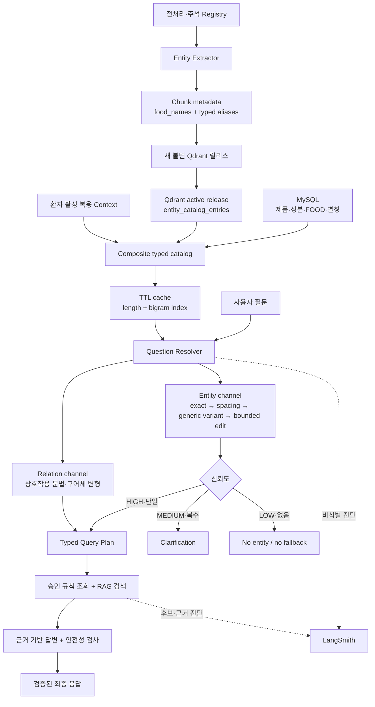
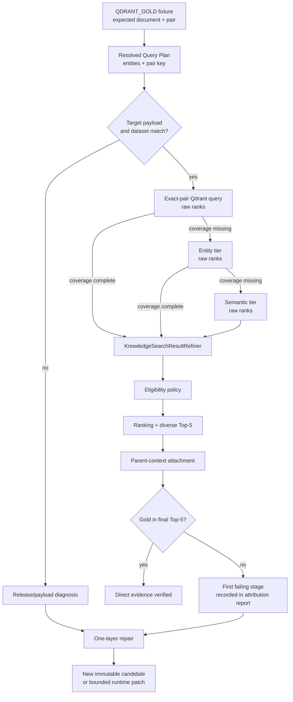
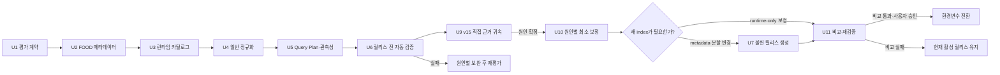

# Source-Backed Food and Expression Resolution - Plan

## Goal Capsule

| 항목 | 내용 |
|---|---|
| Objective | 사용자가 약·영양제·음식 이름을 정확히 쓰거나 일반적인 오타·표기 변형으로 질문해도, 실제 보유 자료에 존재하는 대상만 식별하여 올바른 검색 경로와 근거로 연결한다. |
| Means | RDBMS와 활성 Qdrant 릴리스에서 타입·정식명·별칭을 수집하고, 이를 기반으로 결정론적 질문 해석과 신뢰도 분기를 수행한다. (KTD1–KTD6) |
| Authority | 사용자 확정 범위와 R1–R20이 제품 동작을 결정한다. KTD가 구현 방식을 결정한다. 기존 타입 엔터티 설계 문서는 호환 기준으로 사용한다. |
| Execution profile | TDD로 계약과 회귀 테스트를 먼저 고정한다. 직접 근거 누락은 Qdrant 원시 후보부터 최종 Top-5까지 단계별로 분류한 뒤에만 수정한다. |
| Stop conditions | 임의 제품·성분 fallback이 다시 생기거나, Qdrant 신규 릴리스 생성에 OpenAI 임베딩 전송이 필요하거나, MySQL 스키마 변경이 필요해지면 구현을 멈추고 사용자 확인을 받는다. |
| Tail ownership | 구현자는 단위·통합·고정 20문항 평가와 직접 근거 진단 보고서를 완료한다. 사용자는 프론트 E2E를 실행한다. 구현자는 결과를 현재 활성 릴리스와 비교하되, 후보 릴리스 활성화는 별도 승인으로 남긴다. |

---

## Product Contract

### Summary

이번 작업은 타입 엔터티 기반 질문 해석과 직접 상호작용 근거 검색을 함께 검증한다. RDBMS와 Qdrant가 가진 음식·음료 엔터티를 실제 질문 카탈로그로 연결하고, 제품별 예외 목록 없이 오타·띄어쓰기·영문자 한글 표기·구어체 관계 표현을 해석한다. 검색 근거가 없는 경우에는 비슷한 첫 제품을 대신 답하지 않는다.

현재 활성 릴리스와 별개로 `medication_knowledge_full_v15` 후보가 존재한다. 이 계획은 타이레놀–술처럼 manifest에 직접 근거가 있는 문서가 Top-5에 없을 때, 원인을 payload·dataset version·exact-pair 필터·refiner·eligibility·최종 다양성 선택 중 하나로 확정한다. 진단 전에는 전역 유사도 임계값, reranker, HyDE, sub-query를 바꾸지 않으며 v15를 활성화하지 않는다.

### Problem Frame

고정 검색 평가는 stateless 20문항으로, 등록 복약정보가 필요한 질문은 Chat Core E2E로 분리한다. 현재 v15 후보에서 일부 QDRANT_GOLD 문서가 후보 Top-20과 최종 Top-5 모두에 보이지 않는 관측이 있다. 이는 “근거가 없다”는 결론이 아니라, 평가가 가리킨 collection/dataset과 Qdrant payload가 일치하는지부터 확인해야 하는 미확정 증상이다.

`타이레놀–술`의 정답 문서 `kpicia_pharm_review-3ce7212b15e7c2de`는 manifest에 `아세트아미노펜–알코올` `DRUG_FOOD` 주석과 `술` 별칭을 가진다. 런타임은 exact-pair, entity, semantic 순으로 후보를 조회하고 후보 진단을 남기지만, 현재 진단에는 Qdrant 원시 순위와 `KnowledgeSearchResultRefiner` 이후 순위를 분리해 보존하는 계약이 없다. 따라서 payload 누락과 후단 탈락을 같은 “근거 0건”으로 보지 않도록 해야 한다.

### Key Decisions

- KD1. 실제 RDBMS·Qdrant·환자 컨텍스트에 연결되는 표현만 검색 엔터티로 승인한다. `Governs R1, R2, R7.`
- KD2. 제품명·성분명·음식명을 코드 상수로 계속 추가하지 않는다. `Governs R3, R5, R6.`
- KD3. 높은 신뢰도는 자동 교정하고, 중간 신뢰도 또는 동률 후보는 재질문하며, 낮은 신뢰도는 근거 없음으로 종료한다. `Governs R6, R7, R8.`
- KD4. 직접 근거 누락의 단계별 원인을 확정하기 전에는 유사도 임계값을 낮추거나 reranker·HyDE·sub-query·새 LLM 분류를 추가하지 않는다. `Governs R10, R14, R15–R19.`
- KD5. 기존 Qdrant 컬렉션은 수정하지 않고 새 릴리스가 검증된 경우에만 활성 컬렉션을 교체한다. `Governs R11, R12.`

### Requirements

**엔터티·메타데이터 계약**

- R1. 질문 엔터티는 `canonical_name`, `aliases`, `entity_type`, `kind`, `source`를 보존해야 한다.
- R2. 음식·음료는 `FOOD_CATEGORY`와 `FOOD` 타입으로 표현하고 RDBMS, Qdrant 또는 환자 컨텍스트 출처를 가져야 한다.
- R3. Qdrant 릴리스 메타데이터는 음식 정식명과 정식명에 연결된 검수 별칭을 저장해야 한다.
- R4. Qdrant 카탈로그 공급자는 실제 인덱서가 생성한 payload만으로 약·영양제·음식 엔터티를 재구성해야 한다.

**질문 해석과 검색 안전성**

- R5. 정규화는 Unicode, 공백, 조사, 자모, 일반 알파벳 발음, 제한된 편집 거리와 도메인 관계 표현을 사용하되 개별 제품·성분별 예외를 추가하지 않아야 한다.
- R6. 자동 교정은 실제 카탈로그의 단일 후보로 수렴할 때만 허용해야 한다.
- R7. 후보가 동률이거나 여러 정식명으로 해석되면 하나를 임의 선택하지 않고 `CLARIFICATION_REQUIRED`를 반환해야 한다.
- R8. 관련 분야 질문이지만 유효 엔터티 또는 근거가 없으면 무관한 제품 가이드나 첫 번째 유사 제품으로 fallback하지 않아야 한다.
- R9. 구어체 관계 표현의 교정은 상호작용 의도만 복원하고 존재하지 않는 약·영양제·음식 엔터티를 만들지 않아야 한다.
- R10. 전역 `RAG_MIN_SIMILARITY_SCORE=0.65`와 현재 Dense/DOT 기준선을 유지해야 한다.

**평가·릴리스·호환성**

- R11. 기존 활성 릴리스와 `medication_knowledge_full_v15` 후보를 포함한 모든 release collection은 불변 상태로 유지해야 한다.
- R12. 새 Qdrant 릴리스는 신규 메타데이터가 실제 고정 20문항 정확도를 높이고 잘못된 대상 혼입을 늘리지 않을 때만 활성화해야 한다.
- R13. API 응답 스키마, Frontend 계약과 MySQL 테이블 구조는 이번 작업에서 변경하지 않아야 한다.
- R14. LangSmith에는 원문 수집 설정과 무관하게 정규화 전략, 신뢰도, 후보 수, 타입·출처별 엔터티 수와 pair 생성 결과를 진단값으로 남겨야 한다.

**직접 근거 후보 진단과 후보 릴리스**

- R15. QDRANT_GOLD 문서가 Top-5에 없으면, release target 부재·dataset version 불일치·exact-pair 조회 0건·refiner 제거·eligibility 거부·재정렬 탈락·parent context 대체 중 최초 실패 단계를 기계 판정해야 한다.
- R16. 진단은 질문 ID, collection, dataset version, Query Plan entity/pair key, Qdrant 원시 rank, refiner rank, eligibility 사유, adjusted rank, 최종 Top-5 여부를 하나의 보고서에 남겨야 한다.
- R17. direct pair 보정은 manifest와 chunk metadata의 검수된 `interaction_pair_keys`, `food_names`, `entity_catalog_entries`만 사용해야 하며 제품·음식명 상수나 전역 유사도 하향을 추가하지 않아야 한다.
- R18. `타이레놀–술`, `와파린–비타민 K`, `비타민 D–칼슘`, `마그네슘–아연`처럼 직접 근거가 fixture에 선언된 질문은 expected pair key와 대상 문서를 exact-pair tier부터 검증해야 한다.
- R19. 원인이 metadata 또는 문서 분할이면 v15를 수정하지 않고 새 불변 후보 릴리스를 만든다. 원인이 런타임 검색 경로이면 해당 단계만 최소 수정하고 기존 검색 계약을 회귀 검증한다.
- R20. 새 후보는 stateless 20문항 평가와 등록 복약정보 기반 E2E를 모두 통과한 뒤에만 활성화 후보가 될 수 있다.

### Success Criteria

| 지표 | 완료 기준 | 성격 |
|---|---:|---|
| 잘못된 대상 혼입 | 0건 | 필수 차단 기준 |
| 음식 정식명 인식 | 평가 대상 전건 성공 | 필수 정확도 기준 |
| 음식 별칭→정식명 연결 | 평가 대상 전건 성공 | 필수 정확도 기준 |
| 높은 신뢰도 교정 정밀도 | 100% | 필수 정확도 기준 |
| 모호성 재질문 정밀도 | 100% | 필수 안전 기준 |
| 기존 자동 평가 14건 | 회귀 0건 | 필수 회귀 기준 |
| 이번 단계 활성 대상 문항 | 전건 PASS | 필수 릴리스 기준 |
| 전체 고정 20문항 | 현재 활성 릴리스 기준선보다 PASS 수가 감소하지 않음 | 전체 회귀 기준 |
| 직접 근거 진단 | 각 QDRANT_GOLD 문항의 최초 실패 단계가 100% 분류됨 | 필수 진단 기준 |
| 직접 pair 근거 | fixture가 선언한 direct target이 exact-pair 후보 또는 원인별 보정 후 Top-5에 존재 | 필수 정확도 기준 |
| Qdrant 불가 상태 | 0건 | 운영 기준 |
| P95 전체 응답 시간 | 4.7초 초과 시 원인 기록 | 비차단 경고 기준 |

세션 대명사, 활성 복용 목록, 안전성 오탐은 stateless 20문항과 분리한다. 등록 복약정보를 이용한 질문은 Chat Core E2E에서 별도 검증하되, 검색 기본 계약을 우회하는 근거로 쓰지 않는다.

### Key Flows

- F1. 출처 기반 카탈로그 갱신
  - **Trigger:** 캐시가 비어 있거나 TTL이 만료된다.
  - **Steps:** RDBMS 엔터티·별칭, Qdrant 릴리스 메타데이터, 환자 활성 컨텍스트를 병렬 조회한다. 성공한 공급원만 병합한다. 각 엔터티의 타입과 출처를 유지한다.
  - **Outcome:** Resolver가 사용할 타입 카탈로그와 후보 인덱스가 생성된다.
  - **Covered by:** R1–R4, R14

- F2. 정확 표현 또는 높은 신뢰도 변형 처리
  - **Trigger:** 질문에 카탈로그 정식명이나 별칭 또는 안전한 변형이 포함된다.
  - **Steps:** 정규화, exact/spacing match, 자모·발음 변환, 후보 축소, 제한 편집 거리 순서로 비교한다. 단일 후보일 때만 질문을 교정한다.
  - **Outcome:** 타입·출처가 있는 엔터티와 사용자용 교정 안내가 Query Plan에 전달된다.
  - **Covered by:** R5, R6, R9

- F3. 모호하거나 근거가 없는 표현 처리
  - **Trigger:** 후보가 동률이거나 카탈로그와 대응되지 않는다.
  - **Steps:** 동률 후보는 확인 질문으로 반환한다. 유효 후보가 없으면 빈 엔터티 계약을 유지한다. 제품 가이드와 RAG에 임의 대상을 주입하지 않는다.
  - **Outcome:** 잘못된 제품 답변 없이 clarification 또는 근거 없음 응답으로 종료한다.
  - **Covered by:** R7, R8

- F4. 불변 Qdrant 릴리스 검증
  - **Trigger:** `food_names`와 별칭 메타데이터를 포함한 전처리 산출물이 준비된다.
  - **Steps:** 메타데이터 품질 검사를 통과한 뒤 사용자 승인을 받는다. 새 컬렉션을 생성한다. 현재 활성 릴리스와 같은 질문 세트로 A/B 평가한다.
  - **Outcome:** R12를 충족하면 환경변수만 새 컬렉션으로 전환하고, 아니면 현재 활성 릴리스를 유지한다.
  - **Covered by:** R3, R4, R10–R12

- F5. 직접 근거 누락 귀속
  - **Trigger:** 고정 평가의 QDRANT_GOLD 문서가 후보 Top-20 또는 최종 Top-5에 없다.
  - **Steps:** 동일 collection·dataset version에서 target payload와 pair key를 확인한다. exact-pair, entity, semantic tier의 원시 Qdrant 결과를 순서대로 기록한다. refiner, eligibility, ranking, parent context 선택 이후에도 동일 target을 추적한다.
  - **Outcome:** 하나의 최초 실패 상태와 그 상태를 재현하는 관측값이 남는다. 수정은 그 상태가 가리키는 계층에만 적용한다.
  - **Covered by:** R15–R20

### Acceptance Examples

- AE1. `펙소페나딘을 먹을 때 과일주스를 피해야 하나요?`
  - **Given:** 활성 릴리스에 펙소페나딘–과일주스 주석과 근거 청크가 있다.
  - **When:** 질문을 해석한다.
  - **Then:** `펙소페나딘=DRUG`, `과일주스=FOOD`, `DRUG_FOOD` pair가 생성되고 지정 근거가 검색된다.
  - **Covers:** R1–R4, R9

- AE2. `펙소페나딘과 자몽주스를 같이 먹어도 되나요?`
  - **Given:** `자몽주스`가 검수된 `과일주스` 별칭으로 연결되어 있다.
  - **When:** 질문을 해석한다.
  - **Then:** 별칭 표면형은 보존하고 pair에는 정식명 `과일주스`를 사용한다.
  - **Covers:** R2, R3, R6

- AE3. `타이레놀과 술을 같이 먹어도 되나요?`
  - **Given:** `술`이 정식 FOOD 이름이거나, 활성 RDBMS·Qdrant 카탈로그에서 검수된 별칭으로 정식 FOOD 이름에 연결되어 있다.
  - **When:** 질문을 해석한다.
  - **Then:** `술=FOOD`로 처리한다. 카탈로그에 없으면 코드 상수만으로 FOOD를 만들지 않는다.
  - **Covers:** R2, R5, R8

- AE4. `비타민 디는 왜 먹나요?`
  - **Given:** `비타민 D`가 활성 카탈로그에 있다.
  - **When:** 일반 알파벳 발음 변형을 적용한다.
  - **Then:** 고유 단일 후보인 `비타민 D`로 자동 교정하고 FUNCTION 검색으로 연결한다.
  - **Covers:** R5, R6

- AE5. `와파린이랑 비타민 K 머거도 대?`
  - **Given:** 두 엔터티는 카탈로그에 존재한다.
  - **When:** 구어체 관계 표현을 분석한다.
  - **Then:** 엔터티 교정과 별개로 상호작용 의도를 복원하고 `DRUG_SUPPLEMENT` pair를 만든다.
  - **Covers:** R5, R9

- AE6. `마그 복용법 알려줘.`
  - **Given:** `마그`로 시작하는 후보가 여러 개다.
  - **When:** 후보 순위가 동률 또는 안전 임계 안에서 복수다.
  - **Then:** 첫 후보를 선택하지 않고 최대 5개 후보를 포함한 확인 질문을 반환한다.
  - **Covers:** R7

- AE7. `피곤할 때 가장 좋은 영양제 하나 추천해줘.`
  - **Given:** 질문에 실제 제품·성분 엔터티가 없다.
  - **When:** 질문을 처리한다.
  - **Then:** 엔터티와 제품 가이드 조회는 0건이며 임의 제품을 추천하지 않는다.
  - **Covers:** R8

- AE8. `오늘 너무 배고파요.`
  - **Given:** 복약·영양제 도메인 엔터티와 관계 의도가 없다.
  - **When:** 질문을 처리한다.
  - **Then:** `OUT_OF_SCOPE`로 종료하고 RAG를 호출하지 않는다.
  - **Covers:** R8

- AE9. Qdrant 카탈로그 조회가 실패하고 RDBMS 조회는 성공한다.
  - **Given:** Qdrant 공급원이 예외를 반환한다.
  - **When:** 카탈로그를 갱신한다.
  - **Then:** RDBMS 엔터티는 계속 사용하고 공급원 장애를 LangSmith 진단에 남긴다.
  - **Covers:** R1, R14

- AE10. `타이래놀의 효능과 주의사항을 알려줘.`
  - **Given:** 기존 교정이 정상 동작한다.
  - **When:** 새 정규화 단계가 추가된다.
  - **Then:** `타이레놀`로 교정되는 기존 결과가 유지된다.
  - **Covers:** R5, R6, R12

- AE11. `타이레놀과 술을 같이 먹어도 되나요?`의 v15 진단
  - **Given:** fixture는 `아세트아미노펜–알코올` pair와 `kpicia_pharm_review-3ce7212b15e7c2de`를 gold로 선언한다.
  - **When:** 같은 Qdrant collection과 dataset version으로 진단을 실행한다.
  - **Then:** target이 없으면 payload 또는 version 단계로, target이 반환됐지만 Top-5 밖이면 후속 단계로 구분한다. 결과에 raw rank·refined rank·eligibility 사유·adjusted rank가 남는다.
  - **Covers:** R15–R18

### Scope Boundaries

**이번 구현에 포함**

- RDBMS·Qdrant FOOD/음료 타입 카탈로그 완성
- Qdrant 전처리·청킹·인덱싱 메타데이터 계약 보완
- 제품별 하드코딩 없는 오타·표기·구어체 관계 처리
- Query Plan과 LangSmith 진단 보완
- 20문항 고정 평가 자산과 전후 비교 보고서
- 새 불변 Qdrant 릴리스 준비와 승인 후 A/B 평가
- v15 직접 상호작용 근거 후보 단계별 진단과 원인별 최소 보정

**후속 단계로 연기**

- `그 약`, `그중` 같은 세션 대명사와 이전 메시지 기억
- “내가 복용 중인 약과 영양제 전체”의 활성 컨텍스트 자동 전개
- `MEDICATION_CHANGE_INSTRUCTION`, `MISSING_MEDICAL_DISCLAIMER` 안전성 오탐 보완
- LLM CoT 의도 분류 실험
- reranker, LangGraph, 반복 검색, 유사도 기준 변경
- 제한 Markdown 답변과 Frontend 렌더러

**이번 작업에서 금지**

- 특정 제품·성분·음식 이름을 production 상수에 추가해 테스트만 통과시키는 변경
- 기존 Qdrant 컬렉션 payload 직접 수정
- 평가 문서 ID를 production 검색 입력으로 사용
- 검색 실패 시 첫 유사 제품을 답변 대상으로 채택
- 사용자 승인 없는 OpenAI 대량 임베딩 전송
- 원인 진단 없이 v15를 활성 컬렉션에 연결하는 작업

### Dependencies

- 활성 MySQL에는 `MedicationProductGuide`, `InteractionEntity`, `InteractionEntityAlias`, `SupplementNutrient` 데이터가 있어야 한다.
- 활성 Qdrant 릴리스와 `KNOWLEDGE_DATASET_VERSION`은 일치해야 한다.
- `data/knowledge/manifests/interaction_annotations.yaml`의 엔터티와 별칭은 검수된 원천으로 취급한다.
- LangSmith 프론트 비교는 개발 프로젝트와 콘텐츠 수집 설정을 사용하되, 자동 테스트는 외부 서비스 없이 수행할 수 있어야 한다.

---

## Planning Contract

### Key Technical Decisions

- KTD1. **flat filter fields와 typed catalog metadata를 함께 유지한다.** `drug_names`, `ingredient_names`, 신규 `food_names`는 Qdrant 필터에 사용한다. 신규 `entity_catalog_entries`는 정식명·별칭·타입 연결을 복원하는 데 사용한다. (session-settled: user-directed — chosen over 음식명 상수 목록: 새 음식·음료 자료가 추가되어도 코드 변경 없이 처리하기 위해) `Governs R1–R4.`
- KTD2. **상호작용 주석 manifest가 검수 별칭의 원천이다.** `KnowledgeInteractionAnnotationRegistry`가 매치된 DRUG·SUPPLEMENT·FOOD의 정식명과 별칭을 모두 추출 결과로 전달한다. 임의 본문 토큰은 별칭으로 승격하지 않는다. `Governs R2, R3.`
- KTD3. **Qdrant 카탈로그 공급자를 일반 지식 엔터티 공급자로 확장한다.** 기존 클래스의 공개 호환성을 유지하면서 내부 책임과 문서명을 약·영양제·음식 전체를 나타내도록 정리한다. `Governs R1, R4.`
- KTD4. **정규화는 두 채널로 분리한다.** 엔터티 채널은 source-backed catalog만 비교한다. 관계 채널은 도메인 문법의 일반 표현만 비교한다. 관계 표현 교정은 엔터티를 생성할 권한이 없다. (session-settled: user-directed — chosen over 질문별 예외 규칙: 표현 경우의 수를 코드에 누적하지 않기 위해) `Governs R5, R8, R9.`
- KTD5. **신뢰도는 후보 유일성과 변환 비용으로 결정한다.** exact·공백만 다른 경우는 HIGH다. 일반 문자 변환 또는 허용 편집 거리 내 단일 후보는 HIGH다. 동률·접두 후보·복수 정식명은 MEDIUM으로 clarification한다. source-backed 후보가 없으면 LOW다. `Governs R6, R7.`
- KTD6. **짧은 한국어 표현은 보수적으로 처리한다.** 정규화 길이 2 이하는 fuzzy 교정하지 않는다. 길이 3–5는 편집 거리 1, 길이 6 이상은 편집 거리 2까지만 허용한다. 기존 bigram·길이 인덱스로 후보를 먼저 줄인다. `Governs R5–R7.`
- KTD7. **알파벳 한글 표기는 일반 언어 규칙으로만 생성한다.** A–Z 발음 변환은 모든 카탈로그 엔터티에 동일하게 적용하며, 변환 결과가 실제 단일 엔터티와 일치할 때만 승인한다. `Governs R5, R6.`
- KTD8. **기존 legacy regex normalizer는 live 경로의 권한을 갖지 않는다.** `MedicationChatCoreService`가 Resolver의 명시적 빈 엔터티 목록까지 Query Builder에 전달한다. 단독 builder 호환 경로는 테스트 도구에만 남기고 production 계측으로 사용 여부를 확인한다. `Governs R7, R8.`
- KTD9. **새 Qdrant 릴리스는 기존 활성 릴리스와 공존한다.** 실제 collection 이름과 dataset version은 릴리스 생성 시 확정한다. 기존 벡터 재사용이 안전하게 검증되면 재사용하고, 불가능하면 OpenAI 전송 건수와 비용 범위를 제시한 뒤 승인을 받는다. (session-settled: user-directed — chosen over 기존 컬렉션 갱신: 실패 시 즉시 현재 활성 릴리스로 복구할 수 있어야 하므로) `Governs R10–R12.`
- KTD10. **정확도 기준을 통과한 뒤에만 성능을 판단한다.** P95 증가는 기록하지만, 더 빠르다는 이유로 정확도가 낮은 구현을 채택하지 않는다. (session-settled: user-directed — chosen over 속도 우선 최적화: 현재 프로젝트의 최우선 목표가 정확도이므로) `Governs R12, R14.`
- KTD11. **직접 근거는 원시 Qdrant 결과부터 최종 응답 전까지 동일 target ID로 추적한다.** 운영 검색 결과는 바꾸지 않고 audit 전용 관측값만 추가해, refiner 이전과 이후·eligibility·ranking·parent context를 구분한다. `Governs R15, R16.`
- KTD12. **원인별 보정은 한 계층만 수정한다.** payload/분할 문제는 새 불변 릴리스로, raw 후보 이후 문제는 source-backed metadata 비교 또는 해당 ranking 단계로 한정한다. 전역 threshold나 이름별 예외는 보정 수단이 아니다. `Governs R17–R19.`
- KTD13. **v15는 진단 대상이며 수정 대상이 아니다.** payload 재생성이 필요하면 새 dataset version과 새 collection을 사용하고, 활성 설정은 평가와 별도 승인 전까지 바꾸지 않는다. `Governs R19, R20.`

### High-Level Technical Design

#### Direct-evidence attribution path

### Data Contracts

#### Qdrant chunk metadata

`KnowledgeMetadata`에 다음 계약을 추가한다.

| 필드 | 타입 | 용도 |
|---|---|---|
| `food_names` | `list[str]` | Qdrant 필터와 정식 FOOD 엔터티 확인 |
| `entity_catalog_entries` | `list[KnowledgeEntityCatalogEntry]` | 정식명과 별칭의 연결, `kind`, `role` 복원 |

`KnowledgeEntityCatalogEntry`는 `canonical_name`, `aliases`, `kind`, `role`만 가진다. `role`은 knowledge schema 안의 별도 enum이며 제품명, 성분명, 음식 범주를 구분한다. Qdrant 공급자가 이를 `MedicationQueryEntityType`으로 변환하므로 `schemas/knowledge.py`가 `schemas/medication_search.py`를 import하는 순환 의존성을 만들지 않는다. 출처는 payload 안에 중복 저장하지 않는다. 이 payload를 읽은 공급자가 `source=QDRANT`를 부여한다.

#### Resolver output

기존 `MedicationQuestionResolution`을 유지한다. 진단을 위해 다음 값을 별도 내부 결과 또는 trace metadata로 노출한다.

- `normalization_strategy`: `EXACT`, `SPACING`, `LETTER_PRONUNCIATION`, `JAMO`, `EDIT_DISTANCE`, `NONE`
- `confidence_tier`: `HIGH`, `MEDIUM`, `LOW`
- `shortlisted_candidate_count`
- `tie_count`
- `relation_resolution_status`
- `catalog_source_counts`
- `catalog_type_counts`

API DTO에는 이 값을 추가하지 않는다.

#### Direct-evidence audit output

진단 출력은 평가 전용 모델로 관리하며 Chat API와 LangSmith의 원문 노출 계약을 바꾸지 않는다.

| 필드 | 용도 |
|---|---|
| `query_id`, `collection_name`, `dataset_version` | 평가 대상과 실제 릴리스 범위 고정 |
| `expected_document_id`, `expected_pair_key` | fixture의 직접 근거 target 식별 |
| `payload_presence`, `payload_dataset_version`, `payload_pair_key_match` | release 또는 metadata 계약 확인 |
| `tier`, `qdrant_raw_rank`, `refined_rank` | exact-pair·entity·semantic 조회와 refiner 전후 비교 |
| `eligibility_reason`, `adjusted_rank`, `selected_in_top_5`, `parent_context_status` | 후단 탈락 지점 판정 |
| `first_failure_stage`, `repair_owner` | 보정 범위를 한 계층으로 제한 |

`first_failure_stage`는 `TARGET_ABSENT`, `DATASET_MISMATCH`, `EXACT_PAIR_EMPTY`, `REFINER_DROPPED`, `ELIGIBILITY_REJECTED`, `RANKED_OUT`, `PARENT_CONTEXT_REPLACED`, `TOP_5` 중 하나다. 보고서는 target이 관측되지 않는 경우에도 빈 값 대신 최초 실패 상태를 반드시 가진다.

### Source Merge Rules

1. 같은 정식명·타입·kind가 여러 공급원에 있으면 하나의 resolution group으로 묶는다.
2. 별칭은 정식명별로 합친다. raw entry의 source는 유지하고 최종 엔터티에는 우선순위가 가장 높은 source를 선택한다. 전체 source 집합은 진단값으로 보존한다.
3. 동일 표면형이 다른 정식명에 연결되면 `AMBIGUOUS`다.
4. source 우선순위는 `PATIENT_CONTEXT → RDBMS → QDRANT → CATALOG`이다.
5. 높은 우선순위는 타입 충돌을 숨기지 않는다. 타입 또는 정식명이 충돌하면 clarification으로 보낸다.
6. 일부 공급원이 실패하면 성공한 공급원을 사용한다. 전체 공급원이 실패하면 `QUESTION_RESOLUTION_UNAVAILABLE`을 기록한다.

### Normalization Pipeline

1. NFC/NFKC와 casefold를 적용한다.
2. 공백과 문장부호를 제거한 비교 키를 만든다.
3. 조사 제거와 2–4개 토큰 window 결합을 수행한다.
4. exact와 spacing match를 먼저 검사한다.
5. 일반 알파벳 발음과 Unicode 자모 변형 키를 생성한다.
6. 길이와 bigram 인덱스로 후보를 제한한다.
7. 허용 거리 안에서 편집 거리를 계산한다.
8. 정식명 유일성, 타입 유일성, 후보 동률을 검사한다.
9. HIGH만 자동 교정한다. MEDIUM은 재질문한다. LOW는 엔터티 없이 종료한다.

관계 표현은 같은 pipeline의 엔터티 후보에 섞지 않는다. `같이 먹다`, `함께 복용하다`, `피해야 하나`, `먹어도 돼`와 같은 유한한 도메인 문법을 표준 관계 cue로 두고, 토큰 window의 일반 자모·편집 거리 변형만 허용한다. 이 규칙은 `머거도 대`를 상호작용 의도로 해석할 수 있지만 `머거도`를 약 이름으로 만들 수 없다.

### Sequencing

### System-Wide Impact

- **AI Worker:** schemas, metadata extractor, registry, splitter/indexer, catalogs, resolver, Query Builder와 UseCase 계측이 변경된다.
- **Qdrant:** 새 payload 필드가 추가된다. 새 필드가 없는 legacy payload도 읽기 호환 대상으로 유지한다.
- **MySQL:** 기존 엔터티와 별칭 테이블을 사용한다. migration은 만들지 않는다.
- **FastAPI:** 응답 스키마와 endpoint는 변경하지 않는다.
- **Frontend:** 코드 변경은 없다. 사용자는 기존 Chat 화면에서 20문항 검색 평가와 등록 복약정보 E2E를 분리 실행한다.
- **운영:** 새 컬렉션을 채택할 때 `.env`의 collection과 dataset version만 함께 전환한다.

### Risks and Mitigations

| 위험 | 영향 | 완화 |
|---|---|---|
| 가짜 payload 테스트만 통과 | 실제 릴리스에서 FOOD가 계속 0건 | 전처리→직렬화→Qdrant scroll→Resolver까지 round-trip 통합 테스트 추가 |
| 짧은 한국어 오교정 | 무관한 약·성분 선택 | 길이 2 이하 fuzzy 금지, 단일 후보와 도메인 cue 요구 |
| 별칭 충돌 | 같은 표현이 다른 대상을 가리킴 | canonical 기준 그룹화 후 충돌 시 clarification |
| Qdrant scroll 비용 | 첫 요청 지연 | TTL 캐시, lock, payload include 제한, source별 건수 계측 |
| 일부 공급원 장애 | 카탈로그 전체 소실 | `asyncio.gather(..., return_exceptions=True)` 유지, 성공 공급원 사용 |
| metadata 증가 | snapshot·메모리 증가 | 상호작용 청크에 필요한 entry만 저장, 중복 제거 |
| dirty worktree 겹침 | 사용자 변경 유실 | 구현 전 대상 파일별 diff 확인, 관련 없는 파일과 생성물을 정리하지 않음 |
| 신규 컬렉션 품질 저하 | 현재 활성 릴리스보다 답변 악화 | 새 불변 후보를 별도 생성하고 A/B 실패 시 활성 설정 유지 |
| 실제 target은 Qdrant에 있지만 refiner가 제거 | payload 수정으로 잘못 대응 | 원시·refined rank를 함께 기록해 최초 탈락 단계를 확정 |
| metadata 쌍은 맞지만 넓은 문서가 상위 노출 | 제3 성분·무관 문장 혼입 | pair key가 있는 직접 청크만 보정하고 질문 쌍 이외 claim은 Chain 3에서 차단 |
| v15 평가가 다른 dataset을 참조 | 모든 gold가 0건처럼 관측 | collection·dataset·payload dataset을 한 보고서에서 일치 검증 |

---

## Implementation Units

### U1. 20문항 평가 계약과 현재 실패 기준 고정

- **Goal:** 구현 전 현재 stateless 20문항의 입력·예상 해석·예상 근거·현재 판정을 버전 관리되는 계약으로 고정한다.
- **Requirements:** R10, R12, R14
- **Dependencies:** 없음
- **Files:**
  - Create: `data/knowledge/evaluation/user_expression_queries_v3.yaml`
  - Modify: `ai_worker/schemas/medication_search_evaluation.py`
  - Modify: `ai_worker/evaluation/medication_search_baseline_evaluator.py`
  - Modify: `scripts/evaluate_medication_search_baseline.py`
  - Test: `ai_worker/tests/evaluation/test_medication_search_baseline_evaluator.py`
  - Test: `ai_worker/tests/scripts/test_evaluate_medication_search_baseline.py`
- **Approach:**
  1. 기존 14문항을 복사하지 말고 v2 fixture를 source reference로 보존한다.
  2. 현재 stateless 20문항의 정확한 질문 문자열과 Trace 참조 정책을 v3 fixture 또는 별도 baseline report에 기록한다.
  3. 문항을 `ACTIVE_PHASE`, `DEFERRED_MEMORY`, `DEFERRED_CONTEXT`, `DEFERRED_SAFETY`로 분류한다.
  4. expected entity name뿐 아니라 `entity_type`, `kind`, `source`, expected pair type, expected document ID를 채점한다.
  5. 근거가 없어야 하는 질문은 `expect_no_entity`, `expect_no_guide_lookup`, `expect_no_rag`를 구분한다.
- **Test Scenarios:**
  - v3 YAML이 중복 query ID와 누락된 평가 이유를 거부한다.
  - deferred 문항은 보고서에 나오지만 active-phase pass rate 분모에는 들어가지 않는다.
  - expected document ID가 production Query Plan 입력으로 전달되지 않는다.
- **Verification:** 과거 21문항 관측은 역사적 참고값으로만 보존하고, 현재 20문항 기준선과 등록 복약정보 E2E를 별도 표로 보고한다. 비교마다 collection과 dataset version을 기록한다.

### U2. Qdrant FOOD·별칭 메타데이터 계약 구현

- **Goal:** 실제 전처리·청킹 산출물이 FOOD 정식명과 검수 별칭을 잃지 않도록 한다.
- **Requirements:** R1–R4, R11
- **Dependencies:** U1
- **Files:**
  - Modify: `ai_worker/schemas/knowledge.py`
  - Modify: `ai_worker/rag/metadata/interaction_annotation_registry.py`
  - Modify: `ai_worker/rag/metadata/knowledge_entity_extractor.py`
  - Modify: `ai_worker/rag/splitters/knowledge_splitter.py`
  - Modify: `ai_worker/rag/indexers/knowledge_indexer.py`
  - Test: `ai_worker/tests/rag/metadata/test_interaction_annotation_registry.py`
  - Test: `ai_worker/tests/rag/metadata/test_knowledge_entity_extractor.py`
  - Test: `ai_worker/tests/rag/splitters/test_knowledge_splitter.py`
  - Test: `ai_worker/tests/rag/indexers/test_knowledge_indexer.py`
- **Approach:**
  1. `KnowledgeEntityCatalogEntry`와 `food_names`를 schema에 추가한다.
  2. 주석 registry의 매치 결과가 DRUG·SUPPLEMENT뿐 아니라 FOOD 정식명과 aliases를 반환하도록 한다.
  3. extractor는 매치된 모든 타입을 flat filter field와 typed entry에 동시에 기록한다.
  4. splitter는 document metadata와 chunk metadata의 새 필드를 보존한다.
  5. indexer는 pair type에 필요한 kind 수를 검증한다. `DRUG_FOOD`는 약 1개와 음식 1개가 있어야 적격이다.
  6. legacy payload에 필드가 없을 때는 빈 목록으로 읽는 하위 호환성을 유지한다.
- **Test Scenarios:**
  - manifest의 `펙소페나딘`과 `과일주스`가 `drug_names`, `food_names`, typed entries와 동일 pair key로 직렬화된다.
  - `자몽주스`는 `과일주스`의 alias로 남고 별도 잘못된 canonical pair key를 만들지 않는다.
  - FOOD 없는 `DRUG_FOOD` metadata는 품질 검사에서 실패한다.
  - 기존 DRUG_DRUG와 DRUG_SUPPLEMENT 청크는 변경 없이 통과한다.
- **Verification:** 대표 청크를 전처리한 JSONL을 다시 읽었을 때 Pydantic schema가 유지되고, Qdrant용 payload에 신규 필드가 실제 존재한다.

### U3. RDBMS·Qdrant 공통 typed catalog 조립

- **Goal:** Resolver가 실데이터에서 약·영양제·음식 정식명과 별칭을 동적으로 받도록 한다.
- **Requirements:** R1–R4, R13, R14
- **Dependencies:** U2
- **Files:**
  - Modify: `ai_worker/domain/interfaces.py`
  - Modify: `ai_worker/repositories/medication_expression_catalog_repository.py`
  - Modify: `ai_worker/repositories/supplement_ingredient_catalog_repository.py`
  - Modify: `ai_worker/services/medication_chat_core_service.py`
  - Test: `ai_worker/tests/repositories/test_medication_expression_catalog_repository.py`
  - Test: `ai_worker/tests/repositories/test_supplement_ingredient_catalog_repository.py`
  - Test: `ai_worker/tests/services/test_medication_chat_core_service.py`
- **Approach:**
  1. 기존 `QdrantSupplementIngredientCatalog`의 내부 책임을 `QdrantKnowledgeEntityCatalog`로 일반화한다.
  2. 기존 import를 깨지 않도록 compatibility alias 또는 얇은 wrapper를 한 릴리스 유지한다.
  3. Qdrant provider는 `entity_catalog_entries`를 우선 읽고, 필드가 없는 legacy payload에서는 기존 flat fields를 읽는다.
  4. RDBMS provider는 `InteractionEntityKind.FOOD`와 `InteractionEntityAlias`를 FOOD typed entry로 반환한다.
  5. composite는 source 오류를 분리하고 성공 결과를 합친다. dedupe key는 canonical, type, kind, source다.
  6. cache refresh는 lock으로 단일화하고 source별 entry count와 failure status를 진단용으로 반환한다.
- **Test Scenarios:**
  - 동일한 음식이 RDBMS와 Qdrant에 있어도 source를 잃지 않는다.
  - canonical이 같고 alias만 다른 entry를 합친다.
  - 같은 alias가 두 canonical에 속하면 충돌 정보가 보존된다.
  - Qdrant 예외가 발생해도 RDBMS 이름은 반환된다.
  - 새 필드가 없는 legacy payload와 신규 형태 payload를 모두 읽는다.
- **Verification:** 서비스 factory에서 production Resolver가 공통 typed catalog를 받으며, 기존 supplement name list 사용 경로도 회귀하지 않는다.

### U4. 제품별 하드코딩 없는 표현·오타·관계 정규화

- **Goal:** source-backed 후보만 대상으로 일반적인 오타와 표현 변형을 해석한다.
- **Requirements:** R5–R9
- **Dependencies:** U3
- **Files:**
  - Modify: `ai_worker/domain/medication_question_resolver.py`
  - Modify: `ai_worker/domain/interaction_question_detector.py`
  - Modify: `ai_worker/rag/query_builders/medication_knowledge_query_builder.py`
  - Modify: `ai_worker/schemas/medication_search.py`
  - Test: `ai_worker/tests/domain/test_medication_question_resolver.py`
  - Create or Modify: `ai_worker/tests/domain/test_interaction_question_detector.py`
- **Approach:**
  1. 현재 exact, spacing, bigram, bounded edit distance 순서를 유지한다.
  2. 일반 Unicode 자모 비교 키와 A–Z 한글 발음 비교 키를 추가한다.
  3. 변환 키는 후보를 새로 만들지 않고 실제 catalog entry의 보조 키로만 사용한다.
  4. candidate 결과에 normalization strategy와 confidence를 포함한다.
  5. 관계 detector는 엔터티 resolver와 분리하고 일반 관계 cue의 토큰 window를 보수적으로 비교한다.
  6. `MedicationQueryEntityNormalizer`의 `_BRAND_ALIASES`, `_BRAND_INGREDIENT_ALIASES`, `_FOOD_EXACT_NAMES`가 live 경로 결과를 바꾸지 못하도록 제거하거나 legacy 전용 모듈로 격리한다.
  7. legacy 경로가 호출되면 trace 또는 테스트 진단으로 식별할 수 있게 한다.
- **Test Scenarios:**
  - `타이래놀`과 `타이레놀ㄹ`은 실제 catalog의 `타이레놀`로 교정된다.
  - `비타민 디`는 catalog에 `비타민 D`가 있을 때만 교정된다.
  - `머거도 대`는 relation cue로 인식되지만 엔터티가 되지 않는다.
  - 2글자 이하 표현은 fuzzy 교정되지 않는다.
  - 동률 후보는 `CLARIFICATION_REQUIRED`다.
  - `배고파요`와 `피곤할 때 추천`은 제품명으로 교정되지 않는다.
- **Verification:** 개별 대상 이름을 추가하지 않은 상태에서 fixture에 새 catalog entry를 주입하면 동일 알고리즘으로 exact, alias, typo, ambiguity가 처리된다.

### U5. Query Plan·검색 guard·LangSmith 진단 연결

- **Goal:** 새 해석 결과가 실제 검색 pair와 근거 조회에 전달되고 실패 원인이 관측되도록 한다.
- **Requirements:** R7–R10, R13, R14
- **Dependencies:** U4
- **Files:**
  - Modify: `ai_worker/chains/medication_query_plan_chain.py`
  - Modify: `ai_worker/rag/query_builders/medication_knowledge_query_builder.py`
  - Modify: `ai_worker/use_cases/answer_medication_question.py`
  - Modify: `ai_worker/observability/chat_tracer.py` only if the existing metadata helper cannot represent the new fields
  - Test: `ai_worker/tests/chains/test_medication_lcel_chains.py`
  - Test: `ai_worker/tests/rag/query_builders/test_medication_knowledge_query_builder.py`
  - Test: `ai_worker/tests/use_cases/test_answer_medication_question.py`
- **Approach:**
  1. Resolver의 explicit empty entity list를 Query Builder까지 보존한다.
  2. pair는 kind가 확정된 두 엔터티로만 생성한다.
  3. relation cue만 있고 대상이 하나 이하이면 상호작용 근거를 추정하지 않고 clarification 또는 no-evidence로 보낸다.
  4. product-guide lookup은 product/brand/drug entity가 있을 때만 호출한다.
  5. trace의 `query.resolve`와 `query.plan`에 전략·신뢰도·source count·type count·pair type·pair count를 기록한다.
  6. `LANGSMITH_CAPTURE_CONTENT=false`일 때 이름 원문 대신 count, enum, hash만 기록한다.
- **Test Scenarios:**
  - `펙소페나딘–과일주스`가 `DRUG_FOOD`와 pair key를 만든다.
  - `타이레놀–술`은 두 source-backed 엔터티가 있을 때만 pair를 만든다.
  - 관계 표현만 있는 질문은 임의의 두 대상을 만들지 않는다.
  - explicit empty entities는 legacy regex fallback을 호출하지 않는다.
  - trace metadata는 content capture 설정별 노출 계약을 지키고 source별·type별 catalog count를 모두 보존한다.
- **Verification:** Fake repositories와 retriever가 받은 query plan을 검사해 타입·출처·pair가 API 요청부터 검색까지 보존됨을 확인한다.

### U6. 릴리스 전 자동 평가와 생성 승인 자료 준비

- **Goal:** 신규 payload 계약을 실제 컬렉션에 쓰기 전에 코드 경로와 기존 회귀를 검증하고, 새 릴리스 생성에 필요한 승인 정보를 만든다.
- **Requirements:** R10, R12, R14
- **Dependencies:** U5
- **Files:**
  - Modify: `scripts/evaluate_medication_search_baseline.py`
  - Modify: `scripts/index_knowledge_release.py`
  - Modify: `scripts/preprocess_knowledge_corpus.py` if release manifest propagation is incomplete
  - Create: `data/knowledge/releases/{new_release}/quality_report.json`
  - Test: `ai_worker/tests/scripts/test_evaluate_medication_search_baseline.py`
  - Test: `ai_worker/tests/scripts/test_index_knowledge_release.py`
  - Test: `ai_worker/tests/scripts/test_preprocess_knowledge_corpus.py`
- **Approach:**
  1. 자동 평가에서 범위, resolution status, entity exact match, type/kind/source, pair와 lookup guard를 수집한다.
  2. 기존 14문항과 신규 pure-resolver 문항을 먼저 실행해 코드 회귀를 차단한다.
  3. 신규 metadata schema로 전체 승인 청크를 dry-run한다.
  4. `DRUG_FOOD` 청크의 food name, alias mapping, pair key와 dataset version 누락을 자동 차단한다.
  5. 기존 벡터를 content hash로 안전하게 재사용할 수 있는지 검증한다.
  6. 재임베딩이 필요하면 청크 수, DEMO_RESTRICTED 포함 여부, 모델과 전송 범위를 승인 자료로 만든다.
- **Test Scenarios:**
  - 잘못된 대상 혼입이 0건이다.
  - 기존 성공 문항인 마그네슘, 타이레놀, 칼슘–철분, 와파린–비타민 K가 회귀하지 않는다.
  - 전처리→직렬화→Qdrant fake scroll→Resolver round-trip에서 FOOD와 alias가 보존된다.
  - 새 필드가 없는 legacy payload는 빈 FOOD 필드로 안전하게 읽힌다.
- **Verification:** 전체 자동 gate와 dry-run quality report가 통과한다. 실제 collection 생성이 필요하면 청크 수와 외부 전송 범위를 제시하고 사용자 승인 지점에서 멈춘다.

### U8. Dense·BM25·Hybrid 평가의 런타임 카탈로그 정합성

- **Goal:** 검색 모드 비교가 실제 Chat Core와 동일한 RDBMS·활성 Qdrant typed catalog를 사용하도록 하여, 음식·별칭 인식 결과가 모드별 평가에서 누락되지 않게 한다.
- **Requirements:** R1–R4, R10, R12, R14
- **Dependencies:** U3, U6
- **Files:**
  - Create: `ai_worker/evaluation/runtime_expression_catalog.py`
  - Modify: `scripts/evaluate_medication_search_baseline.py`
  - Modify: `scripts/compare_medication_search_modes.py`
  - Test: `ai_worker/tests/evaluation/test_runtime_expression_catalog.py`
  - Test: `ai_worker/tests/scripts/test_evaluate_medication_search_baseline.py`
  - Test: `ai_worker/tests/scripts/test_compare_medication_search_modes.py`
- **Approach:**
  1. 평가 전용으로 중복된 catalog 조립 코드를 `runtime_expression_catalog` factory 하나로 이동한다.
  2. factory는 MySQL 제품·상호작용 엔터티와 활성 Qdrant의 `entity_catalog_entries`·flat metadata를 병합한 composite catalog를 반환한다.
  3. baseline evaluator와 Dense·BM25·Hybrid comparator가 같은 factory를 사용하게 한다. 모드별 `collection_name`과 `dataset_version`을 함께 주입하며, 값이 생략된 기존 CLI 호출은 평가 YAML의 dataset version을 사용해 호환성을 유지한다.
  4. Qdrant catalog source가 일시적으로 실패해도 DB source로 평가를 지속하되, 보고서에는 source failure와 entry count를 남긴다.
  5. 모드 비교 보고서에 catalog source별 entity 수와 활성 dataset version을 기록해, 검색 알고리즘 차이와 해석 입력 차이를 구분한다.
- **Test Scenarios:**
  - baseline evaluator와 mode comparator가 같은 Config·Qdrant client에서 동등한 composite catalog를 만든다.
  - `펙소페나딘–과일주스`처럼 Qdrant FOOD metadata가 필요한 문항의 Query Plan이 두 평가 도구에서 동일한 `DRUG_FOOD` pair를 만든다.
  - typed FOOD metadata가 없는 legacy payload도 flat field fallback으로 안전하게 실행한다.
  - Qdrant catalog source 오류 시 DB entity로 평가를 종료하고 오류 원인이 진단에 남는다.
  - mode comparator의 Dense, BM25, Hybrid가 collection을 바꾸더라도 질문 해석 결과는 동일한 catalog 기준을 사용한다.
  - 서로 다른 dataset version을 가진 두 릴리스를 비교해도, 각 모드의 resolver와 retriever가 같은 릴리스를 사용한다.
- **Verification:** 비교 보고서에서 entity resolution·pair 결과가 단일 기준선 보고서와 일치한다. 이후의 Dense·Sparse·reranker 채택 판단은 이 정합성 보장이 있는 보고서만 근거로 사용한다.

### U7. 새 불변 Qdrant 릴리스 생성 공통 절차

- **Goal:** U10이 metadata·문서 분할·index 보정이 필요하다고 확정한 경우에만, U11이 검증할 새 immutable collection을 안전하게 생성한다.
- **Requirements:** R3, R4, R10–R12
- **Dependencies:** U6, U8, U10의 index 필요 판정, 사용자 생성 승인
- **Files:**
  - Create: `data/knowledge/releases/{new_release}/release_manifest.json`
  - Create: `data/knowledge/releases/{new_release}/quality_report.json`
  - Create: `docs/experiments/{date}-knowledge-release-generation.md`
- **Approach:**
  1. U10이 index 보정 필요를 판정하고, U11에서 사용할 후보 collection 이름·dataset version·예상 재임베딩 범위를 승인 자료로 제시한 뒤 사용자 승인을 받는다.
  2. 승인 후 새 컬렉션을 생성한다. 현재 활성 릴리스와 v15 후보는 삭제·수정하지 않는다.
  3. release manifest와 quality report에 source corpus, dataset version, payload schema, vector reuse·재임베딩 건수를 남긴다.
  4. 생성 성공 여부와 실제 collection/dataset 값을 U11 비교 입력으로 넘긴다. 이 unit은 점수 비교·프론트 E2E·환경변수 전환을 수행하지 않는다.
- **Test Scenarios:**
  - 신규 컬렉션의 모든 point가 같은 dataset version을 갖는다.
  - FOOD 주석 문서는 `food_names`와 typed aliases를 갖는다.
  - target chunk가 expected dataset version과 direct pair metadata를 가진다.
  - Qdrant unavailable은 0건이다.
  - 중간 실패 시 신규 컬렉션이 활성값을 덮지 않는다.
- **Verification:** Qdrant scroll 표본과 전체 quality report가 schema를 통과한다. 이후 품질 비교·활성화 판단은 U11에서만 수행한다.

### U9. v15 직접 근거 후보의 단계별 귀속 진단

- **Goal:** v15에서 fixture가 선언한 직접 근거가 Top-5에 없을 때, 데이터가 없는지 또는 어느 검색 단계에서 탈락했는지를 재현 가능하게 확정한다.
- **Requirements:** R15, R16, R18
- **Dependencies:** U5, U6, U8
- **Files:**
  - Create: `ai_worker/evaluation/medication_direct_evidence_audit.py`
  - Modify: `ai_worker/schemas/knowledge.py`
  - Modify: `ai_worker/rag/vectorstores/qdrant_knowledge_store.py`
  - Modify: `ai_worker/rag/rerankers/knowledge_search_result_refiner.py`
  - Modify: `ai_worker/evaluation/medication_search_baseline_evaluator.py`
  - Modify: `scripts/evaluate_medication_search_baseline.py`
  - Create: `docs/experiments/2026-09-14-v15-direct-evidence-retrieval-attribution.md`
  - Test: `ai_worker/tests/rag/vectorstores/test_qdrant_knowledge_store.py`
  - Test: `ai_worker/tests/rag/rerankers/test_knowledge_search_result_refiner.py`
  - Test: `ai_worker/tests/evaluation/test_medication_direct_evidence_audit.py`
  - Test: `ai_worker/tests/evaluation/test_medication_search_baseline_evaluator.py`
  - Test: `ai_worker/tests/scripts/test_evaluate_medication_search_baseline.py`
- **Approach:**
  1. baseline fixture의 `QDRANT_GOLD` case마다 expected document과 expected pair key를 audit target으로 만든다. production Query Plan이나 production search filter에는 이 값을 전달하지 않는다.
  2. Qdrant store가 같은 collection, dataset filter, query vector로 조회한 원시 point ID·rank·payload를 audit 경로에서만 반환하도록 한다. 일반 `search()`의 반환 계약과 후보 수는 바꾸지 않는다.
  3. 원시 Qdrant 결과, refiner 결과, candidate tier 관측, eligibility, adjusted ranking, diverse Top-5, parent-context 결과를 target ID로 연결한다.
  4. target payload 자체를 dataset version·`interaction_pair_keys`·`food_names`·`entity_catalog_entries` 기준으로 검사한다. payload가 없거나 version이 다르면 vector score를 원인으로 해석하지 않는다.
  5. CLI에 특정 query ID 또는 모든 QDRANT_GOLD case의 attribution report 생성 옵션을 추가한다. 보고서는 기본 baseline 결과와 별도 파일로 생성하고 collection/dataset 값을 항상 표기한다.
  6. `타이레놀–술`, `와파린–비타민 K`, `비타민 D–칼슘`, `마그네슘–아연`을 우선 실행해 v15의 첫 실패 상태를 문서화한다.
- **Test Scenarios:**
  - target payload가 존재하지만 exact-pair raw query가 빈 경우 `EXACT_PAIR_EMPTY`가 나온다.
  - target이 raw rank에 있으나 refiner 결과에 없으면 `REFINER_DROPPED`가 나온다.
  - target이 eligibility에서 `PAIR_MISMATCH` 또는 `BELOW_SCORE`로 제거되면 해당 reason과 `ELIGIBILITY_REJECTED`가 함께 나온다.
  - target이 eligible이지만 adjusted rank 6위 이하이면 `RANKED_OUT`이 나온다.
  - target이 Top-5 child였으나 parent-context로 대체되면 `PARENT_CONTEXT_REPLACED`가 나온다.
  - fixture expected document은 audit report에만 쓰이며 runtime query plan에 주입되지 않는다.
- **Verification:** v15에 대해 모든 QDRANT_GOLD case의 attribution report를 생성한다. 각 case가 하나의 `first_failure_stage`를 가지며, collection·dataset·target payload 증거가 보고서에서 재현된다.

### U10. 귀속 결과에 따른 한 계층 보정

- **Goal:** U9가 확정한 최초 실패 단계만 고쳐 직접 근거의 회수율을 높이고, 무관한 문서·성분을 함께 올리는 회귀를 막는다.
- **Requirements:** R17–R19
- **Dependencies:** U9
- **Files:**
  - Conditional metadata path: `data/knowledge/manifests/interaction_annotations.yaml`, `ai_worker/rag/metadata/interaction_annotation_registry.py`, `ai_worker/rag/metadata/knowledge_entity_extractor.py`, `ai_worker/rag/splitters/knowledge_splitter.py`, `scripts/preprocess_knowledge_corpus.py`, `scripts/index_knowledge_release.py`
  - Conditional retrieval path: `ai_worker/rag/retrievers/candidate_retrieval.py`, `ai_worker/rag/retrievers/medication_knowledge_retriever.py`, `ai_worker/rag/retrievers/medication_knowledge_eligibility.py`, `ai_worker/rag/retrievers/medication_knowledge_ranking.py`, `ai_worker/rag/rerankers/knowledge_search_result_refiner.py`
  - Test: `ai_worker/tests/rag/metadata/test_interaction_annotation_registry.py`
  - Test: `ai_worker/tests/rag/retrievers/test_medication_knowledge_retriever.py`
  - Test: `ai_worker/tests/rag/rerankers/test_knowledge_search_result_refiner.py`
- **Approach:**
  1. `TARGET_ABSENT`, `DATASET_MISMATCH`, `EXACT_PAIR_EMPTY`이면 manifest boundary·chunk payload·index quality contract만 수정한다. 직접 근거 문장을 포함한 chunk에만 pair key를 부여하고 기존 v15 payload는 수정하지 않는다.
  2. `REFINER_DROPPED`이면 refiner의 dedupe/ranking key가 direct pair metadata와 source-backed FOOD alias를 보존하도록 보정한다. Qdrant raw score와 candidate limit은 변경하지 않는다.
  3. `ELIGIBILITY_REJECTED` 또는 `RANKED_OUT`이면 `food_names`와 `entity_catalog_entries`의 검수 aliases를 generic pair matching에 포함하고, exact declared pair를 우선한다. `아세트아미노펜`, `술`, `와파린` 등 이름별 조건과 전역 임계값 변경은 금지한다.
  4. `PARENT_CONTEXT_REPLACED`이면 parent attach의 대상·pair 일치 조건만 고쳐 child 근거를 대체하지 못하게 한다.
  5. 여러 stage가 보이더라도 가장 이른 실패만 먼저 수정하고 attribution report를 재실행한다. 첫 실패가 바뀌었을 때만 다음 stage를 다룬다.
  6. 수정 후 direct pair 문서의 제3 성분·무관 단락이 질문 근거로 섞이지 않는지 Chain 3 claim 검증 fixture도 회귀한다.
- **Test Scenarios:**
  - `아세트아미노펜–알코올` pair key가 있는 target은 낮은 dense score여도 exact-pair eligibility를 통과한다.
  - `술` 별칭은 manifest의 `알코올` catalog entry로만 매치되며 코드 상수로 새 FOOD를 만들지 않는다.
  - 같은 문서에 여러 pair가 있어도 질문 pair와 다른 성분의 chunk는 direct pair target으로 선택되지 않는다.
  - direct target을 보정해도 product guide의 FUNCTION/CAUTION section selection과 non-interaction 검색은 회귀하지 않는다.
  - direct target이 없는 질문은 보정 때문에 안전·복용 지시를 새로 만들지 않는다.
- **Verification:** U9 보고서를 다시 실행해 수정 대상의 `first_failure_stage`가 `TOP_5`가 되었음을 확인한다. 다른 QDRANT_GOLD case의 wrong-target mixing은 0건을 유지한다.

### U11. 새 불변 후보 릴리스와 20문항 재검증

- **Goal:** payload 또는 chunking 보정이 필요했던 경우 새 immutable release에서 직접 근거 회수와 기존 검색 품질을 함께 검증한다.
- **Requirements:** R12, R19, R20
- **Dependencies:** U10 완료. metadata 또는 split/index 변경이면 U7이 생성한 후보를 사용하고, runtime-only 보정이면 영향을 받은 기존 collection을 사용한다.
- **Files:**
  - Read: `data/knowledge/releases/{next_release}/release_manifest.json` when U7 ran
  - Read: `data/knowledge/releases/{next_release}/quality_report.json` when U7 ran
  - Create: `docs/experiments/2026-09-14-direct-evidence-release-comparison.md`
  - Modify: `scripts/index_knowledge_release.py` only if U10 quality guard requires it
  - Test: `ai_worker/tests/scripts/test_index_knowledge_release.py`
  - Test: `ai_worker/tests/scripts/test_evaluate_medication_search_baseline.py`
- **Approach:**
  1. U10이 index 보정을 요구한 경우 U7이 생성한 collection과 dataset version을 사용한다. runtime-only 보정이면 현재 영향 collection과 current active를 대상으로 하며 v15와 current active는 변경·삭제하지 않는다.
  2. 대상 후보에서 U9 attribution report, stateless 20문항 baseline, registered calcium–iron Chat Core E2E를 각각 실행한다.
  3. current active, v15, 그리고 존재하는 next release를 같은 evaluation file과 명시 collection/dataset으로 비교한다. 결과 표는 direct pair Recall@20·Hit@5·MRR·wrong-target mixing·P95와 first failure stage 분포를 포함한다.
  4. 활성화 추천은 R12/R20 기준을 충족하고 사용자가 승인할 때만 제안한다. 이 unit은 환경변수 전환을 수행하지 않는다.
- **Test Scenarios:**
  - next release의 target chunks가 expected dataset version과 pair metadata를 모두 가진다.
  - content hash가 같은 vector만 재사용되고 변경 embedding text는 재사용하지 않는다.
  - next release의 20문항 결과가 현재 활성 릴리스보다 낮지 않고, direct target은 Top-5에 있다.
  - registered calcium–iron E2E가 stateless fixture와 분리된 patient context에서만 수행된다.
- **Verification:** release manifest, quality report, attribution report, 20문항 비교 보고서가 함께 저장된다. 전환하지 않은 상태에서도 rollback 대상과 비교 기준이 명확하다.

---

## Verification Contract

### Automated Gates

| Gate | Command | Done signal | Covers |
|---|---|---|---|
| 포맷·정적 검사 | `uv run --group dev ruff check ai_worker scripts` | 오류 0건 | U2–U7 |
| Resolver 집중 테스트 | `uv run --group ai --group app --group dev python -m pytest ai_worker/tests/domain/test_medication_question_resolver.py ai_worker/tests/domain/test_interaction_question_detector.py -q` | 신규 정규화·모호성·무 fallback 전건 통과 | U4 |
| Metadata round-trip | `uv run --group ai --group app --group dev python -m pytest ai_worker/tests/rag/metadata ai_worker/tests/rag/splitters/test_knowledge_splitter.py ai_worker/tests/rag/indexers/test_knowledge_indexer.py -q` | FOOD·alias payload 왕복 전건 통과 | U2 |
| Catalog 집중 테스트 | `uv run --group ai --group app --group dev python -m pytest ai_worker/tests/repositories/test_medication_expression_catalog_repository.py ai_worker/tests/repositories/test_supplement_ingredient_catalog_repository.py ai_worker/tests/services/test_medication_chat_core_service.py -q` | RDBMS·Qdrant·부분 장애 전건 통과 | U3 |
| Query Plan·UseCase | `uv run --group ai --group app --group dev python -m pytest ai_worker/tests/chains/test_medication_lcel_chains.py ai_worker/tests/rag/query_builders/test_medication_knowledge_query_builder.py ai_worker/tests/use_cases/test_answer_medication_question.py -q` | pair·lookup guard·trace 전건 통과 | U5 |
| 평가 도구 테스트 | `uv run --group ai --group app --group dev python -m pytest ai_worker/tests/evaluation ai_worker/tests/scripts/test_evaluate_medication_search_baseline.py -q` | v3 schema·집계·보고서 전건 통과 | U1, U6 |
| 모드 비교 정합성 | `uv run --group ai --group app --group dev python -m pytest ai_worker/tests/evaluation/test_runtime_expression_catalog.py ai_worker/tests/scripts/test_compare_medication_search_modes.py -q` | Dense·BM25·Hybrid가 runtime typed catalog를 공통 사용 | U8 |
| 직접 근거 귀속 | `uv run --group ai --group app --group dev python -m pytest ai_worker/tests/evaluation/test_medication_direct_evidence_audit.py ai_worker/tests/rag/vectorstores/test_qdrant_knowledge_store.py ai_worker/tests/rag/rerankers/test_knowledge_search_result_refiner.py ai_worker/tests/rag/retrievers/test_medication_knowledge_retriever.py ai_worker/tests/scripts/test_evaluate_medication_search_baseline.py -q` | target의 최초 실패 단계와 각 stage 관측이 전건 일치 | U9, U10 |
| 후보 릴리스 품질 | `uv run --group ai --group app --group dev python -m pytest ai_worker/tests/scripts/test_index_knowledge_release.py ai_worker/tests/scripts/test_evaluate_medication_search_baseline.py -q` | immutable release·pair metadata·vector reuse guard 통과 | U11 |
| AI Worker 전체 회귀 | `RUN_OPENAI_INTEGRATION_TESTS=0 uv run --group ai --group app --group dev python -m pytest ai_worker/tests -q` | 실패 0건, 외부 연동만 skip | 전체 |
| Diff 건전성 | `git diff --check` | 공백·충돌 marker 오류 0건 | 전체 |

### External Evaluation Gates

1. 로컬 MySQL과 Qdrant를 사용해 v3 자동 평가를 실행한다.
2. OpenAI embedding query 호출은 기존 개발 Key와 timeout 정책을 사용한다.
3. stateless 20문항은 명시 collection·dataset version으로 실행하고, 등록 복약정보 기반 시나리오는 Chat Core E2E로 별도 실행한다.
4. LangSmith를 사용할 수 있으면 질문별 `query.resolve`, `query.plan`, `rag.retrieve`, `safety.validate` span을 확인한다. 사용량 제한 시 attribution report와 서버 로그를 동일 질문 ID 기준으로 보관한다.
5. baseline과 변경 후 결과는 질문 순서가 아니라 question text hash 또는 저장된 trace ID로 매칭한다.
6. v15 attribution은 `--collection medication_knowledge_full_v15`와 대응 dataset version을 명시해 실행하며, 결과에 실제 payload dataset을 함께 기록한다.
7. 새 컬렉션 생성은 U11의 사용자 승인 전에는 실행하지 않는다.

### Evaluation Metrics

| 지표 | 의미 | 판정 방식 |
|---|---|---|
| Entity exact accuracy | 정식명·type·kind가 기대값과 일치하는 비율 | active-phase 전건 일치 |
| Correction precision | 자동 교정 중 실제 정답으로 바뀐 비율 | 100% |
| Clarification precision | 재질문한 사례가 실제 모호 사례인 비율 | 100% |
| Pair construction accuracy | 상호작용 두 대상과 pair type/key가 맞는 비율 | active-phase 전건 일치 |
| Wrong-target mixing | 다른 약·성분·음식이 엔터티·근거에 섞인 건수 | 0건 |
| Hit@5 | 정답 근거가 최종 5건에 존재하는지 | 기존 성공 문항 회귀 없음 |
| MRR | 첫 정답 근거 순위의 역수 평균 | 현재 활성 릴리스 대비 하락 금지 |
| Source accuracy | 선택 근거가 질문 대상과 직접 관련된 비율 | 현재 활성 릴리스 대비 하락 금지 |
| Trace completeness | 필수 span과 진단 필드가 남은 비율 | 100% |
| Direct evidence attribution | QDRANT_GOLD case가 `first_failure_stage`를 가진 비율 | 100% |
| Exact-pair target coverage | 직접 pair target이 exact-pair raw 후보 또는 보정 후 Top-5에 존재하는 비율 | fixture 대상 전건 |
| P50/P95 | 전체 응답 지연의 중앙값·상위 5% | 정확도 통과 후 경고 판단 |

### Manual Verification

- 프론트 답변의 사용자용 교정 문구가 실제 변경된 표현만 표시하는지 확인한다.
- 여러 후보가 있을 때 정확한 제품명·성분명을 요청하며 임의 후보 설명을 붙이지 않는지 확인한다.
- 근거를 찾지 못했을 때 안전하다고 단정하지 않는지 확인한다.
- 영어 논문 근거가 이번 변경으로 원문 노출 회귀를 만들지 않는지 확인한다.
- LangSmith 콘텐츠 수집을 끈 설정에서도 count, enum, hash 진단이 남는지 확인한다.
- `타이레놀–술` attribution report가 target payload, exact-pair raw rank, refined rank, eligibility, Top-5 결과를 한 행에서 연결하는지 확인한다.

---

## Definition of Done

- [ ] U1의 stateless 20문항 평가 계약과 baseline 보고서가 저장되어 있다.
- [ ] U2의 FOOD·typed alias metadata가 전처리부터 index payload까지 왕복한다.
- [ ] U3의 RDBMS·Qdrant·환자 typed catalog가 부분 장애를 견디며 source를 보존한다.
- [ ] U4의 일반 정규화가 개별 제품·성분·음식 하드코딩 없이 acceptance examples를 통과한다.
- [ ] U5의 Query Plan이 explicit empty entity, FOOD pair와 no-fallback 계약을 지킨다.
- [ ] U6의 자동 gate와 신규 릴리스 dry-run quality report가 통과한다.
- [ ] U7을 실행했다면 release manifest와 quality report가 저장되고, 기존 collection을 덮어쓰지 않았다.
- [ ] U9의 모든 QDRANT_GOLD case에 target payload 증거와 하나의 `first_failure_stage`가 기록되어 있다.
- [ ] U10은 최초 실패 단계 하나만 보정하며, 제품·음식명 상수·전역 threshold·reranker·HyDE·sub-query 변경을 포함하지 않는다.
- [ ] U11이 필요한 경우 v15를 덮어쓰지 않은 새 immutable release, release quality report, attribution report가 저장되어 있다.
- [ ] 잘못된 대상 혼입은 0건이고 active-phase 문항은 모두 PASS다.
- [ ] 기존 자동 평가 14건과 AI Worker 전체 테스트에 회귀가 없다.
- [ ] Ruff와 `git diff --check`가 통과한다.
- [ ] 신규 Qdrant 릴리스가 필요하면 U7 승인 지점에서 멈추며, 승인 후에만 컬렉션을 생성한다.
- [ ] 신규 릴리스가 평가 기준을 통과하지 못하면 활성 설정은 현재 활성 릴리스를 유지한다.
- [ ] 실패한 실험의 임시 코드, 이름별 예외 상수와 사용하지 않는 compatibility branch는 최종 diff에서 제거한다.
- [ ] 사용자 소유의 미커밋 파일과 무관한 생성물은 수정·삭제하지 않는다.

---

## Appendix

### Current Evidence and Code Anchors

- `docs/superpowers/specs/2026-09-08-typed-query-entities-design.md`: 타입·출처 엔터티와 무 fallback의 선행 설계
- `docs/superpowers/plans/2026-09-08-typed-query-entities.md`: 완료된 1단계 구현 범위
- `docs/solutions/architecture-patterns/medication-chat-lcel-question-interpretation.md`: 결정론적 Resolver, LCEL Query Plan과 LangSmith 관측 원칙
- `docs/solutions/architecture-patterns/medication-knowledge-rag-evolution.md`: 약 17,000개 전체 후보 순회 제거, length·bigram index와 TTL cache 근거
- `data/knowledge/evaluation/user_expression_queries.yaml`: 기존 14문항 평가 계약
- `data/knowledge/evaluation/chat_representative_queries.yaml`: Chat route·source·safety 기대 계약
- `data/knowledge/manifests/interaction_annotations.yaml`: 검수된 상호작용 엔터티와 별칭 원천
- `ai_worker/services/medication_chat_core_service.py`: 런타임 RDBMS·Qdrant catalog 조립 위치
- `ai_worker/repositories/medication_expression_catalog_repository.py`: 제품·상호작용 엔터티·영양성분 RDBMS 공급자
- `ai_worker/repositories/supplement_ingredient_catalog_repository.py`: Qdrant metadata scroll과 composite 부분 장애 처리
- `ai_worker/rag/metadata/interaction_annotation_registry.py`: 현재 FOOD를 pair match에는 사용하지만 출력 metadata에서 누락하는 위치
- `ai_worker/rag/metadata/knowledge_entity_extractor.py`: 현재 `drug_names`, `ingredient_names`만 생성하는 위치
- `ai_worker/schemas/knowledge.py`: 현재 `food_names`와 typed aliases가 없는 payload schema
- `ai_worker/domain/medication_question_resolver.py`: exact·spacing·bigram·edit distance·TTL cache 구현
- `ai_worker/domain/interaction_question_detector.py`: 관계 의도 정규식 구현
- `ai_worker/rag/query_builders/medication_knowledge_query_builder.py`: live path와 legacy regex fallback 경계
- `ai_worker/rag/retrievers/candidate_retrieval.py`: exact-pair → entity → semantic 후보 tier와 tier별 원시 rank 관측 위치
- `ai_worker/rag/vectorstores/qdrant_knowledge_store.py`: dataset version 필터와 `interaction_pair_keys` Qdrant filter 구성 위치
- `ai_worker/rag/rerankers/knowledge_search_result_refiner.py`: Qdrant 결과의 dedupe·제목/어휘 기반 재정렬 위치
- `ai_worker/rag/retrievers/medication_knowledge_eligibility.py`: direct pair·dense score 수용 사유 결정 위치
- `ai_worker/rag/retrievers/medication_knowledge_ranking.py`: section coverage와 document diversity Top-5 선택 위치
- `ai_worker/rag/retrievers/medication_knowledge_diagnostics.py`: 현재 candidate diagnostics와 새 원시/refined 관측 연결 위치
- `data/knowledge/evaluation/user_expression_queries_v3.yaml`: stateless 20문항의 QDRANT_GOLD direct evidence 계약

### Baseline Failure Ownership

| 실패 유형 | 이번 계획 | 후속 계획 |
|---|---|---|
| FOOD/음료 누락 | 해결 | - |
| `비타민 디` 표기 변형 | 해결 | - |
| `머거도 대` 관계 표현 | 해결 | - |
| 잘못된 첫 제품 fallback | 차단 유지·회귀 검증 | - |
| `그 약`, `그중` | 변경하지 않음 | 세션 message history와 대명사 해소 |
| 활성 복용 전체 요청 | 변경하지 않음 | patient-context expansion |
| 안전성 오탐 | 변경하지 않음 | validator reason-code 정밀화 |
| 직접 근거 후보 누락 | U9–U11에서 원인 귀속·최소 보정 | 근거 후보 커버리지 확인 후 reranker 판단 |
| 일반 검색 후보 순위 | 기준선만 관찰 | 근거 후보 커버리지 확인 후 reranker 판단 |

### Rollback

코드 회귀는 이번 변경 커밋만 되돌린다. Qdrant 릴리스 회귀는 작업 시작 시 기록한 현재 활성 `KNOWLEDGE_QDRANT_COLLECTION`과 대응 `KNOWLEDGE_DATASET_VERSION`을 함께 복원한다. 새 컬렉션은 검증과 팀 공유가 끝날 때까지 삭제하지 않는다.
