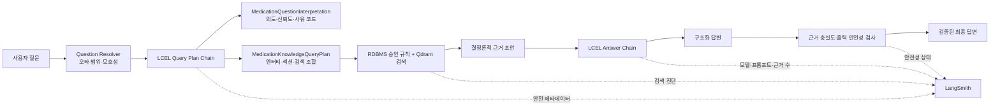

# 약·영양제 Chat Core 질문 해석·LCEL 체인·LangSmith 관측성 도입 기록

## 배경과 해결하려던 문제

기존 Chat Core에는 오타 교정, 질문 범위 판정, 제품·성분 추출, 검색 섹션 판정과 상호작용 조합 생성이 이미 구현되어 있었다. 그러나 각 결과가 `resolution`, `query_plan` 등 서로 다른 객체에 흩어져 있어 다음 문제가 있었다.

- 한 질문을 최종적으로 어떤 의도와 신뢰도로 해석했는지 하나의 계약으로 확인하기 어려웠다.
- Use Case가 검색 계획 구현체를 직접 생성해 대체 체인 실험과 단위 테스트가 어려웠다.
- LangSmith에는 단계별 수치는 남았지만 질문 해석의 최종 판정과 판정 근거 코드가 한곳에 모이지 않았다.
- LLM 답변 정제 호출은 구조화 출력은 사용했지만 입력 검증, 프롬프트 생성, 모델 호출, 출력 검증이 명시적인 LCEL 단계로 연결되지 않았다.

이번 변경의 목적은 기존 검색 규칙과 안전 정책을 바꾸는 것이 아니라, 이미 검증된 동작을 타입이 있는 체인 경계로 감싸고 관측 가능하게 만드는 것이다.

## 도입한 구조



### 1. 통합 질문 해석 결과 모델

`MedicationQuestionInterpretation`은 Question Resolver와 Query Plan의 결과를 다음 필드로 통합한다.

| 필드 | 의미 |
|---|---|
| `interpretation_version` | 질문 해석 계약과 평가 결과를 비교하는 버전 |
| `scope` | 서비스 범위 질문, 인사, 범위 밖 질문 구분 |
| `resolution_status` | 원문 유지, 자동 교정, 재질문 필요, 미해결 상태 |
| `intent` | 의약품 안내, 영양제 안내, 상호작용, 일반 안내, 명확화 등 최종 의도 |
| `confidence` | 결정론적 해석 근거에 따른 `HIGH`·`MEDIUM`·`LOW` |
| `normalized_entity_names` | 검색에 사용할 정규화 제품명·성분명 |
| `requested_section_types` | 기능, 사용법, 주의사항, 상호작용 등 요청 섹션 |
| `interaction_types` | 약-약, 약-영양제, 영양제-영양제, 약-음식 조합 |
| `needs_clarification` | 사용자에게 후보를 다시 확인해야 하는지 여부 |
| `reason_codes` | 자동 교정, 엔터티 확인, 상호작용 조합 확인 등 판정 사유 |
| `query_plan_hash` | 동일 검색 계획을 비교하는 SHA-256 식별자 |

신뢰도는 LLM의 주관적 확률이 아니다. 다음 결정론적 기준으로 부여한다.

- `HIGH`: Question Resolver가 원문을 유지했고 검색 엔터티가 확인됨
- `MEDIUM`: 하나의 고신뢰 후보로 자동 교정된 뒤 엔터티가 확인됨
- `LOW`: 명확화가 필요하거나 Resolver 정보가 없거나 엔터티를 확인하지 못함

인사·서비스 범위 밖 질문과 제품명 재확인이 필요한 질문도 검색 전에 같은 해석
체인을 통과한다. 따라서 조기 반환 응답도 `query.plan` Trace와 통합 해석 결과를
남긴다. 체인 자체가 실패하면 검색이나 LLM을 계속 호출하지 않고
`QUERY_PLAN_FAILED` 제한 응답으로 종료한다.

자유 형식 Chain-of-Thought는 저장하지 않는다. 대신 운영과 테스트에서 비교 가능한 열거형, 개수, 해시와 사유 코드만 보존한다.

### 2. LCEL Query Plan Chain

질문 계획 체인은 다음 Runnable을 순서대로 실행한다.

```text
RunnableLambda(input validation)
→ RunnableLambda(deterministic query planning)
→ MedicationQuestionPlanResult
```

출력은 `interpretation`과 `query_plan`을 함께 가진다. 기존 정규식·사전·메타데이터 기반 검색 계획은 그대로 유지하므로 이 리팩터링만으로 OpenAI 호출이 하나 더 생기지 않는다.

### 3. LCEL Answer Chain

답변 정제 체인은 다음 단계를 명시한다.

```text
RunnableLambda(input validation)
→ RunnableLambda(prompt messages)
→ ChatOpenAI.with_structured_output(..., strict=True)
→ RunnableLambda(output validation)
```

LLM은 RDBMS와 Qdrant가 만든 결정론적 초안과 출처를 자연스러운 한국어로 정리한다. 구조화 출력은 `answer`와 실제로 사용한 `section_types`만 허용하며, 이후 기존 근거 충실도 검사와 출력 안전성 검사를 반드시 통과해야 한다.

### 4. 체인 의존성 주입

`AnswerMedicationQuestionUseCase`는 기본 Query Plan 체인을 제공하되 생성자에서 다른 `Runnable`을 주입할 수 있다. 이에 따라 다음이 가능해졌다.

- 실제 DB·Qdrant 없이 특정 계획을 반환하는 단위 테스트
- 규칙 기반과 향후 LLM 보조 해석 체인의 A/B 비교
- 체인 내부 구현 변경 없이 Use Case의 검색·안전 흐름 재사용

답변 쪽도 `build_medication_answer_chain(response_runnable=...)` 형태로 모델 Runnable을 외부에서 주입한다. 운영에서는 `ChatOpenAI.with_structured_output`을 사용하고, 테스트에서는 네트워크 호출 없는 `RunnableLambda`를 사용한다.

## LangSmith 메타데이터 정책

### Query Plan 단계

다음 메타데이터와 출력 요약을 기록한다.

- `intent`, `scope`, `resolution_status`, `confidence`
- `interpretation_version`
- `needs_clarification`, `reason_codes`
- `correction_count`, `normalized_entity_count`
- `requested_section_types`, `interaction_pair_count`
- `supplement_vocabulary_count`
- `query_plan_hash`

### Answer 단계

다음 메타데이터를 LCEL 모델 호출에 전달한다.

- `model_name`, `prompt_version`, `route`
- `source_count`, `covered_section_count`

### 개인정보·원문 보호

기본 설정에서는 질문 원문, 정규화된 제품·성분명, 환자 복약 내용과 검색 청크 본문을 메타데이터에 남기지 않는다. 대신 개수, 상태, 열거형과 SHA-256 해시로 문제를 진단한다. 콘텐츠 평가가 필요한 제한된 개발 환경에서만 기존 `capture_content` 정책을 명시적으로 활성화한다.

각 단계의 지연시간은 별도의 중복 타이머를 추가하지 않고 LangSmith Span의 시작·종료
시각으로 계산한다. `patient_context.load`, `question.resolve`, `query.plan`,
`interaction_rules.search`, `rag.retrieve`, `medication_guide.lookup`, `llm.generate`,
`safety.validate` 경계를 유지해 병목 구간을 비교한다.

## 평가 보고서 연결

Chat Core 평가 실행기는 응답의 비공개 `question_interpretation`을 읽어 다음을 JSON과
Markdown 보고서에 보존한다.

- 예상/관측 질문 의도와 의도 정확도
- 해석 신뢰도·버전·사유 코드
- 정규화 엔터티와 요청 섹션
- Query Plan/Execution Plan SHA-256 해시
- 안전성 상태·응답 시간·LangSmith Trace ID

API 직렬화에서는 `question_interpretation`을 제외하므로 내부 진단 계약이 프론트 응답
스키마를 변경하지 않는다.

## 채택하지 않은 선택지

### 질문 의도 분류를 전부 LLM CoT로 전환

채택하지 않았다. 약명·성분명·상호작용 조합은 재현 가능한 규칙과 DB·Qdrant 어휘로 먼저 판정하는 편이 비용, 지연시간, 동일 입력 일관성과 의료 안전성에 유리하다. 현재 평가 세트에서 규칙 기반 해석의 한계가 확인될 때만 구조화 출력 LLM 분류기를 보조 단계로 A/B 실험한다.

### `RunnableWithMessageHistory`로 대화 저장 통합

채택하지 않았다. 현재 대화의 원본 저장과 세션 소유권·트랜잭션은 MySQL Chat Repository가 담당한다. LangChain 메모리를 별도로 추가하면 두 저장소의 순서와 복구 정책이 달라질 수 있다. LLM에는 DB에서 조회한 이력을 축약해 전달하는 현재 단일 진실 공급원 구조를 유지한다.

### LangGraph 도입

현재 흐름은 분기가 있지만 유한하고 순차적인 요청-응답 파이프라인이다. 재검색 루프, 도구 재시도, 사람 승인과 장기 실행 상태가 실제 요구사항이 될 때 도입한다. 지금은 LCEL 체인이 더 단순하고 테스트하기 쉽다.

## 기대 효과

- 질문 해석 결과와 검색 계획이 하나의 타입 계약으로 연결된다.
- 체인 구현을 주입할 수 있어 검색 전략 실험이 Use Case 수정 없이 가능하다.
- LangSmith에서 “검색 실패”와 “질문 해석 실패”를 분리해 볼 수 있다.
- 원문을 노출하지 않고도 자동 교정 여부, 엔터티 수, 의도, 요청 섹션과 해시로 회귀를 비교할 수 있다.
- 답변 생성 단계가 구조화 입력·출력으로 고정되어 임의 JSON과 프롬프트 형식 변화를 조기에 차단한다.

## 남은 개선 사항

- `약인가요`처럼 질문 서술어가 엔터티 후보로 남는 기존 Query Builder 노이즈를 평가 세트 기준으로 줄인다.
- 통합 해석 결과를 고정 평가 YAML의 예상값과 자동 비교하고 LangSmith Dataset 평가로 연결한다.
- 규칙 기반 해석 실패율이 충분히 측정된 뒤에만 LLM 보조 분류 체인을 실험한다.
- LangSmith 메타데이터의 저장량과 추적 지연을 개발 환경에서 확인한다.

## 변경 이력

| 버전 | 변경 | 좋아진 점 |
|---|---|---|
| `medication-chat-prompt-v3` | Persona·6원칙·답변 제약을 Markdown 자산으로 관리 | 프롬프트 역할과 금지 규칙을 코드 밖에서 검토 가능 |
| LCEL Answer Chain | 입력 검증·프롬프트·구조화 모델·출력 검증 연결 | 테스트 대체성과 출력 계약 강화 |
| LCEL Query Plan Chain | 결정론적 질문 계획을 타입이 있는 Runnable로 구성 | 검색 계획을 독립 테스트·교체 가능 |
| 통합 질문 해석 모델 | 의도·신뢰도·정규화·사유 코드를 단일 결과로 통합 | 질문 해석 회귀를 정량 비교 가능 |
| 체인 의존성 주입 | Use Case와 모델 구현을 Runnable 경계로 분리 | 향후 A/B 실험과 테스트 격리 용이 |
| LangSmith 메타데이터 보완 | 해석·검색·답변 단계에 안전한 진단 필드 추가 | 개인정보 원문 없이 실패 원인 분류 가능 |
| 조기 반환·실패 계약 통합 | 인사·범위 밖·명확화도 해석 Trace를 남기고 계획 실패 시 검색 중단 | 누락된 분기 없이 질문 해석 실패를 분리 가능 |
| 평가 보고서 연동 | 의도·신뢰도·버전·사유 코드·계획 해시를 평가 결과에 포함 | 버전별 회귀와 실패 원인을 같은 기준으로 비교 가능 |

## 검증 명령

```bash
uv run --group dev ruff check ai_worker
uv run --group ai --group dev python -m pytest ai_worker/tests -q
git diff --check
```
