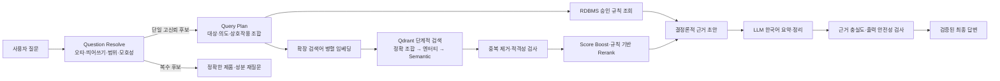

# 의약품·영양제 RAG 아키텍처와 검색 품질 개선 이력

## Context

초기 RAG는 퇴원 환자용 공공 가이드라인 PDF를 일정 길이로 나누고 Dense 벡터 검색으로 찾는 구조였다. 프로젝트 범위가 의약품·영양제 기능, 복용 정보, 약-약·약-영양제·영양제-영양제·약-음식 상호작용으로 넓어지면서 단순한 의미 유사도만으로는 다음 문제를 해결할 수 없었다.

- PDF마다 표, 제목, 번호 계층, 머리말과 본문 추출 방식이 달랐다.
- 서로 다른 약·성분·환자 사례가 같은 청크에 섞일 수 있었다.
- 한국어 질문과 영어 논문 사이의 임베딩 유사도가 낮았다.
- 전체 문서가 늘자 동일 내용의 다른 출처와 비슷한 질환 문서가 상위 결과에 섞였다.
- `마그네슘은 왜 먹어?`, `타이래놀`처럼 실제 사용자 표현이 정확한 제품명 검색과 달랐다.
- 검색 실패를 안전함으로 오해하거나 LLM이 근거에 없는 복용 결정을 생성하면 안 됐다.

이 프로젝트의 우선순위는 속도보다 정확도다. 질문 대상과 직접 관련된 근거를 찾고, 다른 약·성분을 섞지 않으며, 근거가 없으면 모른다고 제한한 뒤 그 범위 안에서 지연시간을 줄인다.

## Guidance

### 1. 아키텍처가 변화한 순서

| 단계 | 구조 | 발견한 문제 | 다음 단계에서 적용한 해결 |
|---|---|---|---|
| 초기 공공 가이드라인 RAG | PDF → 고정 길이 분할 → OpenAI 임베딩 → Qdrant Dense 검색 | 문서 구조와 무관하게 잘려 제목·설명·주의사항이 분리됨 | 문서 유형별 전처리와 섹션 경계 우선 청킹 도입 |
| 대표 문서 파일럿 | 유형별 대표 8문서 → 자동 품질 검사·수동 검수 → 452청크 | 작은 정답 세트에서는 성능이 높지만 전체 자료를 대표하지 못함 | 전체 적격 문서를 별도 불변 릴리스로 생성 |
| 전체 v1 | 776문서·9,826청크 → `medication_knowledge_full_v1` | 같은 내용의 복수 출처, 낮은 원점수의 정확한 청크, 한국어-영어 상호작용 검색 실패 | 후보 확대, 질문 확장, 엔터티·섹션 Score Boost, 조합 검증 |
| 메타데이터 v2 | 청크 생성 시 약명·성분명·상호작용 조합·근거 수준 저장 | Dense 검색만으로 비슷한 질환과 다른 사례가 상위에 노출 | 메타데이터 필터, 중복 제거, 규칙 기반 Reranker, 단계적 검색 |
| 사용자 표현 해석 | Question Resolve → Query Plan → 검색 | 약 17,000개 후보 전체 비교 시 질문 해석 시간이 크게 증가 | 길이·바이그램 후보 인덱스와 TTL 캐시, 모호성 분기 |
| 현재 구조 | 구조화 RDBMS 규칙 + Qdrant 근거 + LLM 한국어 설명 + 출력 안전성 검사 | 특정 성분을 코드에 계속 추가하면 확장성이 떨어짐 | RDBMS·활성 Qdrant 메타데이터에서 질문 어휘를 자동 구성 |

현재 온라인 처리 흐름은 다음과 같다.



### 2. PDF 전처리 방법

#### 2.1 원문 추출

`KnowledgePdfLoader`는 `pypdf`로 페이지별 텍스트를 읽고 페이지 번호를 유지한다. 기본 문서는 원래 추출 순서를 따르고, 팜리뷰처럼 일반 추출에서 NUL 문자와 공백 손상이 확인된 유형만 `layout` 모드를 사용한다 (`ai_worker/rag/loaders/knowledge_pdf_loader.py:12-40`).

원문을 한 번에 합쳐 버리지 않는 이유는 최종 출처에 실제 `page_start`와 `page_end`를 표시하고, 청크가 어느 페이지에서 왔는지 검증하기 위해서다.

#### 2.2 공통 정규화

`KnowledgeNormalizer`는 다음처럼 의미를 바꾸지 않는 문자 수준 정리만 수행한다 (`ai_worker/rag/normalizers/knowledge_normalizer.py:30-74`).

- Unicode NFKC 정규화
- NUL·제어문자 제거
- 연속 공백·탭과 비정상 줄바꿈 정리
- 여러 페이지에서 반복되는 짧은 머리말·꼬리말 제거
- 한 줄 전체가 페이지 번호인 문자열 제거
- 확인된 다운로드 감사 문자열, InDesign 푸터, 발행기관 배너 제거

짧은 텍스트, 대체문자, 120자 이상의 무공백 문자열은 `REVIEW` 또는 `OCR_REQUIRED`로 분류한다 (`ai_worker/rag/normalizers/knowledge_normalizer.py:76-130`). 줄바꿈을 모두 제거하거나 LLM으로 문장을 임의 복원하지 않는 이유는 함량·단위·주의 표현의 의미가 달라질 수 있기 때문이다.

#### 2.3 문서 유형별 복원

공통 정규화로 해결되지 않는 구조는 문서 유형별 규칙으로 처리한다.

- 건강기능식품공전은 전용 계층 파서가 `원료`, `기능성 내용`, `일일섭취량`, `섭취 시 주의사항`을 번호 계층과 함께 복원한다.
- `(가)의 경우` 같은 참조는 번호 경로가 실제로 확인될 때만 참조 내용을 붙인다.
- `μg RAE`처럼 PDF에서 기호 위치가 이동한 알려진 패턴만 결정론적으로 복원한다.
- `규격`, `시험법`, 제조기준은 원본 추출문에는 보존하지만 소비자 답변용 검색 청크에서는 제외한다.
- 연구 논문은 Abstract, Methods, Results, Discussion, Conclusion을 분리하고 References 이후는 검색에서 제외한다.
- 부작용 사례는 한 문서의 한 환자 사례 경계를 유지한다.

비타민 A 대표 문서는 보완 전 5청크에서 `원료`, `기능성`, `일일섭취량` 3청크로 정제됐다. 비타민 B6는 `원료`, `기능성`, `일일섭취량`, `주의사항` 4청크로 유지됐고 시험법 혼입이 제거됐다.

#### 2.4 품질 게이트

전처리 성공은 텍스트 파일이 생성됐다는 의미가 아니다. 다음 두 게이트를 모두 통과해야 전체 인덱싱 후보가 된다.

1. 자동 검사: 최소 텍스트 품질, 최대 토큰, 의미 섹션 존재, 필수 공전 절, 단위·괄호·번호 참조·섹션 혼입 검사
2. 수동 검사: 원본 읽기 순서, 제목과 설명 결합, 약명·성분명·함량·단위, 개체 혼합, 페이지 범위를 대표 표본으로 대조

같은 입력을 두 번 처리해 JSONL SHA-256이 같은지도 검사한다. 따라서 전처리 실행 순서나 LLM 편차로 청크 ID가 바뀌지 않는다. 자동 검사와 수동 검수 흐름은 `ai_worker/services/knowledge_pilot_preprocessing_service.py:249-333`에 구현돼 있다.

### 3. 청킹 방법

현재 청킹은 단순히 “의미 기반”이라고 부를 수 있는 LLM 분할이 아니다. 제목·번호·필드 패턴으로 의미 경계를 먼저 찾고, 해당 섹션이 너무 길 때만 `RecursiveCharacterTextSplitter`를 적용하는 결정론적 계층 분할이다.

```text
문서 유형 판별
→ 제목·번호 계층으로 섹션 분리
→ 참고문헌·비검색 섹션 제외
→ 최대 토큰 초과 섹션만 재귀 분할
→ 짧은 꼬리 조각 재결합
→ 실제 원문 위치에서 페이지 범위 계산
→ SHA-256 기반 chunk_id 생성
```

재귀 분할 순서는 `문단 → 줄 → 한국어/영어 문장 종결 → 세미콜론 → 쉼표 → 공백 → 문자`다 (`ai_worker/rag/splitters/knowledge_splitter.py:192-204`, `491-514`). 작은 꼬리 청크는 앞 청크와 합쳐도 최대 토큰 이하인 경우에만 다시 합친다 (`ai_worker/rag/splitters/knowledge_splitter.py:546-567`).

| 문서 유형 | 목표 최소 / 최대 토큰 | overlap | 선택 이유 |
|---|---:|---:|---|
| 약물백과 | 250 / 600 | 50 | 효능·용법·주의를 분리하면서 긴 설명 문맥을 연결 |
| 부작용 사례 | 300 / 700 | 0 | 서로 다른 환자 사례 혼합 방지 |
| 팜리뷰 | 400 / 750 | 80 | 긴 논리 흐름을 유지하되 장 단위 분리 |
| 건강기능식품 공전 | 200 / 500 | 0 | 성분별 기능·섭취량·주의를 독립 검색 |
| 기능성 평가 가이드 | 250 / 600 | 40 | 같은 기능 설명의 짧은 앞뒤 문맥 유지 |
| 약-음식·상호작용 모노그래프 | 150 / 450 | 0 | 상호작용 두 대상을 하나의 근거로 보존 |
| 학술 논문 | 400 / 800 | 100 | 결과·한계를 분리하면서 논증 문맥 유지 |

사례·성분·상호작용처럼 독립성이 중요한 문서는 overlap을 0으로 두고, 서술형 문서만 제한적으로 사용한다. 정책 값은 `ai_worker/rag/splitters/knowledge_splitter.py:50-66`에 정의돼 있다.

각 청크의 `content`는 사용자에게 출처로 보여줄 정규화 원문이다. `embedding_text`는 검색을 위해 `[문서]`, `[약]`, `[성분]`, `[상호작용]`, `[근거 수준]`, `[연구 대상]`, `[섹션]` 접두어를 붙인다 (`ai_worker/rag/splitters/knowledge_splitter.py:625-661`). 검색용 보강 텍스트를 원문 인용처럼 보여주지 않기 위해 두 필드를 분리한다.

청크 ID는 문서 ID, 섹션, 페이지 범위, 청크 순서, 원문 내용 해시를 합쳐 SHA-256으로 만든다 (`ai_worker/rag/splitters/knowledge_splitter.py:569-588`). 같은 원문·정책은 같은 ID를 만들고 변경된 청크만 식별할 수 있다.

### 4. 임베딩과 Qdrant 릴리스 방법

현재 기본 임베딩은 OpenAI `text-embedding-3-small`, 1,536차원이다. `OpenAIEmbeddingProvider`는 비어 있는 입력, 결과 개수 불일치와 벡터 차원 불일치를 차단한다 (`ai_worker/rag/embeddings/openai_embedding_provider.py:19-102`). Qdrant 거리 함수는 Cosine이다.

인덱싱은 다음 계약을 따른다.

1. 하나의 릴리스에는 하나의 `dataset_version`만 허용한다.
2. `index_eligible=true`이고 품질 승인을 통과한 청크만 사용한다.
3. `embedding_text`를 기본 64개 단위로 임베딩한다.
4. 새 Qdrant 컬렉션을 생성하고 기본 64개 단위로 upsert한다.
5. 저장된 point 수와 입력 청크 수가 다르면 실패한다.

이 과정은 `ai_worker/rag/indexers/knowledge_indexer.py:45-105`에 구현돼 있다. 기존 컬렉션을 제자리 수정하지 않고 새 `dataset_version + collection`을 만드는 불변 릴리스 방식을 사용한다. 새 버전이 검색 평가를 통과한 후에만 환경설정의 활성 컬렉션을 바꾸므로 실패 시 이전 버전으로 되돌릴 수 있다.

#### 컬렉션 변화

| 컬렉션 | 목적 | 규모·결과 |
|---|---|---|
| `medication_knowledge_baseline_v1` | 유형별 대표 문서의 전처리·청킹 계약 검증 | 8문서, 452청크 |
| `medication_knowledge_full_v1` | 승인된 전체 자료 첫 릴리스 | 776문서, 9,826청크 |
| `medication_knowledge_full_v2` | 상호작용·엔터티·근거 수준 메타데이터 포함 | 10,012청크, 현재 정밀도 개선 기준선 |
| `medication_knowledge_full_v2_o200k` | 토크나이저만 바꾼 A/B 후보 | 7,138청크, 정확도 동률이라 기본 전환 보류 |

### 5. 프롬프트 구성과 Persona

#### 5.1 System prompt

약·영양제 Chat Core의 system prompt는 한 파일에 긴 문자열로 중복 작성하지 않는다. 다음 세 부분을 순서대로 결합한다 (`ai_worker/llm/prompts/medication_chat_prompt.py:17-48`).

1. `medication_knowledge_coach_persona.md`: 친절한 임상영양사라는 역할과 설명 방식
2. `chat_answer_principles.md`: 근거 범위·정보 유형·의료적 판단 금지 등 답변 6원칙
3. 약·영양제 답변 전용 제약: 결정론적 초안에 있는 사실만 한국어로 요약하고, 근거 없는 항목과 Markdown 기호를 만들지 않는 규칙

Persona는 사용자가 확인한 복약정보와 검색 근거를 쉽게 설명하되 스스로 진단·처방·복용 결정을 하지 않는 역할이다. 핵심을 먼저 말하고, 간결하고 친절한 존댓말을 사용하며, 임신·수유·소아·고령자·간·신장 질환자 주의도 검색 근거가 있을 때만 설명한다 (`ai_worker/llm/prompts/assets/medication_knowledge_coach_persona.md`).

답변 6원칙은 다음과 같다 (`ai_worker/llm/prompts/assets/chat_answer_principles.md`).

1. 환자 확정정보를 가장 우선하고 생성하거나 수정하지 않는다.
2. 검색된 근거에서 직접 확인되는 내용만 설명한다.
3. 환자 확정정보, 검색 근거, 일반 생활안내를 섞지 않는다.
4. 진단·처방·복용 시작·중단·변경·증량·감량을 지시하지 않는다.
5. 근거가 부족하면 추측하지 않고 확인할 수 없다고 표현한다.
6. 허용된 출력 구조와 정보 유형을 지킨다.

두 Markdown 자산은 허용 목록을 거쳐 한 번만 읽고 캐시한다. 등록되지 않았거나 비어 있는 파일은 로딩 단계에서 실패시킨다 (`ai_worker/llm/prompts/prompt_assets.py:4-28`).

#### 5.2 User prompt

약·영양제 답변의 user prompt는 별도 고정 Markdown 파일이 아니다. `build_medication_chat_messages()`가 실행 시점의 데이터를 JSON으로 직렬화해 `HumanMessage`로 만든다 (`ai_worker/llm/prompts/medication_chat_prompt.py:51-69`). 포함되는 값은 다음과 같다.

- 현재 질문과 축약된 이전 대화
- 현재 복용 중인 약과 영양제 이름
- RDBMS 규칙과 Qdrant 근거로 먼저 만든 결정론적 답변 초안
- 실제 사용한 출처 제목
- 질문 처리 Route

JSON은 한글을 유지하고 불필요한 공백을 제거해 전달한다. LLM은 이 입력으로 새로운 의료 판단을 만드는 주체가 아니라, 이미 확보한 근거 초안을 읽기 쉬운 한국어로 정리하는 역할만 맡는다.

기존 환자·퇴원 가이드 Chat 흐름도 동일한 Persona와 6원칙을 system prompt로 사용한다. 이 흐름의 user prompt에는 질문·이전 대화, 질문 분류 결과, 환자 확정정보, 검색된 가이드라인 청크가 들어간다 (`ai_worker/llm/prompts/chat_answer_prompt.py:24-97`). 질문 의도와 Route를 분류하는 system/user prompt는 `ai_worker/llm/prompts/chat_classification_prompt.py`에 별도로 분리돼 있다.

### 6. 검색 방법의 변화

#### 6.1 초기 Dense 검색

초기 검색은 질문을 한 번 임베딩하고 Qdrant의 Cosine 유사도 상위 결과를 가져왔다. 구조가 단순하고 빨랐지만 제품명·성분명·질환명·상호작용 관계를 구분하지 못했다.

#### 6.2 Query Plan과 검색어 확장

현재 `MedicationKnowledgeQueryBuilder`는 질문에서 다음을 구조화한다 (`ai_worker/rag/query_builders/medication_knowledge_query_builder.py:351-460`).

- 제품명·성분명·영양성분·음식·주제
- `FUNCTION`, `DAILY_INTAKE`, `CAUTION`, `INTERACTION` 의도
- 약-약, 약-영양제, 영양제-영양제, 약-음식 조합
- 한국어 확장 검색어와 필요한 영문 학술 검색어

한국어 질문과 영어 상호작용 논문을 한 혼합 문장으로 임베딩했을 때 목표 논문 점수는 0.5527이었다. 영문 검색어 `calcium iron absorption interaction`을 별도로 임베딩했을 때 0.6979로 올라갔다. 따라서 원 질문과 대체 검색어를 각각 임베딩한 뒤 병렬 검색한다 (`ai_worker/rag/retrievers/medication_knowledge_retriever.py:113-154`).

#### 6.3 단계적 검색

검색은 한 번에 전역 Semantic 검색을 하지 않는다. 가능한 경우 다음 순서로 범위를 넓힌다 (`ai_worker/rag/retrievers/medication_knowledge_retriever.py:358-386`).

1. `EXACT_PAIR`: 상호작용 `pair_key`가 정확히 일치하는 청크
2. `ENTITY`: 질문의 약명·성분명이 메타데이터에 있는 청크
3. `SEMANTIC`: 앞 단계에서 필요한 섹션 근거가 부족할 때 전체 Dense 검색

필요한 근거가 앞 단계에서 확보되면 이후 단계는 실행하지 않는다. 정확한 조건을 먼저 사용하되 데이터가 부족한 경우에만 안전하게 검색 범위를 넓히는 구조다.

#### 6.4 Reranker와 Score Boost

현재 Reranker는 Cross-encoder나 LLM 모델이 아니다. Qdrant 후보를 규칙과 메타데이터로 재정렬하는 경량 Reranker다.

Qdrant 직후 `KnowledgeSearchResultRefiner`가 같은 섹션·엔터티·정규화 본문을 중복 제거하고, 질문에 명시된 정확한 제목과 메타데이터 토큰 일치를 우선한다 (`ai_worker/rag/rerankers/knowledge_search_result_refiner.py:28-61`).

그다음 `MedicationKnowledgeRetriever`가 다음 가산점을 적용한다 (`ai_worker/rag/retrievers/medication_knowledge_retriever.py:436-566`).

| 조건 | 가산점 |
|---|---:|
| 주제 제목 정확히 일치 | +0.15 |
| 상호작용 대상 쌍 일치 | +0.12 |
| 약명·성분명 정확히 일치 | +0.12 |
| 약명·성분명 포함 일치 | +0.08 |
| 요청 섹션 일치 | +0.05 |
| 두 대상이 같은 문장에 등장 | +0.04 |
| 문서 유형 일치 | +0.03 |
| 상호작용 유형 일치 | +0.03 |

전역 기준 0.65는 단순히 낮추지 않는다. 원점수가 낮은 후보는 엔터티, 요청 섹션, 상호작용 쌍이 확인되고 보정 점수가 기준을 넘을 때만 제한적으로 채택한다 (`ai_worker/rag/retrievers/medication_knowledge_retriever.py:455-529`). 최종적으로 문서당 최대 2청크만 선택해 한 문서가 답변 근거를 독점하지 않게 한다.

#### 6.5 Question Resolve와 사용자 표현

Query Plan 앞에 `Question Resolve` 단계를 추가했다 (`ai_worker/use_cases/answer_medication_question.py:134-146`). 이 단계는 `타이래놀 → 타이레놀` 같은 오타, 띄어쓰기, 통칭, 범위 밖 질문과 여러 후보의 모호성을 처리한다.

처음에는 약 17,000개의 정규화 후보를 질문마다 넓게 비교하면서 Query Resolve 지연이 사용자 실험에서 평균 약 10초 증가했다. 현재는 후보 목록을 길이와 바이그램으로 미리 인덱싱하고 TTL 300초 동안 재사용한 뒤, 줄어든 후보에만 편집거리를 계산한다 (`ai_worker/domain/medication_question_resolver.py:35-38`, `95-104`, `120-178`).

RDBMS 영양성분과 활성 Qdrant 릴리스의 `ingredient_names`도 300초 캐시로 합쳐 사용한다 (`ai_worker/repositories/supplement_ingredient_catalog_repository.py:11-129`). 실제 확인에서는 Qdrant에서 24개 영양성분을 읽었고 비타민 K를 영양제 엔터티로 식별했다. 어휘 최초 적재는 약 579.3ms, 캐시 재조회는 약 0.001ms였다. 이 수치는 전체 Chat 응답 시간이 아니라 어휘 카탈로그 조회 구간의 로컬 측정값이다.

### 7. 성능 변화와 해석

서로 다른 평가 범위의 결과를 한 숫자로 비교하면 안 된다. 아래 표는 각 단계에서 무엇을 측정했는지 함께 기록한다.

| 실험 | 평가 범위 | Hit@5 | MRR | 출처 정확도 | 중복률 | 잘못된 대상 | 검색 P95 |
|---|---|---:|---:|---:|---:|---:|---:|
| 대표 기준선 | 8문서·452청크, 10질문 | 1.000 | 1.000 | 1.000 | 0.000 | 0건 | 43.755ms |
| 전체 v1 원본 기준선 | 776문서·9,826청크, 기존 10질문 | 1.000 | 0.8333 | 0.6829 | 0.0976 | 0건 | 152.452ms |
| v2 보완 전 | 14질문 | 1.000 | 0.880952 | 0.803922 | 0.058824 | 0건 | 104.668ms |
| v2 정제 후 | 동일 14질문 | 1.000 | 1.000 | 1.000 | 0.000 | 0건 | 134.921ms |
| `o200k_base` 후보 | 동일 14질문 | 1.000 | 1.000 | 1.000 | 0.000 | 0건 | 105.518ms |

대표 기준선의 100%는 전체 서비스 정확도가 아니다. 작은 검수 세트에서 파이프라인 계약이 맞았다는 뜻이다. 전체 v1에서 출처 정확도가 68.29%로 떨어진 것은 단순히 데이터가 많아서만이 아니라 다음 두 요인이 함께 있었다.

- 동일 내용을 가진 다른 문서 ID가 평가상 오답·중복으로 집계됐다.
- Dense 의미가 비슷한 다른 질환·약물 사례가 구조화 필터 없이 상위에 들어왔다.

v2에서는 대표 출처 선택, 엔터티 필터, 정확한 제목 우선, 메타데이터 재정렬을 적용해 같은 14질문에서 MRR과 출처 정확도를 1.0으로 회복했다. 검색 P95는 보완 전 104.668ms에서 134.921ms로 소폭 증가했지만 300ms 상한 안이며 정확도 개선을 우선해 채택했다.

`o200k_base`는 한국어를 더 적은 토큰으로 표현해 청크 수를 10,012개에서 7,138개로 28.7% 줄이고 P95를 213.345ms에서 105.518ms로 낮췄다. 그러나 14질문의 정확도는 `cl100k_base`와 같았다. 속도만 좋아지고 정확도는 개선되지 않았으므로 기본 컬렉션 전환 근거로 사용하지 않았다.

### 8. 어려움과 해결 과정

| 어려움 | 실패하거나 부족했던 접근 | 해결 방법 | 현재 방지 장치 |
|---|---|---|---|
| PDF 글자·순서·단위 손상 | 공백만 지우거나 LLM으로 전체 문장 복원 | 확인된 문자 패턴만 복원하고 나머지는 차단·수동 검수 | OCR_REQUIRED, 단위·괄호·번호 참조 검사 |
| 제목과 설명 분리 | 고정 1,000자·200자 overlap | 문서 유형별 섹션을 먼저 나누고 긴 섹션만 토큰 재귀 분할 | 유형별 최대 토큰·경계 테스트 |
| 작은 꼬리 청크 | 분할 결과를 그대로 저장 | 최대 토큰 안에서 앞 청크와 재결합 | 원문 위치 추적 회귀 테스트 |
| 영어 논문 검색 실패 | 한국어와 영어를 한 문장으로 임베딩 | 한국어·영어 대체 검색어를 별도로 임베딩해 병렬 검색 | 상호작용 쌍과 동일 문장 검증 |
| 마그네슘 기능 청크가 0.65 미만 | 전역 임계값을 낮추는 방안 | 최소 후보를 넓게 가져오고 정확한 엔터티·섹션만 보정 | 원점수 허용 범위와 적격성 검사 |
| 전체 자료에서 중복 출처 증가 | 기대 문서 ID를 무조건 정답에 추가 | 섹션·엔터티·본문 기준 중복 제거 후 근거 수준으로 대표 선택 | `KnowledgeSearchResultRefiner` |
| 유사 질환 혼입 | Dense 유사도만 사용 | 정확 제목·엔터티 필터와 단계적 검색 | 하드 네거티브 평가 |
| 제품명과 영양성분 충돌 | RDBMS 부분 제품명 결과를 먼저 반환 | RDBMS와 Qdrant 근거를 함께 본 뒤 경로 결정 | 제품 제형·기능성 의도 분리 |
| 오타 교정 지연 | 17,000개 후보 반복 비교 | 길이·바이그램 인덱스, 캐시, 축소 후보 편집거리 | 고신뢰 자동교정·중간신뢰 재질문 |
| 특정 성분 하드코딩 확장 한계 | 비타민 K 등 이름을 코드에 계속 추가 | RDBMS와 활성 Qdrant 메타데이터에서 어휘 자동 구성 | 공급원 일부 장애 시 성공한 목록만 사용 |
| 검색됐지만 LLM이 과장 | 자연스러운 생성만 의존 | 근거 초안 생성 후 LLM 정리, 생성 주장·출력 안전성 재검사 | 복약 변경·진단·치료 결정 차단 (`ai_worker/safety/grounded_claim_validator.py:13-88`) |

### 9. 현재 도출된 원칙

1. 검색 모델보다 먼저 원문과 청크 품질을 고친다.
2. 의미 유사도는 후보 생성 신호이며, 의학적 관계가 확인됐다는 증거가 아니다.
3. 약명·성분명·상호작용 쌍·섹션을 구조화한 뒤 원문과 일치하는지 확인한다.
4. 전체 임계값을 낮추지 않고 강한 메타데이터 일치가 있는 후보만 제한적으로 보정한다.
5. 새 데이터는 기존 컬렉션을 수정하지 않고 새 불변 릴리스로 만든다.
6. 같은 평가 세트에서 정확도가 개선될 때만 활성 컬렉션을 바꾼다.
7. 검색 결과가 없다는 사실을 안전하다는 결론으로 표현하지 않는다.
8. RDBMS 승인 규칙은 결정론적 판정에, Qdrant 원문은 상세 설명에, LLM은 한국어 요약에 사용한다.
9. LLM이 근거에 없는 복용 시작·중단·용량·간격을 결정하지 못하게 한다.
10. 전체 Chat 시간과 Qdrant 검색 시간을 분리해서 측정한다.

## Why This Matters

의약품·영양제 챗봇에서 검색 건수를 늘리는 것만으로는 품질이 좋아지지 않는다. 잘못된 약이나 다른 환자 사례가 섞인 답변은 “근거가 있는 오답”처럼 보이므로 근거가 없는 답변보다 더 위험할 수 있다.

현재 구조는 원문 복원, 청크 경계, 임베딩 입력, 검색 후보, 상호작용 관계, 답변 생성과 안전성 검사를 각각 분리한다. 이 분리 덕분에 실패가 발생했을 때 다음처럼 원인을 특정할 수 있다.

- 정답 청크가 후보에 없음: 전처리·청킹·임베딩·질문 확장 문제
- 후보에는 있지만 순위가 낮음: 필터·Score Boost·Reranker 문제
- 근거는 맞지만 답변이 잘못됨: 프롬프트·한국어 요약·근거 충실도 문제
- 답변은 자연스럽지만 의료적 지시가 포함됨: 출력 안전성 문제

따라서 검색 성능 저하를 곧바로 데이터 증가나 LLM 문제로 단정하지 않고 단계별 진단 지표로 확인할 수 있다.

## When to Apply

- 새로운 PDF 문서 유형을 Qdrant에 추가할 때
- 기존 컬렉션보다 큰 전체 릴리스를 만들 때
- 새 임베딩 모델·토크나이저·청킹 정책을 비교할 때
- 사용자 오타·통칭·성분명 질문의 실패율이 높아질 때
- Reranker, Sparse/BM25 또는 LangGraph 도입 필요성을 판단할 때

Cross-encoder Reranker는 `Recall@20`에는 정답이 있지만 현재 재정렬 후 Top 5 순위가 반복적으로 낮을 때 실험한다. 후보 자체에 정답이 없다면 Reranker가 아니라 전처리, 메타데이터, 질문 확장 또는 Dense/Sparse 후보 결합을 먼저 고쳐야 한다. LangGraph는 반복 검색·도구 선택·상태 분기가 실제 평가에서 필요하다고 확인되기 전에는 도입하지 않는다.

## Examples

### 마그네슘 기능 질문

```text
질문: 마그네슘은 왜 먹어?
초기 실패: 의약품 이름 부분 일치 목록 또는 근거 없음
개선: FUNCTION 의도 + 마그네슘 엔터티 → 성분 필터 → 기능성 섹션 보정
결과: 마그네슘 FUNCTION 근거 4건 검색
```

### 칼슘-철분 영어 연구 질문

```text
질문: 칼슘과 철분을 같이 먹어도 되나요?
초기 실패: 한국어 검색 원점수 약 0.528, 최종 근거 0건
개선: calcium iron absorption interaction을 별도 임베딩
      → 두 성분이 같은 근거에 있는지 검증
결과: 최상위 0.6979, 관련 근거 3건 검색
```

### 타이레놀 오타 질문

```text
질문: 타이래놀 효능 알려줘
초기 문제: 약 17,000개 후보 전체 비교로 Question Resolve 지연
개선: 길이·바이그램 인덱스로 후보 축소 → 편집거리 계산
결과: 단일 고신뢰 후보는 타이레놀로 교정하고,
      동률·복수 후보는 임의 선택하지 않고 재질문
```

## Related

- `data/knowledge/CHUNKING_STRATEGY.md`
- `data/knowledge/SEARCH_QUALITY_IMPROVEMENT_HISTORY.md`
- `data/knowledge/EVALUATION_RESULTS.md`
- `data/knowledge/FULL_RELEASE_RESULTS.md`
- `data/knowledge/SUPPLEMENT_CODE_PREPROCESSING_RESULTS.md`
- `data/knowledge/evaluation/KNOWLEDGE_FULL_V2_CITATION_ANALYSIS.md`
- `docs/experiments/2026-09-01-v2-tokenizer-baseline.md`
- `docs/experiments/2026-09-02-o200k-tokenizer-comparison.md`
