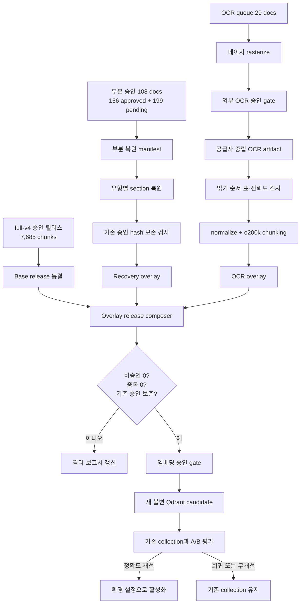

# Knowledge Corpus OCR Recovery and Qdrant Release Implementation Plan

> **For agentic workers:** REQUIRED SUB-SKILL: Use `superpowers:test-driven-development` for each implementation unit and `superpowers:verification-before-completion` before reporting completion. External OCR, OpenAI embedding, and Qdrant activation remain explicit approval gates.

**Goal:** 부분 승인 문서의 격리 청크와 OCR 대기 문서를 안전하게 복원해, 기존 승인 코퍼스를 잃지 않는 새 불변 Qdrant 후보 컬렉션을 만든다.

**Architecture:** 현재 `full-v4-o200k-partial-dry-run`을 변경하지 않는 기준선으로 고정한다. 부분 승인 문서는 기존 승인 청크를 보존하면서 격리 구간만 재처리하고, OCR 문서는 공급자 중립적인 페이지·블록 산출물로 변환한 뒤 기존 정규화·청킹·품질 감사 파이프라인에 다시 투입한다. 최종 릴리스는 `기존 전체 승인 코퍼스 + 부분 복원 오버레이 + OCR 승인 오버레이` 순서로 합성하며, 승인되지 않은 청크는 임베딩 로더가 읽을 수 없는 격리 디렉터리에 유지한다.

**Tech Stack:** Python 3.13, Pydantic, pypdf/pdfplumber, pypdfium2 또는 동등한 결정론적 PDF rasterizer, Pillow, CLOVA General OCR adapter, tiktoken `o200k_base`, OpenAI `text-embedding-3-small`, Qdrant, pytest, Ruff

**Related artifacts:**

- `docs/superpowers/specs/2026-09-07-knowledge-corpus-partial-recovery-design.md`
- `docs/superpowers/plans/2026-09-07-knowledge-corpus-partial-recovery.md`
- `data/knowledge/CHUNKING_STRATEGY.md`
- `data/knowledge/processed/full-v4-o200k-partial-dry-run/reports/recovery-summary.json`
- `data/knowledge/processed/full-v4-o200k-partial-dry-run/reports/ocr-required.jsonl`

## Product Contract

### Summary

부분 승인된 문서의 안전한 청크는 유지하고 손상된 구간만 복원한다. OCR 대기 문서는 페이지 단위 OCR과 자동 품질 검사를 거쳐 승인 청크만 기존 전체 코퍼스에 합성하고, 검색 정확도가 기존 컬렉션보다 개선된 경우에만 새 Qdrant 컬렉션을 활성화한다.

### Problem Frame

현재 dry-run은 문서 전체 차단 대신 청크 단위 부분 승인을 도입해 많은 내용을 복원했지만, 두 종류의 미처리 근거가 남아 있다.

1. 부분 승인 문서 108개에는 승인된 청크 156개와 `PENDING` 청크 199개가 함께 존재한다. 승인 청크는 즉시 릴리스 가능하지만, `PENDING` 구간에는 건강기능식품 기능성·섭취량·주의사항처럼 검색 가치가 있는 내용이 남아 있을 수 있다.
2. OCR 대기 문서 29개는 일반 PDF 텍스트 계층만으로 신뢰할 수 있는 본문을 얻지 못했다. 19개는 카탈로그에서 처음부터 OCR 대상으로 분류됐고, 10개는 일반 추출 후 품질 검사에서 추가 감지됐다.

`릴리스 청크의 비승인 상태 0건`은 손상 청크가 모두 복원됐다는 뜻이 아니다. 비승인 청크가 릴리스에서 정확히 격리됐다는 뜻이다. 따라서 품질 기준을 낮춰 청크를 강제로 포함하는 것이 아니라, 격리된 구간을 별도 복원하고 동일한 승인 계약을 다시 적용해야 한다.

### Baseline Snapshot

| 항목 | 현재 값 | 이 계획에서의 역할 |
|---|---:|---|
| 카탈로그 문서 | 1,299 | 전체 입력 기준 |
| 텍스트 추출 가능 문서 | 1,267 | 일반 PDF 파이프라인 대상 |
| 릴리스 문서 | 1,035 | 새 컬렉션의 기본 코퍼스 |
| 릴리스 청크 | 7,685 | 반드시 보존해야 할 승인 근거 |
| 부분 승인 문서 | 108 | 격리 구간 복원 대상 |
| 부분 승인 문서의 기존 승인 청크 | 156 | 복원 후에도 보존해야 할 회귀 방지 기준 |
| 부분 승인 문서의 `PENDING` 청크 | 199 | 부분 복원 대상 |
| OCR 대기 문서 | 29 | OCR 추출·검증 대상 |
| 릴리스 내 비승인 청크 | 0 | 전 과정에서 유지할 안전 불변식 |

OCR 29건의 출처 분포는 다음과 같다.

| 출처 | 문서 수 | 주된 처리 특성 |
|---|---:|---|
| 약학정보원 이상사례 | 20 | 사례 단위 경계, 의심 약물, 경과, 이상반응, 평가 의견 분리 |
| 약학정보원 약물백과 | 6 | 다단 본문, 소제목, 약물군·성분명 문맥 유지 |
| 약학정보원 팜리뷰 | 1 | 긴 학술형 본문과 표·참고문헌 분리 |
| 건강기능식품 기능성 원료 | 2 | 원료명, 기능성, 섭취량, 주의사항 계층 복원 |

### Requirements

- 기존 승인 청크 7,685개와 그 출처 연결을 잃지 않는다.
- 부분 승인 문서의 기존 승인 청크 156개를 재처리 과정에서 조용히 삭제하거나 더 낮은 상태로 변경하지 않는다.
- `PENDING` 199개는 문서별 하드코딩이 아니라 동일 문서 유형에 재사용 가능한 복원 규칙으로 처리한다.
- 원문에 없는 기능성, 섭취량, 주의사항을 채우거나 추론하지 않는다. 실제로 없는 섹션은 누락 상태로 남긴다.
- OCR 대기 29건은 문서·페이지·원본 SHA-256과 연결된 재현 가능한 산출물로 만든다.
- OCR 성공을 자동 승인으로 간주하지 않는다. 페이지 순서, 텍스트 품질, 표 구조, 신뢰도 검사를 통과한 청크만 승인한다.
- OCR 원문 응답과 페이지 이미지는 Git에 올리지 않는다. 추적 가능한 manifest와 집계 보고서만 Git에 포함한다.
- `PENDING`, `REPAIR_REQUIRED`, `EXCLUDED_NON_CONTENT` 청크는 임베딩 입력에 포함하지 않는다.
- 최종 Qdrant 후보는 새 청크만 모은 델타 컬렉션이 아니라 기존 의약품·영양제 승인 코퍼스를 모두 포함한 전체 컬렉션이어야 한다.
- `DEMO_RESTRICTED` 문서를 외부 OCR 또는 OpenAI 임베딩 API로 전송할 때는 각각 명시적인 실행 승인을 요구한다.
- 새 컬렉션 활성화 전 기존 컬렉션과 같은 평가 계약으로 A/B 비교한다.

### Success Criteria

- 복원 manifest에서 부분 승인 문서 108개, 복원 대상 `PENDING` 청크 199개, OCR 문서 29개가 중복 없이 재현된다.
- OCR 29개 모두가 `OCR_SUCCESS`, `PENDING`, `REPAIR_REQUIRED`, `FAILED_RETRYABLE` 중 하나의 명시적 결과와 사유를 가진다. 조용히 누락되는 문서는 0개다.
- 기존 승인 청크는 canonical content hash 기준으로 모두 최종 릴리스에서 확인된다.
- 최종 릴리스의 비승인 청크 수는 0개다.
- 동일 원본 SHA-256과 동일 normalized content hash의 중복 청크는 1개만 남는다.
- Qdrant point 수, 릴리스 청크 수, 릴리스 manifest 수가 일치한다.
- 기존 평가 질문에서 Hit@5, MRR, 출처 정확도, 잘못된 대상 혼입률이 회귀하지 않는다.
- 복원 문서 전용 평가 질문에서는 기대 문서가 검색 후보에 새로 포함된다.
- 정확도 조건이 충족되지 않으면 활성 컬렉션은 변경되지 않는다.

### Scope Boundaries

이 계획은 108개 부분 승인 문서의 199개 `PENDING` 청크와 OCR 대기 29개를 대상으로 한다. 현재 남은 제외 문서 중 `AUTOMATIC_QUALITY_BLOCKED`, `NO_CHUNKS`, `TEXT_QUALITY_REVIEW`만 해당하는 다른 문서는 별도 후속 복원 대상으로 유지한다.

의료적 내용을 OCR 또는 LLM으로 보완하거나 새로 생성하지 않는다. OCR은 원문 문자와 좌표를 추출하는 역할만 하고, 승인 판단은 결정론적 검사와 표본 수동 검수로 수행한다.

## Key Decisions

1. **기존 릴리스는 기준선으로 동결한다.** 복원 작업이 기존 승인 증거를 다시 작성하지 않도록 base release와 recovery overlay를 분리한다.
2. **부분 복원은 문서 교체형 overlay로 합성한다.** 동일 문서가 재처리되면 원본 SHA-256이 같은지 확인하고, 기존 승인 content hash가 보존되는 경우에만 복원본이 기존 문서 청크를 대체한다.
3. **OCR 산출물은 공급자 중립 계약으로 저장한다.** ai_worker의 후속 전처리는 CLOVA 응답 형식을 직접 알지 않고, 페이지·블록·좌표·신뢰도·엔진 버전만 읽는다.
4. **OCR 문서는 일반 문서와 같은 승인 게이트를 통과한다.** OCR 전용 품질 검사 후 기존 normalizer, splitter, chunk review 계약을 재사용한다.
5. **새 컬렉션은 불변 전체 릴리스다.** 기존 컬렉션을 삭제하거나 그 자리에서 갱신하지 않는다.
6. **새 컬렉션은 `o200k_base`와 DOT을 사용한다.** 문서·질의 임베딩을 L2 정규화하고 단위 벡터 검증을 통과한 경우에만 Qdrant 거리 방식을 DOT으로 생성한다.
7. **정확도가 활성화의 최우선 기준이다.** 검색 P95는 회귀 경고로 기록하되, 정확도를 낮추면서 맞추는 강제 활성화 기준으로 사용하지 않는다.

## End-to-End Flow



## Planning Contract

### Implementation Unit 0: 현재 기준선 보호 및 작업 전제 확인

**Files:**

- Verify: `data/knowledge/processed/full-v4-o200k-partial-dry-run/reports/preprocessing-quality.json`
- Verify: `data/knowledge/processed/full-v4-o200k-partial-dry-run/reports/corpus-quality-audit.json`
- Verify: `data/knowledge/processed/full-v4-o200k-partial-dry-run/reports/recovery-summary.json`
- Verify: `data/knowledge/processed/full-v4-o200k-partial-dry-run/reports/ocr-required.jsonl`
- Preserve: 현재 미커밋된 부분 릴리스 구현 파일

**Purpose:** 새 복원 작업이 현재 부분 릴리스 구현과 섞여 기준선을 잃지 않도록 한다.

- [ ] 현재 미커밋된 부분 릴리스 코드와 테스트를 먼저 별도 커밋한다.
- [ ] unrelated 파일(`:memory:.ses`, `frontend/.vite/`, `media/ocr-tmp/`, `output/`, `tmp/`)은 stage하거나 수정하지 않는다.
- [ ] 기준선 보고서의 문서·청크·OCR 집계와 실제 파일 수를 검증하는 read-only 명령을 문서화한다.
- [ ] 기준선 보고서와 release 청크 목록의 SHA-256 manifest를 생성해 이후 overlay 합성의 보존 기준으로 사용한다.

**Acceptance:** 기준선 manifest만으로 7,685개 승인 청크와 29개 OCR 대기 문서를 다시 식별할 수 있다.

### Implementation Unit 1: 부분 복원·OCR 실행 manifest 계약

**Files:**

- Create: `ai_worker/schemas/knowledge_recovery.py`
- Create: `ai_worker/services/knowledge_recovery_manifest_service.py`
- Create: `scripts/build_knowledge_recovery_manifests.py`
- Create: `ai_worker/tests/services/test_knowledge_recovery_manifest_service.py`
- Create: `ai_worker/tests/scripts/test_build_knowledge_recovery_manifests.py`
- Generate: `data/knowledge/manifests/partial_chunk_recovery_manifest.jsonl`
- Generate: `data/knowledge/manifests/knowledge_ocr_manifest.jsonl`

**Interfaces:**

- `PartialChunkRecoveryEntry`: document ID, source ID, source SHA-256, 원본 경로, 기존 승인 content hash, 복원 대상 chunk ID·페이지 범위·상태
- `KnowledgeOcrManifestEntry`: document ID, source ID, source SHA-256, 원본 경로, OCR 감지 경로(`CATALOG` 또는 `DYNAMIC`), access scope

- [ ] **RED:** 같은 document ID 또는 SHA-256이 중복되거나 보고서 수치와 manifest 수치가 다르면 실패하는 테스트를 작성한다.
- [ ] `corpus-quality-audit.json`에서 부분 승인 108개와 `PENDING` 199개를 추출한다.
- [ ] `ocr-required.jsonl`에서 catalog 19개와 dynamic 10개를 합치고 document ID와 SHA-256으로 중복 제거한다.
- [ ] raw PDF의 현재 SHA-256이 manifest와 다르면 실행을 중단한다.
- [ ] manifest에는 OCR 본문이나 민감한 공급자 응답을 넣지 않는다.

**Acceptance:** 생성 결과가 `108 docs / 199 pending chunks / 29 OCR docs`와 정확히 일치한다.

### Implementation Unit 2: 건강기능식품 부분 승인 구간 복원

**Files:**

- Modify: `ai_worker/rag/parsers/supplement_code_parser.py`
- Modify: `ai_worker/rag/normalizers/knowledge_normalizer.py`
- Modify: `ai_worker/rag/splitters/knowledge_splitter.py`
- Modify: `ai_worker/services/knowledge_pilot_preprocessing_service.py`
- Modify: `scripts/preprocess_knowledge_corpus.py`
- Test: `ai_worker/tests/rag/parsers/test_supplement_code_parser.py`
- Test: `ai_worker/tests/rag/normalizers/test_knowledge_normalizer.py`
- Test: `ai_worker/tests/rag/splitters/test_knowledge_splitter.py`
- Test: `ai_worker/tests/services/test_knowledge_pilot_preprocessing_service.py`
- Test: `ai_worker/tests/scripts/test_preprocess_knowledge_corpus.py`

**Observed failure classes:**

- `MISSING_SUPPLEMENT_CONTEXT`: 104개 문서
- `MISSING_REQUIRED_SUPPLEMENT_SECTION`: 95개 문서
- `MALFORMED_SUPPLEMENT_TEXT`: 55개 문서
- `SUPPLEMENT_SECTION_CONTAMINATION`: 2개 문서

한 문서가 여러 사유를 동시에 가질 수 있으므로 합계는 108보다 클 수 있다.

- [ ] **RED:** 원료명·기능성·일일섭취량·주의사항이 다른 섹션과 섞이거나 원료 문맥이 사라지는 대표 fixture를 작성한다.
- [ ] 기능성 원료 심사보고서와 건강기능식품 공전 형식을 문서 프로필로 구분한다.
- [ ] `(가)`, `(나)` 참조는 실제 상위 문구로 해석하되 원문에 없는 내용을 생성하지 않는다.
- [ ] `규격`, 제조기준, 시험법처럼 챗봇 답변에 사용하지 않는 구간은 파싱 구조에는 남기고 Qdrant 후보에서는 제외한다.
- [ ] 기능성·일일섭취량·주의사항 경계가 검출되면 같은 청크 안의 다음 섹션 내용을 분리한다.
- [ ] 필수 섹션이 원문에 실제로 없는 경우 문서 경고는 유지하되, 완전한 단일 섹션 청크까지 차단하지 않는다.
- [ ] `--document-manifest` 또는 동등한 선택 옵션으로 108개만 재처리할 수 있게 한다.
- [ ] 재처리 결과에서 기존 승인 content hash 156개의 보존 여부를 검사한다.

**Acceptance:** 품질 기준을 낮추지 않고 새로 승인된 청크 수가 증가하며, 기존 승인 evidence는 모두 유지된다. 복원하지 못한 청크는 원인 코드와 함께 `PENDING` 또는 `REPAIR_REQUIRED`로 남는다.

### Implementation Unit 3: OCR 페이지 추출과 공급자 중립 artifact

**Files:**

- Modify: `pyproject.toml`
- Modify: `uv.lock`
- Create: `ai_worker/schemas/knowledge_ocr.py`
- Create: `ai_worker/services/knowledge_ocr_extraction_service.py`
- Create: `scripts/extract_knowledge_ocr.py`
- Create: `ai_worker/tests/services/test_knowledge_ocr_extraction_service.py`
- Create: `ai_worker/tests/scripts/test_extract_knowledge_ocr.py`
- Reuse through adapter: `app/services/medication_ocr_v3/providers/clova_general.py`

**Artifact contract:**

- 문서 식별자와 원본 SHA-256
- page number와 page image SHA-256
- renderer 이름·버전·DPI·회전 정보
- OCR engine 이름·버전·실행 시각
- block ID, text, confidence, bounding polygon, line-break 신호
- provider 오류를 숨긴 안정적인 상태 코드
- 전체 artifact SHA-256

- [ ] **RED:** 페이지 누락, 중복 페이지, 원본 hash 불일치, 비정상 좌표, 비유한 confidence, 빈 OCR 응답을 거부하는 테스트를 작성한다.
- [ ] PDF 페이지를 300 DPI 이미지로 결정론적으로 rasterize하고 페이지별 hash를 기록한다.
- [ ] OCR 호출 전에 회전만 교정하고, 글자 내용을 바꾸는 이미지 보정은 적용하지 않는다.
- [ ] offline script 경계에서 기존 CLOVA General OCR provider를 감싸되 ai_worker 전처리 코어가 `app` 응답 형식에 의존하지 않게 한다.
- [ ] 문서·페이지 단위 체크포인트를 저장해 중단 후 성공한 페이지를 재호출하지 않는다.
- [ ] 429·timeout·일시적 5xx만 제한적으로 재시도하고 인증·프로토콜 오류는 즉시 중단한다.
- [ ] `DEMO_RESTRICTED` 문서가 있으면 `--allow-demo-restricted-ocr` 같은 명시적 실행 동의가 없을 때 외부 전송을 차단한다.
- [ ] API key, endpoint, 원문 OCR 응답을 로그에 출력하지 않는다.

**Acceptance:** fake provider로 29개 manifest 전체를 순회하는 테스트가 통과하고, 같은 입력을 재실행해도 이미 완료된 페이지는 호출 횟수가 증가하지 않는다.

**Approval gate:** 실제 29개 PDF 페이지를 CLOVA OCR로 전송하기 전에 사용자 승인을 다시 받는다.

### Implementation Unit 4: OCR artifact를 KnowledgePage로 복원

**Files:**

- Create: `ai_worker/rag/loaders/knowledge_ocr_artifact_loader.py`
- Create: `ai_worker/rag/loaders/knowledge_document_loader_router.py`
- Modify: `ai_worker/services/knowledge_corpus_preprocessing_service.py`
- Modify: `ai_worker/services/knowledge_pilot_preprocessing_service.py`
- Test: `ai_worker/tests/rag/loaders/test_knowledge_ocr_artifact_loader.py`
- Test: `ai_worker/tests/rag/loaders/test_knowledge_document_loader_router.py`
- Test: `ai_worker/tests/services/test_knowledge_corpus_preprocessing_service.py`

- [ ] **RED:** 다단 문서에서 오른쪽 열이 왼쪽 열 중간에 섞이는 경우, 표 셀이 본문에 삽입되는 경우, 페이지 순서가 바뀌는 경우를 fixture로 만든다.
- [ ] OCR block의 bounding polygon을 행·열로 군집화해 일반 본문은 위→아래, 다단 본문은 왼쪽 열→오른쪽 열 순으로 복원한다.
- [ ] 표는 셀 좌표와 열 경계를 신뢰할 수 있을 때만 `KnowledgeContentKind.TABLE`로 만들고, 불명확하면 `TABLE_STRUCTURE_UNSAFE`로 격리한다.
- [ ] 페이지 반복 머리글·꼬리글은 반복 위치와 normalized signature가 함께 일치할 때만 제거한다.
- [ ] catalog `OCR_REQUIRED` 문서는 artifact가 있을 때만 preprocessing manifest에 포함한다.
- [ ] dynamic OCR 문서는 일반 PDF 추출 결과 대신 OCR artifact를 사용하되 원본 SHA-256이 같아야 한다.
- [ ] OCR artifact가 없거나 불완전하면 기존 skip 상태를 유지한다.

**Acceptance:** OCR 문서가 기존 `KnowledgePage` 계약으로 변환되고, 일반 PDF loader를 변경하지 않고 같은 normalizer와 splitter로 전달된다.

### Implementation Unit 5: OCR 전용 자동 품질 검사와 문서 유형별 복원

**Files:**

- Modify: `ai_worker/rag/normalizers/knowledge_normalizer.py`
- Modify: `ai_worker/services/knowledge_pilot_preprocessing_service.py`
- Create: `ai_worker/services/knowledge_ocr_quality_service.py`
- Create: `ai_worker/tests/services/test_knowledge_ocr_quality_service.py`
- Extend: 문서 유형별 loader/splitter 테스트 fixtures

**Quality gates:**

- 원본의 비어 있지 않은 모든 페이지가 artifact에 존재한다.
- replacement character와 비정상 제어문자가 없다.
- 비정상적으로 긴 무공백 문자열이 없다.
- 페이지·block 좌표가 유효하고 reading order가 결정 가능하다.
- 기존 `OCR_REVIEW_CONFIDENCE_THRESHOLD` 기본값 0.90 미만 block은 자동 승인이 아니라 검수 대상으로 분류한다.
- table header·열 수·행 수가 페이지 경계를 넘어도 일관된다.
- source, document ID, page range, access scope, dataset version이 모든 청크에 존재한다.

**Source profiles:**

- [ ] 이상사례: 사례 개요, 환자 정보, 의심 약물, 발생 경과, 평가·의견 경계를 분리하고 다른 환자 사례를 합치지 않는다.
- [ ] 약물백과: 제목과 약물군 문맥을 하위 소제목에 상속하고 참고문헌·저자·연락처를 제외한다.
- [ ] 팜리뷰: 초록·본문·표·참고문헌을 분리하고 다단 읽기 순서를 검사한다.
- [ ] 기능성 원료: 원료명·기능성·일일섭취량·섭취 주의사항을 독립 청크로 만들고 제조·시험 구간은 검색 후보에서 제외한다.
- [ ] OCR 결과의 약명·성분명·함량·단위는 자동 교정하지 않는다. 신뢰도가 낮으면 수동 검수 대상으로 보낸다.

**Acceptance:** OCR 문서별 품질 보고서와 수동 검수 Markdown이 생성되며, 승인되지 않은 청크는 release 디렉터리에 생성되지 않는다.

### Implementation Unit 6: 복원 overlay와 전체 불변 릴리스 합성

**Files:**

- Modify: `ai_worker/services/knowledge_release_composition_service.py`
- Modify: `scripts/compose_knowledge_release.py`
- Test: `ai_worker/tests/services/test_knowledge_release_composition_service.py`
- Test: `ai_worker/tests/scripts/test_compose_knowledge_release.py`
- Generate: `data/knowledge/processed/knowledge-full-v4-o200k-ocr-recovery-v1/`

**Overlay order:**

1. base: `full-v4-o200k-partial-dry-run/release/chunks`
2. partial recovery overlay: 108개 재처리 문서
3. OCR overlay: 품질 승인된 OCR 문서

- [ ] **RED:** 같은 document ID의 overlay가 원본 SHA-256이 다르거나 기존 승인 hash를 잃으면 합성을 거부하는 테스트를 작성한다.
- [ ] 같은 document ID가 overlay에 있으면 청크를 단순 추가하지 않고 문서 단위로 교체한다.
- [ ] overlay는 같은 원본 SHA-256이어야 하며 기존 승인 canonical content hash를 모두 포함해야 한다.
- [ ] chunk ID 중복과 normalized content hash 중복을 제거한다.
- [ ] 같은 내용이 다른 출처에 존재하면 출처가 다르므로 삭제하지 않고, 검색 중복 판정을 위한 canonical content hash만 기록한다.
- [ ] 최종 모든 청크가 `APPROVED`, `index_eligible=true`, 동일 dataset version인지 검사한다.
- [ ] 최종 manifest에 base/overlay별 문서·청크 증감, 대체 문서, 중복 제거, 미복원 사유를 기록한다.

**Acceptance:** 새 전체 릴리스가 기존 7,685개 승인 evidence를 보존하면서 새 승인 청크만 추가하고, 비승인 상태는 0개다.

### Implementation Unit 7: 전체 dry-run과 수동 검수 범위 축소

**Files:**

- Generate: `data/knowledge/processed/knowledge-full-v4-o200k-ocr-recovery-v1/reports/`
- Modify: `data/knowledge/CHUNKING_STRATEGY.md`
- Create: `data/knowledge/OCR_RECOVERY_RESULTS.md`

- [ ] 임베딩 없이 partial recovery와 OCR artifact 전처리를 전체 실행한다.
- [ ] 문서별 자동 상태, 승인·대기·복원 필요 청크 수, 페이지 신뢰도 분포를 집계한다.
- [ ] 수동 검수는 모든 청크가 아니라 다음 표본만 생성한다.
  - 문서 유형별 첫 문서
  - 최저 confidence 문서
  - 다단 또는 표 경고가 있는 문서
  - 약명·성분명·함량·단위가 포함된 청크
  - 자동 복원 규칙이 처음 적용된 문서
- [ ] 수동 승인 결과는 원문 SHA-256과 chunk content hash에 묶어 저장해 재전처리 후 잘못 재사용되지 않게 한다.
- [ ] `PENDING`과 `REPAIR_REQUIRED`가 남아도 승인 청크만 전체 릴리스에 포함하고 남은 수를 보고한다.

**Acceptance:** 사람이 확인해야 할 청크가 위험 표본으로 한정되고, 자동 통과 근거와 제외 사유가 보고서에서 재현된다.

### Implementation Unit 8: 임베딩 전 계약 강화와 Qdrant 후보 생성

**Files:**

- Modify: `scripts/index_knowledge_release.py`
- Modify: `ai_worker/rag/indexers/knowledge_indexer.py`
- Modify: `ai_worker/rag/vectorstores/qdrant_knowledge_store.py`
- Test: `ai_worker/tests/scripts/test_index_knowledge_release.py`
- Test: `ai_worker/tests/rag/indexers/test_knowledge_indexer.py`
- Test: `ai_worker/tests/rag/vectorstores/test_qdrant_knowledge_store.py`

- [ ] **RED:** 비승인 청크, 보고서 불일치, 중복 chunk ID, 원본 hash 누락, 비정규화 DOT 벡터를 거부하는 테스트를 작성한다.
- [ ] 릴리스 quality report뿐 아니라 release manifest hash까지 인덱싱 입력과 대조한다.
- [ ] OpenAI 임베딩 호출 전 `DEMO_RESTRICTED` 청크 수와 총 전송 청크 수를 사용자에게 표시하고 명시적 flag를 요구한다.
- [ ] `o200k_base`는 청크 크기 계산용으로 유지하고 임베딩 입력은 `embedding_text`만 사용한다.
- [ ] DOT 컬렉션에서는 문서 임베딩을 L2 정규화하고 norm 허용 오차 검사를 통과시킨다.
- [ ] Qdrant payload에 source ID, document ID, document type, page range, section type, drug names, ingredient names, interaction type, pair keys, evidence level, study population, dataset version, access scope, content hash, extraction method를 저장한다.
- [ ] 새 컬렉션은 기존 컬렉션과 다른 불변 이름으로 생성하고, 이미 같은 이름이 존재하면 덮어쓰지 않는다.
- [ ] upsert 완료 후 point 수와 릴리스 청크 수를 비교한다.

**Candidate naming:** `medication_knowledge_full_v4`를 기본 후보명으로 사용하되, 실제 생성 시점에 이미 존재하면 새 버전명을 발급한다.

**Approval gate:** 실제 승인 청크를 OpenAI 임베딩 API로 전송하고 Qdrant 컬렉션을 생성하기 전에 사용자 승인을 다시 받는다.

### Implementation Unit 9: 검색 A/B 평가와 활성화

**Files:**

- Extend: `data/knowledge/evaluation/pilot_queries.yaml`
- Create: `data/knowledge/evaluation/ocr_recovery_queries.yaml`
- Reuse: `scripts/evaluate_knowledge_retrieval.py`
- Reuse: `scripts/compare_knowledge_releases.py`
- Extend tests as needed: `ai_worker/tests/rag/evaluators/`

**Evaluation groups:**

- 부분 복원된 건강기능식품 원료의 기능성·섭취량·주의사항
- OCR 이상사례의 약명·이상반응·경과
- OCR 약물백과와 팜리뷰의 약물군·주의사항
- 약–약, 약–영양제, 영양제–영양제, 약–음식 상호작용
- 제품명·통칭·성분명·오타 표현
- 근거가 없는 질문
- 유사 이름의 다른 약이 섞이기 쉬운 hard negative

**Metrics and gates:**

- Hit@5: 기대 문서가 상위 5개 안에 있는지
- MRR: 첫 정답 문서의 순위
- citation/source accuracy: 검색 결과가 기대 출처 계약과 맞는지
- wrong-entity mixing: 다른 약·성분이 섞였는지
- duplicate retrieval rate: 같은 근거가 반복됐는지
- groundedness/safety: 답변 주장이 검색 근거와 안전 규칙 안에 있는지
- P50/P95: 검색 및 전체 답변 시간 회귀 관찰

- [ ] 현재 활성 컬렉션과 후보 컬렉션을 동일 질문·동일 top-k·동일 query plan으로 평가한다.
- [ ] 기존 질문 하나라도 Hit 또는 rank가 회귀하면 원인을 문서 누락, metadata, chunk boundary, query interpretation, reranking으로 분류한다.
- [ ] 정확도 지표에 회귀가 없고 하나 이상의 정확도 지표가 개선될 때만 comparator가 `ACTIVATE`를 반환하게 한다.
- [ ] P95 증가는 경고로 남기되 정확도 개선을 숨기지 않는다.
- [ ] 활성화는 환경의 collection 이름만 변경하고 기존 컬렉션은 유지한다.

**Acceptance:** 비교 보고서가 `ACTIVATE`이면 후보를 활성화하고, `KEEP_BASELINE`이면 기존 컬렉션을 유지한다. 롤백은 collection 환경값을 이전 값으로 되돌리는 것으로 완료된다.

## Verification Commands

각 구현 단위는 관련 테스트만 먼저 RED/GREEN으로 실행하고, 완료 시 다음 전체 검증을 수행한다.

```bash
uv run --group dev ruff check ai_worker scripts

uv run --group ai --group app --group dev \
  python -m pytest ai_worker/tests -q

git diff --check
```

외부 호출 없는 전체 dry-run 예시:

```bash
uv run --group ai --group app \
  python -m scripts.preprocess_knowledge_corpus \
  --documents data/knowledge/manifests/documents.jsonl \
  --sources data/knowledge/manifests/sources.yaml \
  --pilot-quality-report data/knowledge/processed/full-v2/reports/preprocessing-quality.json \
  --pilot-quality-report data/knowledge/processed/additional-research-bulk-o200k-dry-run-v16/reports/preprocessing-quality.json \
  --pilot-manifest data/knowledge/manifests/pilot_manifest.json \
  --pilot-manifest data/knowledge/manifests/additional_research_bulk_manifest.json \
  --output data/knowledge/processed/knowledge-full-v4-o200k-ocr-recovery-v1 \
  --dataset-version knowledge-full-v4-o200k-ocr-recovery-v1 \
  --tokenizer-encoding o200k_base
```

실제 OCR·임베딩 명령은 구현 후 `--dry-run`으로 대상 문서·페이지·청크 수를 먼저 출력하고, 사용자 승인 후에만 실행한다.

## Failure and Recovery Policy

| 실패 | 처리 |
|---|---|
| 원본 SHA-256 변경 | 해당 문서 중단, manifest 재생성 요구 |
| OCR 인증·프로토콜 오류 | 즉시 중단, 키·endpoint 노출 없이 상태 코드만 기록 |
| OCR timeout·일시 오류 | 제한 재시도 후 `FAILED_RETRYABLE` 유지 |
| 일부 페이지 OCR 실패 | 성공 페이지도 자동 릴리스하지 않고 문서 incomplete 상태 유지 |
| reading order 불명확 | 해당 청크 `REPAIR_REQUIRED`, 다른 승인 청크만 부분 릴리스 |
| 표 열·행 복원 실패 | 표 청크만 격리, 주변 본문은 별도 승인 가능 |
| 기존 승인 hash 소실 | overlay 합성 중단 |
| 중복 chunk/document | Qdrant 생성 전 합성 단계에서 중단 |
| Qdrant point 수 불일치 | 후보 컬렉션 비활성 상태 유지, 재실행 또는 새 버전 생성 |
| 검색 정확도 회귀 | 기존 활성 컬렉션 유지 |

## Deferred Follow-Up Work

- OCR 대기 외에 남아 있는 `AUTOMATIC_QUALITY_BLOCKED` 문서 207개 전체 복원
- `NO_CHUNKS` 9개와 `TEXT_QUALITY_REVIEW` 4개 전용 규칙
- OCR 엔진 간 품질·비용 비교
- OCR 결과에 대한 LLM 기반 교정
- 기존 Qdrant 컬렉션 삭제

LLM 기반 OCR 교정은 원문에 없는 의학 정보를 만들 위험이 있으므로 현재 범위에서는 사용하지 않는다.

