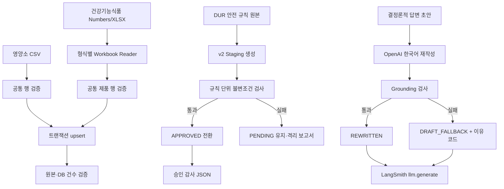

# 참조 데이터 적재와 답변 Fallback 관측성 설계

## 1. 목적

이 설계는 다음 작업을 하나의 검증 가능한 흐름으로 연결한다.

1. 한국인 영양소 섭취기준을 MySQL에 적재한다.
2. 건강기능식품 XLSX 원본을 기존 `supplement_nutrients` 스키마에 적재한다.
3. `medication-safety-v2` 후보를 규칙 단위로 검수하고 승인한다.
4. 전처리에서 제외된 1,592행 중 결정론적으로 복원 가능한 행만 후보로 복원한다.
5. `OpenAIMedicationAnswerGenerator`가 LLM 답변 대신 결정론적 초안을 반환한 이유를 명시적으로 분류하고 LangSmith에 기록한다.

정확성을 최우선으로 하며, 누락된 단위나 의료적 의미를 임의로 추정하지 않는다.

## 2. 현재 상태

2026-09-01 로컬 MySQL 기준 상태는 다음과 같다.

| 데이터 | 상태 |
|---|---|
| `medication_product_guides` | e약은요 원본 4,748건과 DB 4,748건 일치 |
| `interaction_rules` | `interaction-pilot-v1` 약-약 규칙 1,211건 승인 |
| `medication_safety_rules` | v1 5,235건, v2 5,190건이 모두 `PENDING` |
| `supplement_nutrients` | 0건 |
| `nutrient_standard` | 0건 |

`medication-safety-v2`는 원본 7,502행 중 5,910행을 받아들이고, 중복 720건을 병합해 5,190개 후보를 생성했다. 1,592행은 필수값 누락 또는 지원되지 않는 표현 때문에 제외됐다.

## 3. 범위와 비범위

### 3.1 포함

- CSV·XLSX 읽기, 헤더·형식·중복 검증
- 트랜잭션 기반 upsert와 원본/DB 건수 검증
- 안전 규칙 v2 후보 단위 승인과 감사 기록
- 제외 행의 결정론적 복원 및 미복원 행 격리
- LLM 재작성 결과와 fallback 이유의 구조화
- LangSmith span에 비식별 진단값 기록
- 단위·통합·회귀 테스트와 로컬 DB 검증

### 3.2 제외

- 새로운 DB 테이블 또는 컬럼 추가
- 누락된 의약품 단위의 임의 추정
- 검증되지 않은 안전 규칙의 일괄 승인
- v1 데이터 물리 삭제
- 질문·환자정보·답변 원문을 기본 LangSmith 설정에 기록
- 기존 검색 개선 미커밋 파일 변경

## 4. 전체 데이터 흐름



## 5. 영양소 섭취기준 적재

기존 `scripts/import_nutrient_standards.py`의 파서와 upsert를 유지한다. 실행 전 `--dry-run` 검증 경로를 추가해 DB를 변경하지 않고 다음을 확인할 수 있게 한다.

- 헤더가 `EXPECTED_HEADERS`와 완전히 일치한다.
- `(grp, age)`가 중복되지 않는다.
- 숫자는 `DECIMAL(10,3)` 범위를 벗어나지 않는다.
- 입력 레코드 수가 24건이다.

실제 적재는 한 트랜잭션에서 수행한다. upsert 후 동일 트랜잭션 안에서 대상 키의 건수를 다시 조회하고 24건이 아니면 예외로 전체 롤백한다. 기존 데이터가 있으면 생성과 갱신 건수를 별도로 출력한다.

## 6. 건강기능식품 XLSX 지원

### 6.1 파서 구조

기존 Numbers 지원을 제거하지 않는다. 파일 형식별 읽기만 분리하고, 행 검증은 하나로 공유한다.

```text
parse_workbook(path)
├── .numbers → read_numbers_rows(path)
├── .xlsx    → read_xlsx_rows(path)
└── rows     → validate_rows(rows)
```

XLSX는 `openpyxl.load_workbook(read_only=True, data_only=True)`로 읽는다. 수식 자체가 아니라 저장된 계산값을 사용하며 첫 번째 시트의 첫 번째 유효 행을 헤더로 판단한다.

### 6.2 검증 규칙

- 31개 헤더의 이름과 순서가 정확히 일치해야 한다.
- `food_code`는 원본 내에서 유일해야 한다.
- 필수 문자열·정수·소수 필드는 기존 `FIELD_SPECS`를 그대로 사용한다.
- 빈 행은 제외하지만 일부 값만 있는 손상 행은 실패 처리한다.
- 파싱 결과가 파일명에 표시된 5,556건과 다르면 적재하지 않는다.

### 6.3 적재 안전성

upsert는 기존 `food_code`를 기준으로 생성·갱신한다. 적재 후 원본의 모든 `food_code`가 DB에 존재하는지 확인한다. 전체 테이블 건수는 다른 데이터셋이 공존할 수 있으므로 강제로 5,556건과 같게 만들지 않는다.

## 7. 안전 규칙 v2 검수와 승인

### 7.1 승인 단위

데이터셋 전체의 `ready_for_rdb_import`와 규칙 하나의 승인 가능성을 분리한다. 제외 행이 존재해 전체 데이터셋이 불완전하더라도, 다음 불변조건을 만족하는 개별 후보는 승인할 수 있다.

- `rule_dataset_version == medication-safety-v2`
- 규칙 키가 64자리 SHA-256 형식이다.
- 대상 `interaction_entity`가 존재한다.
- 출처가 한 개 이상 존재한다.
- 조건이 필요한 규칙은 조건이 한 개 이상 존재한다.
- 비교 연산자에 필요한 값과 단위가 존재한다.
- `APPROVED` 전환 시 `approved_at`이 기록된다.

### 7.2 승인 명령

새 승인 스크립트는 기본적으로 dry-run으로 동작하도록 설계한다.

```text
python -m scripts.approve_medication_safety_rules \
  --dataset-version medication-safety-v2 \
  --reviewer feature-199-local \
  --expected-count 5190 \
  --apply
```

`--apply`가 없으면 DB를 수정하지 않는다. 예상 건수와 검증 통과 건수가 다르면 `--apply`가 있어도 승인하지 않는다. 승인 작업은 한 트랜잭션에서 수행한다.

### 7.3 감사 기록

승인 후 다음 정보를 JSON으로 남긴다.

- 데이터셋 버전
- 승인 대상 규칙 수
- 신규 승인 수와 기존 승인 수
- 실패 규칙 수와 이유별 건수
- 승인된 규칙 키 목록의 SHA-256
- 검수자와 승인 시각

v1은 삭제하거나 거부 상태로 바꾸지 않는다. 런타임은 설정된 활성 버전과 `APPROVED`를 동시에 만족하는 규칙만 조회한다.

## 8. 제외된 1,592행 복원

복원은 정확한 의미가 유지되는 경우에만 수행한다.

| 제외 이유 | 처리 |
|---|---|
| `UNSUPPORTED_AGE_MONTH_UNIT` 24행 | 개월 값을 일 범위 또는 연 단위 소수로 바꾸지 않고 `AGE_DAYS` 범위로 결정론적 변환 |
| `AMBIGUOUS_DOSE_EXPRESSION` 46행 | 단위·최소·최대가 명시적으로 분리되는 패턴만 복원 |
| `UNSUPPORTED_DOSE_EXPRESSION` 16행 | 검증된 새 패턴과 단위 사전이 일치할 때만 복원 |
| `UNSUPPORTED_DURATION_EXPRESSION` 1행 | 명시적인 일수 범위일 때만 복원 |
| `MISSING_REQUIRED_VALUE` 1,505행 | 다른 원본 컬럼에 같은 값과 단위가 명시된 경우만 복원; 그렇지 않으면 격리 유지 |

복원 결과는 기존 v2를 덮어쓰지 않고 새 세대와 SHA-256을 생성한다. 기존 v2와 복원 세대의 후보 수·중복 수·제외 이유를 비교하는 품질 보고서를 만든다. 복원된 후보도 자동 승인하지 않고 앞 절의 규칙 단위 승인 검사를 다시 거친다.

## 9. OpenAI 답변 Fallback 관측성

### 9.1 문제

현재 `OpenAIMedicationAnswerGenerator.generate()`는 재작성 결과에 초안에 없던 용량 또는 안전 단정이 있으면 원래 초안을 반환한다. 호출자는 반환된 답변만 보고 재작성이 성공했는지 fallback인지 구분할 수 없으며, LangSmith `llm.generate` span에도 원인이 기록되지 않는다.

### 9.2 결과 계약

생성기는 답변과 관측값을 함께 반환한다.

```text
MedicationAnswerGenerationOutcome
├── result: MedicationChatResult
└── observation: MedicationAnswerGenerationObservation
    ├── status
    ├── fallback_used
    ├── fallback_reason
    ├── draft_answer_hash
    └── generated_answer_hash
```

상태와 이유는 자유 문자열이 아닌 enum으로 제한한다.

```text
status:
- REWRITTEN
- DRAFT_FALLBACK
- SKIPPED
- FAILED

fallback_reason:
- GENERATED_DOSAGE_NOT_IN_DRAFT
- UNSUPPORTED_SAFETY_ASSERTION
- NO_GROUNDED_SOURCES
- CLARIFICATION_REQUIRED
- CLIENT_ERROR
```

Grounding 검사는 단순 boolean 대신 실패 이유를 반환한다. 여러 검사가 실패하면 의료적으로 더 위험한 `UNSUPPORTED_SAFETY_ASSERTION`을 우선한다.

### 9.3 예외 처리

OpenAI 호출 실패는 기존처럼 `ChatAnswerGenerationError`를 발생시킨다. 다만 오류 객체에 안전한 `reason_code=CLIENT_ERROR`를 포함해 use case가 LangSmith span에 기록한 뒤 예외를 다시 전달할 수 있게 한다. API 오류 원문·키·질문 내용은 기록하지 않는다.

### 9.4 LangSmith 출력

`llm.generate` span에는 다음만 기록한다.

```json
{
  "rewrite_status": "DRAFT_FALLBACK",
  "fallback_used": true,
  "fallback_reason": "GENERATED_DOSAGE_NOT_IN_DRAFT",
  "draft_answer_hash": "<sha256>",
  "generated_answer_hash": "<sha256>",
  "route": "MEDICATION_GUIDE",
  "source_count": 1
}
```

`LANGSMITH_CAPTURE_CONTENT=false`인 기본 환경에서는 원문을 저장하지 않는다. true인 평가 환경에서도 이 커스텀 관측값은 해시와 코드만 기록한다.

## 10. 오류 처리

- 파싱·헤더·건수 오류: DB 변경 전 실패
- upsert 후 검증 오류: 트랜잭션 롤백
- 승인 예상 건수 불일치: 승인 0건으로 실패
- 복원 불가능한 행: 삭제하지 않고 격리 보고서에 유지
- LangSmith 장애: 기존 `SafeChatTracer` 정책에 따라 비즈니스 응답을 중단하지 않음
- OpenAI 장애: `ChatAnswerGenerationError` 유지, 안전한 원인 코드만 추적

## 11. 테스트 전략

모든 동작 변경은 실패 테스트를 먼저 작성한다.

1. 영양소 CSV 24건 파싱·upsert·롤백 테스트
2. 같은 fixture를 Numbers/XLSX로 읽었을 때 동일 레코드가 생성되는 테스트
3. 손상 XLSX 헤더·중복 식품코드·잘못된 소수값 차단 테스트
4. 안전 규칙 승인 불변조건과 dry-run 테스트
5. 예상 건수 불일치 시 승인되지 않는 트랜잭션 테스트
6. 개월 단위 연령과 명시적 용량 단위 복원 테스트
7. 단위가 실제로 없는 행이 계속 격리되는 테스트
8. LLM 재작성 성공·용량 추가·안전 단정·출처 없음·명확화·클라이언트 오류별 관측값 테스트
9. `llm.generate` LangSmith span에 원문 없이 이유 코드가 기록되는 use case 테스트
10. Ruff, 관련 단위 테스트, 전체 AI Worker·App 테스트, DB 적재 건수 검증

## 12. 완료 기준

- `nutrient_standard`에 원본 24건이 검증된 상태로 존재한다.
- 건강기능식품 XLSX의 검증된 5,556개 `food_code`가 DB에 존재한다.
- `medication-safety-v2`에서 불변조건을 만족한 예상 규칙이 승인되고 감사 파일이 생성된다.
- 1,592행의 각 행이 복원 또는 명시적 격리 상태로 설명된다.
- 초안 fallback의 모든 분기가 구조화된 원인 코드를 반환한다.
- LangSmith에서 질문마다 재작성 상태와 fallback 이유를 조회할 수 있다.
- 기존 검색 개선 미커밋 파일에는 변경이 없다.
