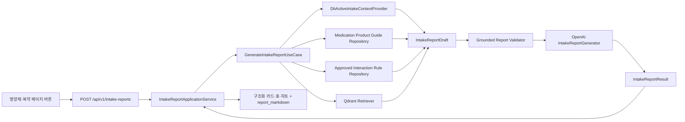

# 복용약·영양제 생활관리 보고서 API 설계

## 목표

영양제 페이지와 복약 페이지의 버튼이 같은 API를 호출하면, 인증 사용자의 현재 활성 의약품·영양제를 함께 분석한 생활관리 보고서를 반환한다. 기존 채팅은 질문·대화 이력을 중심으로 동작하며 그대로 유지한다. 보고서 API는 채팅 세션이나 메시지를 만들지 않고, 사용자 정보에 기반한 일회성 종합 분석만 수행한다.

## 범위

- 추가: `POST /api/v1/intake-reports`
- 추가: 보고서 전용 DTO, Application Service, AI Worker Core Service, UseCase, LLM 구조화 출력 모델·프롬프트, 단위·통합·API 테스트
- 재사용: 활성 복용정보 Provider, 의약품 가이드 Repository, 승인 상호작용 규칙 Repository, Qdrant Retriever, ChatTracer, OpenAI·Qdrant 프로세스 생명주기
- 제외: 보고서 이력 저장, PDF 생성·공유, 프론트 버튼·카드·차트 렌더링, 식단 입력 기반 분석, 복용 변경 권고

## 접근 방식

### 선택: 보고서 전용 UseCase + 기존 근거 조회 구성요소 재사용

`GenerateIntakeReportUseCase`가 활성 복용정보를 한 번 읽고, 제품 가이드·승인 규칙·필요한 Qdrant 근거를 모아 결정론적 `IntakeReportDraft`를 만든다. 전용 LLM Generator는 이 초안의 범위 안에서만 한국어 Markdown 보고서를 정리한다. Application Service는 구조화 데이터와 Markdown을 하나의 API 응답으로 변환한다.

이 방식은 채팅의 질문 분류·대화 이력·메시지 저장을 재사용하지 않으므로, 가짜 질문을 만들거나 보고서가 대화 기록에 섞이는 문제를 피한다.

### 대안 1: 기존 Chat UseCase에 가짜 질문을 전달

구현은 빠르지만 질문 분류 결과와 채팅 세션 저장에 의존한다. 보고서의 전체 복용 목록·중복 성분·카드형 집계와 맞지 않아 선택하지 않는다.

### 대안 2: 프론트가 여러 API를 호출해 보고서를 조립

LLM·RAG·상호작용 근거·안전성 판단이 프론트에 분산되고, 화면마다 결과가 달라질 수 있다. 근거와 안전성 경계를 서버에 유지하기 위해 선택하지 않는다.

## API 계약

### 요청

- Endpoint: `POST /api/v1/intake-reports`
- 인증: Bearer Access Token 필수
- Body: `{}`
- 분석 범위: 요청 사용자의 현재 활성 의약품과 영양제 전체
- `focus`, 제품 ID, 세션 ID는 받지 않는다.

### 성공 응답

응답은 다음을 함께 반환한다.

- `report_status`: `COMPLETED`, `PARTIAL`, `EMPTY`
- `data_availability`: 활성 의약품·영양제 수와 근거 조회 가능 여부
- `executive_summary`: 검토한 제품 수, 중복 확인 항목 수, 상호작용 확인 항목 수, 2문장 이내 요약
- `current_stack`: 프론트의 현재 복용 목록 표 데이터
- `review_cards`: 상호작용·중복·주의·정보 부족을 위한 카드 데이터
- `nutrient_totals`: 계산 근거가 완전한 성분만 포함하는 일일 합산 데이터
- `chart_data`: 프론트 차트용 제품 수·확인 항목 수 데이터
- `product_guides`: 제품별 간단 안내 카드 데이터
- `unverified_items`: 제품 식별·함량·복용 시간·근거 부족 항목
- `report_markdown`: 인쇄·PDF·본문 렌더링용 제한된 Markdown

프론트는 `executive_summary.summary_cards`, `current_stack`, `review_cards`, `chart_data`를 사용해 카드·표·그래프를 렌더링한다. Markdown 본문에는 카드 모양을 강제하지 않는다.

### 상태·오류

- 활성 복용정보가 없으면 `200`과 `report_status=EMPTY`를 반환한다.
- Qdrant가 일시적으로 불가하지만 RDBMS·승인 규칙을 조회할 수 있으면 `200`과 `report_status=PARTIAL`을 반환한다.
- RDBMS 등 핵심 복용정보를 전혀 조회할 수 없을 때만 `503`을 반환한다.
- 인증 토큰이 없거나 유효하지 않으면 `401`을 반환한다.
- 보고서 생성은 채팅과 동일하게 전체 처리 제한 시간 안에 완료해야 하며, 초과 시 `504`를 반환한다.

## 데이터 흐름

## 구성요소와 책임

### FastAPI

- `app/apis/v1/intake_report_router.py`
  - 인증 사용자 확인, ReDoc summary·description·응답 예시, HTTP 응답 변환
- `app/dependencies/intake_report.py`
  - Qdrant Client와 Report Core Service의 앱 단위 재사용
- `app/dtos/intake_reports.py`
  - camelCase JSON API 계약
- `app/services/intake_report.py`
  - 타임아웃, LangSmith root trace, AI Worker 호출, API View 조립

### AI Worker

- `ai_worker/schemas/intake_report.py`
  - 활성 복용 목록을 확장한 보고서 입력, 결정론적 초안, 카드·표·차트·Markdown 결과 모델
- `ai_worker/use_cases/generate_intake_report.py`
  - 근거 조회와 보고서 분석 순서 제어
- `ai_worker/services/intake_report_core_service.py`
  - UseCase 의존성 조립과 외부 호출 경계
- `ai_worker/llm/generators/intake_report_generator.py`
  - `with_structured_output`으로 Markdown 요약과 사용한 근거 섹션을 제한
- `ai_worker/llm/prompts/assets/intake_report_prompt_v1.md`
  - 보고서 전용 Role·Context·Task·Format·Constraint·Example 템플릿
- `ai_worker/safety/intake_report_validator.py`
  - 근거 없는 상호작용·함량·안전 결론·복용 변경 지시 차단

## 결정론적 분석 규칙

1. 활성 복용 목록은 `DbActiveIntakeContextProvider`에서 가져온다.
2. 의약품 안내는 정확 제품이 하나로 식별될 때 `MedicationProductGuide`를 사용한다. 모호한 제품명은 후보를 나열하거나 정보 부족으로 분류한다.
3. 상호작용 카드는 활성 복용 대상 쌍에서 승인된 규칙만 우선 생성한다.
4. Qdrant 근거는 규칙·제품 가이드가 부족한 추가 설명에만 사용한다. 검색 실패는 안전 결론으로 바꾸지 않는다.
5. 성분 총섭취량은 성분별 단위·함량·일일 섭취 횟수를 모두 확인할 수 있을 때만 계산한다. 그렇지 않으면 `unverified_items`로 이동한다.
6. 식단 정보는 현재 구조화되어 있지 않으므로 식단과 영양제의 중복을 판단하지 않는다.
7. 근거 수준은 `APPROVED_RULE`, `PUBLIC_GUIDE`, `RESEARCH`, `REGISTERED_INTAKE`, `UNVERIFIED`로 표시한다. 임의의 `Very Strong` 같은 임상 확실성 등급은 생성하지 않는다.

## LLM과 안전성 경계

- LLM은 결정론적 초안과 실제 출처 목록만 입력받는다.
- LLM은 새로운 제품, 성분, 용량, 상호작용, 효능, 부작용, 안전 결론을 추가할 수 없다.
- LLM은 영어 연구 근거를 한국어 핵심 요약으로 바꿀 수 있으나 연구 대상·한계를 유지한다.
- 검증기는 LLM 출력이 초안·근거의 대상과 섹션을 벗어났는지 검사한다.
- 검증 실패 시 근거 기반 결정론적 본문으로 대체하거나, 근거 부족 항목으로 분리한다.
- 복용 시작·중단·증량·감량·복용 간격 변경의 직접 지시는 출력하지 않는다.

## 현재 데이터 모델과 초기 기능 경계

- `Medication`, `MedicationSlot`, `UserSupplementNutrient`, `UserSupplementNutrientSlot`을 보고서의 현재 복용 목록과 시간 정보에 사용한다.
- `MedicationProductGuide.item_image_url`은 제품 이미지가 있을 때만 반환한다.
- `InteractionEntity`, `MedicationInteractionEntity`, `SupplementInteractionEntity`, `InteractionRule`, `MedicationSafetyRule`은 제품·성분 매핑과 승인 규칙에 사용한다.
- `NutrientStandard`는 향후 성별·연령 등 사용자 조건이 충분히 연결됐을 때 섭취기준 비교에 사용한다. 첫 구현에서는 사용자 조건과 단위가 확정된 경우에만 비교값을 출력한다.
- `SupplementNutrient`의 현재 컬럼은 제품별 성분 라벨 전체를 보장하지 않는다. 따라서 보고서가 함량을 추정하지 않도록 한다.
- 보고서 이력 테이블·마이그레이션은 이번 범위에 추가하지 않는다.

## 관측성·성능

- root trace 이름은 `intake-report.generate`로 한다.
- Trace에는 사용자 식별자를 해시 처리한 `user_key`, 활성 약·영양제 수, 카드 수, 사용한 출처 수, `report_status`, 안전성 결과, 전체 소요 시간을 남긴다.
- 원문 복용 메모·전체 보고서 본문·제품 상세를 LangSmith에 남길지는 기존 `LANGSMITH_CAPTURE_CONTENT` 정책을 따른다.
- OpenAI와 Qdrant 호출은 현재 설정의 개별 타임아웃을 따르고, API 전체에는 채팅과 같은 30초 제한을 적용한다.
- RDBMS의 독립 조회는 가능한 범위에서 병렬 처리하되, 응답 결과 조립은 결정론적 순서를 유지한다.

## 테스트 전략

1. Schema·Assembler 단위 테스트
   - 빈 복용 목록, 카드 우선순위, 근거 수준, Markdown 섹션 생략, 미확인 항목 분리
2. UseCase 단위 테스트
   - 승인 규칙, 제품 가이드, Qdrant 근거, RAG 장애 부분 응답, 함량 부족 시 미계산
3. Generator·Validator 단위 테스트
   - 영어 근거 한국어 요약, 근거 없는 복용 변경 지시 차단, 구조화 출력 실패 fallback
4. Application Service 단위 테스트
   - 30초 제한, LangSmith 메타데이터, `EMPTY`·`PARTIAL`·`COMPLETED`
5. Router API 테스트
   - 인증, ReDoc 계약, camelCase 응답, 401·503·504
6. 통합 테스트
   - 실제 DB fixture와 Qdrant·OpenAI를 사용하는 선택적 통합 시나리오

## 완료 기준

- 인증 사용자가 버튼을 누르면 활성 약·영양제를 모두 분석한 구조화 보고서를 받는다.
- 프론트가 카드·표·그래프를 그릴 수 있는 수치·행·카드 데이터가 포함된다.
- Markdown 본문이 [보고서 출력 템플릿](../../intake-report-output-template.md)을 따른다.
- 근거 없는 안전성·복용 변경·식단 중복 결론을 생성하지 않는다.
- 기존 채팅 Router·세션·SSE 동작에 회귀가 없다.
