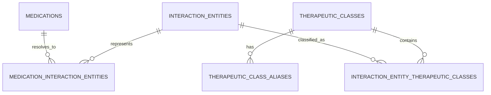

# Therapeutic-class registered-intake retrieval and verified pair-evidence design

## Goal

Make a registered-intake question such as “혈액응고와 관련된 약은 등록한 영양제와 어떤 점을 조심해야 해?” retrieve only the user’s active medicines that have a reviewed therapeutic-class classification, then retrieve only approved structured rules or verified RAG pair evidence for those medicine–supplement combinations.

Also make direct supplement-pair evidence searchable when, and only when, an official source document explicitly establishes the relation. The first reviewed candidate is vitamin D–calcium. Magnesium–zinc uses the same pipeline, but remains unavailable until a source document containing a direct relation is identified and reviewed.

## Observed failure

1. The active medicine record is not mapped to `interaction_entities`; the existing `MedicationInteractionEntity` count for the registered warfarin example is zero.
2. The active-intake fallback therefore expands every active medicine and supplement, rather than selecting the medicine belonging to the class asked for.
3. The knowledge collection contains entity-only candidates for vitamin D–calcium and magnesium–zinc, but no approved `interaction_pair_keys`; entity co-occurrence must not be treated as direct interaction evidence.

## Constraints

- Therapeutic classifications, aliases, provenance, review status, and dataset version are database data, never Python constants.
- Only `APPROVED` therapeutic-class assignments may select a registered medicine for class-based interaction retrieval.
- The runtime never creates classifications or medication-to-entity mappings as a side effect of a chat request.
- A direct interaction claim still requires an approved RDB rule or an exact reviewed `interaction_pair_key` from Qdrant.
- A document annotation may only create a pair key for a chunk whose text contains both annotated entities.
- Magnesium–zinc must not be annotated unless an identified source chunk directly supports that pair.
- A Qdrant release is immutable. This change prepares annotations and validates release inputs but does not call OpenAI or create a collection without a separate explicit approval.

## Data model

### `therapeutic_classes`

Stable, source-independent concepts such as `ANTICOAGULANT`. `code` is unique and is used for query-time matching; `display_name` is presentation text.

### `therapeutic_class_aliases`

Reviewed expression vocabulary for a class, for example `항응고제` and `혈액응고 관련 약`. These aliases are input data and can be expanded through review without changing query code.

### `interaction_entity_therapeutic_classes`

Links a canonical interaction entity to a therapeutic class. It stores `review_status`, `classification_dataset_version`, source identity, source URL, source record, raw source text, and approval timestamp. This is deliberately separate from a user’s `Medication` row: one reviewed classification can serve many registered records once the medicine resolves to the canonical interaction entity.

## Query-time flow

1. The existing resolver produces a normal query plan.
2. For a registered-intake question containing a therapeutic-class alias, `TherapeuticClassRepository`:
   - finds matching reviewed class aliases;
   - resolves each active medication through an existing mapping or a read-only exact canonical/alias match;
   - returns only active medication names whose canonical entity has an `APPROVED` assignment in the active classification dataset.
3. The use case pairs those selected medicines with the active supplements. It must not fall back to all medicines if the class lookup has no approved match.
4. The existing rule repository and Qdrant retriever receive the resulting typed entity names. RDB rules remain `APPROVED`-only. Qdrant direct interaction evidence remains exact-pair-only.
5. Trace metadata records counts and status codes, not sensitive entity names when content capture is disabled.

## Pair annotation flow

1. A reviewed entry in `interaction_annotations.yaml` identifies a source document and both canonical entities.
2. During preprocessing, only chunks from that document that contain both aliases receive `interaction_pair_keys`.
3. Index validation proves the annotated source/chunk contains both sides before it is eligible for a new immutable collection.
4. For vitamin D–calcium, the approved official MFDS document explicitly states that vitamin D is needed for calcium absorption and utilization. The annotation is therefore allowed.
5. A current scan has not located a direct magnesium–zinc relationship in the checked corpus. The feature will support it through the same annotation schema once a source is reviewed; no pair key is added now.

## Failure behavior

| Condition | Result |
| --- | --- |
| No matching therapeutic-class alias | Do not expand all active medicines; retain safe evidence-gap guidance. |
| Class alias matches, but no active medicine has an approved classification | Do not imply the user takes a medicine in that class. |
| Active medication cannot resolve to an interaction entity | Do not write a mapping during chat; return no class selection. |
| Pair has broad Qdrant candidates but no exact reviewed key | `RESTRICTED`; never call it safe. |
| RDB rule is `PENDING` | Not used in a deterministic answer. |

## Tests

1. A class-based active-intake question with active `와파린`, unrelated active medicine, and `비타민 K` selects only warfarin and retrieves its approved rule/pair evidence.
2. An active medication without an approved class mapping is excluded, rather than becoming a broad fallback candidate.
3. A non-class registered-intake question retains the existing all-active-intake behavior.
4. The MFDS vitamin D annotation adds a pair key only to chunks with both vitamin D and calcium.
5. Magnesium–zinc remains unannotated without a reviewed direct source.
6. Repository-level tests prove only `APPROVED` classifications are returned and trace output contains aggregate counts/status only.

## Non-goals

- Do not auto-classify medicines from an LLM response.
- Do not use `MedicationChatRiskProfile.anticoagulant_use` as a substitute for source-backed therapeutic classification.
- Do not create or activate a Qdrant collection in this scope.
