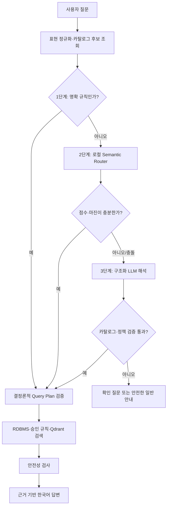

# 3단계 질문 분류 설계

> 상태: 구현 완료 · 평가 및 배포 활성화 대기
> 작성일: 2026-09-10
> 대상: AI Worker 약·영양제 챗봇

## 1. 배경과 목표

현재 챗봇은 `RuleBasedMedicationQuestionResolver`와 결정론적 `MedicationQueryPlanChain`으로 질문을 해석한다. 제품명·성분명·음식명은 RDBMS와 Qdrant 카탈로그에서 확인하고, 이후 의도·검색 섹션·상호작용 쌍을 규칙으로 결정한다.

이 방식은 명확한 질문에는 빠르고 안전하지만, 다음 표현에서 의도 해석이 제한될 수 있다.

- 오타 또는 구어체: `타이래놀 효능`, `같이 머거도 돼?`
- 세션 참조: `그 약 복용법도 알려줘`
- 넓거나 모호한 표현: `비타민 B는 어떤 역할을 해?`
- 복합 요청: `오메가3 효능, 섭취량, 주의사항 알려줘`
- 등록 복약정보를 암시하는 질문: `그중 혈액 응고와 관련된 약은?`

목표는 규칙 기반의 안전성과 재현성을 유지하면서, 불확실한 질문에만 의미 기반 분류와 구조화 LLM 해석을 추가하는 것이다. LLM은 제품·성분·안전성의 최종 결정자가 아니다.

## 2. 비목표

- LLM이 카탈로그 밖의 약물·성분·음식명을 생성하거나 확정하지 않는다.
- LLM의 추론 전문(CoT)을 저장·표시·LangSmith에 기록하지 않는다.
- 승인 규칙, RDBMS 제품 가이드, RAG 근거보다 LLM 판단을 우선하지 않는다.
- 에이전트가 임의로 도구를 선택하는 Tool Calling/Graph 구조를 이번 분류 기능에 도입하지 않는다.
- 모든 질문에 외부 LLM을 호출하지 않는다.

## 3. 목표 아키텍처



### 3.1 공통 전제: 표현 정규화와 후보 조회

분류 전에 기존 `RuleBasedMedicationQuestionResolver`가 질문의 표현을 정리하고, RDBMS·Qdrant·등록 복약정보에서 후보를 확보한다.

- 후보 엔터티는 `canonical_name`, `kind`, `entity_type`, `source`, `resolution_status`를 보유한다.
- 후보가 없는 상태에서 특정 제품 가이드 조회나 임의의 유사 제품 fallback은 금지한다.
- 제품명·성분명 확정은 항상 카탈로그 검증 결과를 사용한다.

### 3.2 1단계: 명확 규칙 분류

기존 규칙 경로를 유지한다. 네트워크 및 모델 호출 없이 즉시 종료할 수 있는 질문이 대상이다.

| 대상 | 예시 | 결과 |
| --- | --- | --- |
| 인사 | `안녕하세요` | 짧은 인사 |
| 서비스 범위 밖 | `오늘 날씨 알려줘` | 관련 질문 유도 |
| 명확한 제품 안내 | `타이레놀 효능 알려줘` | `MEDICATION_GUIDE` |
| 명확한 영양성분 안내 | `마그네슘은 왜 먹나요?` | `SUPPLEMENT_GUIDE` |
| 명확한 상호작용 | `칼슘과 철분 같이 먹어도 돼?` | `INTERACTION` |
| 위험 신호 | `두 배 먹어도 될까?` | 기존 안전성 정책 우선 |

규칙은 사용자 표현의 의료적 의미를 넓게 추론하지 않는다. 확실하지 않으면 다음 단계로 넘긴다.

### 3.3 2단계: 로컬 Semantic Router

로컬 다국어 문장 임베딩 모델로 질문과 의도별 예시 문장을 비교한다. 목적은 **경로 분류**이며 제품·성분 확정이 아니다.

지원 경로는 기존 `MedicationChatRoute` 및 현재 정책 범위로 제한한다.

- `MEDICATION_GUIDE`
- `SUPPLEMENT_GUIDE`
- `INTERACTION`
- `ACTIVE_INTAKE`
- `GENERAL_GUIDANCE`
- `CLARIFICATION`
- `OUT_OF_SCOPE`

피로 질문은 별도 `FATIGUE_INTERVIEW` 경로를 새로 만들지 않는다. 기존 `FatigueConversationPolicy`가 위험 신호와 추가 질문 필요 여부를 처리한다.

#### Router 입력과 출력

입력은 질문 본문, 기존 해석 상태, 카탈로그 후보 수, 세션 참조 존재 여부다. 등록 약 이름이나 답변 본문은 모델에 보내지 않는다.

```json
{
  "route": "INTERACTION",
  "top_score": 0.84,
  "second_score": 0.61,
  "confidence": "HIGH",
  "reason_codes": ["SEMANTIC_INTERACTION"]
}
```

적용 조건은 아래 두 값을 모두 만족할 때다.

- `top_score >= min_score`
- `top_score - second_score >= min_margin`

초기 임계값은 평가 세트로 정한다. 숫자를 코드 상수로 고정하지 않고 환경 설정으로 관리한다.

```env
SEMANTIC_ROUTER_ENABLED=false
SEMANTIC_ROUTER_MODEL=intfloat/multilingual-e5-small
SEMANTIC_ROUTER_MIN_SCORE=<평가 후 결정>
SEMANTIC_ROUTER_MIN_MARGIN=<평가 후 결정>
```

모델은 컨테이너 빌드 또는 배포 이미지 단계에서 미리 내려받아 포함한다. 요청마다 다운로드하지 않으며, 앱 시작 시 한 번 로드한다. 프로젝트에는 이미 `sentence-transformers`, CPU `torch`, `fastembed` 의존성이 있다.

`10~20ms`는 모델 로드 후 단일 Router 호출에 대한 희망 목표일 뿐 보장값이 아니다. AWS 배포 CPU에서 워밍업 후 P50/P95를 측정해 실제 채택 여부를 판단한다. 전체 챗봇 요청 시간에는 RDBMS, Qdrant, OpenAI 답변 생성 시간이 포함되므로 이 수치와 구분해 기록한다.

### 3.4 3단계: 구조화 LLM fallback

기존 `conditional_question_interpretation_chain.py`를 확장한다. 다음 경우에만 호출한다.

- Semantic Router가 낮은 점수 또는 작은 마진을 반환한 경우
- 규칙과 Semantic Router의 경로가 충돌한 경우
- 여러 후보 엔터티가 있고 요청 항목이 복합적인 경우
- 세션 참조가 있으나 최근 확정 엔터티가 하나로 결정되지 않은 경우

LLM은 `with_structured_output(..., method="json_schema", strict=True)`를 사용한다. 자유 서술, CoT, 후보 외 이름은 허용하지 않는다.

```json
{
  "route": "INTERACTION",
  "requested_section_types": ["INTERACTION", "CAUTION"],
  "candidate_entity_keys": ["candidate_0", "candidate_1"],
  "confidence": "MEDIUM",
  "reason_codes": ["MULTI_ENTITY", "TYPO_CANDIDATE"]
}
```

`candidate_entity_keys`는 입력으로 전달한 후보에만 대응하는 일회성 키다. LLM이 이름을 새로 쓰지 못하게 하며, 출력 뒤에 서버가 키·후보·정책을 다시 검증한다.

### 3.5 최종 검증과 실패 안전성

Semantic Router 또는 LLM 결과는 기존 `MedicationKnowledgeQueryPlan`을 직접 교체하지 않는다. 다음 검증을 통과한 변경만 기존 계획에 병합한다.

1. 제안 경로가 지원 경로인지 확인한다.
2. 모든 후보 키가 현재 카탈로그 후보에 존재하는지 확인한다.
3. 요청 섹션이 `FUNCTION`, `DAILY_INTAKE`, `CAUTION`, `INTERACTION` 중 허용된 값인지 확인한다.
4. 활성 복약정보·세션 참조가 필요하면 해당 컨텍스트가 실제 존재하는지 확인한다.
5. 위험 질문은 Router/LLM 결과와 관계없이 기존 안전 규칙을 우선 적용한다.

검증 실패, 모델 시간 초과, 모델 오류 시에는 LLM 결과를 폐기한다. 특정 약물을 추정해 검색하지 않고 기존 규칙 결과, 확인 질문 또는 안전한 일반 안내로 돌아간다.

## 4. LCEL·의존성 주입 구조

새 컴포넌트는 `ai_worker/chains`에 두고, `MedicationChatCoreService`에서 설정에 따라 주입한다.

```text
QuestionRoutingChain
  ├─ RunnableLambda: 규칙 결과 판정
  ├─ RunnableBranch: 확정 규칙이면 종료
  ├─ RunnableLambda: LocalSemanticRouter.invoke
  ├─ RunnableBranch: router 신뢰도 통과 여부
  └─ ConditionalQuestionInterpretationChain: LLM fallback

AnswerMedicationQuestionUseCase
  └─ 결과를 검증한 뒤 기존 QueryPlan / Retriever / Safety / Generator 실행
```

`RunnableParallel`은 동일한 입력으로 독립적인 값을 동시에 구할 때만 사용한다. 이번 분류는 이전 단계의 확신도에 따라 다음 단계를 선택하는 순차 정책이므로 `RunnableBranch`가 더 적합하다.

이번 기능은 OpenAI Function Calling이나 LangGraph가 필요하지 않다. 분류기의 분기와 검증은 결정론적 LCEL Runnable로 충분하다.

## 5. 관측성 및 개인정보

LangSmith에는 본문 대신 아래의 최소 진단값을 남긴다.

- `question.routing.stage`: `RULE`, `SEMANTIC`, `LLM`, `FALLBACK`
- 규칙·Router·LLM 각각의 제안 route
- Router top score, second score, margin
- LLM trigger reason, 출력 검증 성공 여부
- 후보 수, 허용/폐기된 후보 수
- 단계별 소요 시간
- 최종 route 및 기존 safety status

`LANGSMITH_CAPTURE_CONTENT=false`인 환경에서는 질문 원문, 후보 이름, LLM 출력, 답변 본문을 기록하지 않는다. CoT는 어떤 환경에서도 만들거나 저장하지 않는다.

## 6. 평가와 채택 기준

### 6.1 평가 세트

기존 20개 고정 질문에 다음 변형을 추가한다.

- 제품명·성분명·통칭: 타이레놀, 아세트아미노펜, 오메가3
- 오타·구어체: 타이래놀, 가치 먹어도 돼, 머거도 대
- 상호작용: 약-약, 약-영양제, 영양제-영양제, 약-음식
- 세션 참조: `그 약`, `그중`
- 넓은 영양소 질문: 비타민 B
- 인사 및 범위 밖 질문
- 위험·용량 변경 질문
- 등록 복약정보 기반 질문

### 6.2 성공 기준

| 항목 | 기준 |
| --- | --- |
| 경로 정확도 | 기존 규칙 기준선보다 낮아지지 않음 |
| 잘못된 약물 혼입 | 0건 |
| 위험 질문 안전성 회귀 | 0건 |
| 세션 밖 정보 혼입 | 0건 |
| LLM fallback | 실제 저신뢰도·충돌 사례에만 호출 |
| Router 지연시간 | AWS 워밍업 환경에서 P50/P95 실측 기록 |
| 전체 챗 응답 | 기존 P95 대비 과도한 증가가 없는지 비교 |

성능이 개선되지 않으면 2단계는 기본 비활성으로 유지하고, 3단계는 현재처럼 실험 플래그 아래에 둔다.

## 7. 구현 순서

1. `QuestionRoutingDecision`과 Router 입력·출력 Pydantic 계약 작성
2. 의도 프로토타입 설정 파일과 로컬 Semantic Router 구현
3. Router 점수·마진·fallback 조건 단위 테스트 작성
4. 기존 Query Plan과 병합하는 검증 정책 구현
5. 기존 조건부 LLM 체인을 후보 키 기반 구조화 출력으로 확장
6. `MedicationChatCoreService` 설정·의존성 주입 연결
7. LangSmith 진단 메타데이터와 평가 스크립트 추가
8. 고정 평가 세트와 AWS 환경 지연시간 A/B 결과 기록
9. 결과가 기준을 만족할 때만 `SEMANTIC_ROUTER_ENABLED=true` 검토

## 8. 변경 이력

<!--
v0.1 (2026-09-10)
- 규칙 → 로컬 Semantic Router → 구조화 LLM fallback의 3단계 설계를 정의했다.
- 제품·성분·안전성은 기존 카탈로그·승인 규칙·결정론적 검증이 최종 권한을 유지한다.
- 모델 지연시간은 가정하지 않고 AWS 실측으로 채택하도록 했다.

v0.2 (2026-09-10)
- QuestionRoutingDecision과 LocalSemanticQuestionRouter를 구현했다.
- Router는 catalog-backed 후보가 있는 저신뢰도 질문만 처리하며, 상호작용 route를 제안해도 검증된 엔터티 사이의 pair만 생성한다.
- Conditional LLM 출력은 약물명 대신 서버가 생성한 candidate key만 반환하도록 v2 계약으로 전환했다.
- 설정 기본값은 모두 비활성이다. 로컬 모델이 이미지에 없거나 Router 오류가 발생하면 기존 규칙 기반 흐름으로 안전하게 돌아간다.
- AI Worker 전체 테스트 1104 passed, 1 skipped 및 Ruff 전체 검증을 통과했다.
-->
