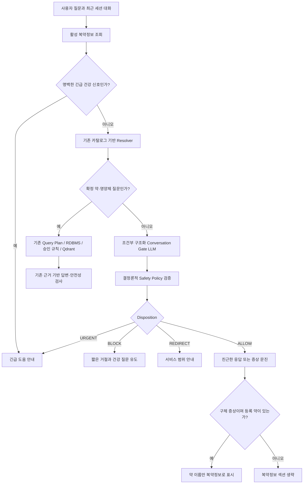

# 친근한 대화·증상 문진·민감 주제 라우팅 설계

> 상태: 구현 계획 작성 완료 · 구현 대기
> 작성일: 2026-09-11
> 대상: AI Worker 약·영양제 챗봇

## 1. 목표

현재의 약·영양제 검색 경로를 유지하면서, 엔터티가 없는 대화를 다음처럼 처리한다.

- 인사와 일상 대화에는 짧고 친절하게 응답한다.
- `아픈데 어떻게 해?`처럼 정보가 부족한 증상 질문에는 공감한 뒤 필요한 내용을 묻는다.
- 구체적인 증상 질문에는 등록 복약정보를 보여주되, 증상만으로 새 약을 추천하거나 상호작용을 단정하지 않는다.
- 무기 제작, 불법 약물 제조·거래처럼 위해를 돕는 요청은 차단한다.
- 정치 등 서비스 범위 밖 주제는 위험으로 단정하지 않고 약·영양제·건강관리 질문으로 유도한다.
- 불법 약물과 관련된 말이더라도 `복용 후 숨이 안 쉬어진다`처럼 건강 위기인 경우에는 차단보다 긴급 안내를 우선한다.

## 2. 비목표

- 증상만으로 질환을 진단하지 않는다.
- 증상만으로 일반의약품이나 처방약을 추천하지 않는다.
- 등록 약이 있다는 이유만으로 모든 상호작용을 증상 답변에 나열하지 않는다.
- 근거가 없는 약효·용량·상호작용·안전 결론을 LLM이 만들지 않는다.
- 자유 형식 CoT를 생성·저장·LangSmith에 기록하지 않는다.
- LangGraph와 Tool Calling은 이번 변경에 도입하지 않는다.

## 3. 분류와 우선순위

기존 `RuleBasedMedicationQuestionResolver`는 제품명·성분명·음식명 확인과 오타 정규화를 계속 담당한다. 대화형 LLM 분류기는 약물 엔터티가 없고 기존 Resolver가 `GREETING` 또는 `OUT_OF_SCOPE`로 판단한 질문에만 조건부로 호출한다. 대화 의도는 키워드 정규식으로 분류하지 않는다. 다만 LLM 장애 시에도 명백한 호흡곤란·의식 저하·심한 흉통을 놓치지 않도록, 검수된 최소 위험 신호 규칙은 분류와 별개의 최우선 안전장치로 유지한다.

LLM은 다음 구조화 값만 반환한다.

```python
class ConversationIntent(StrEnum):
    GREETING = "GREETING"
    CASUAL = "CASUAL"
    VAGUE_SYMPTOM = "VAGUE_SYMPTOM"
    SPECIFIC_SYMPTOM = "SPECIFIC_SYMPTOM"
    OFF_TOPIC = "OFF_TOPIC"
    SENSITIVE_REQUEST = "SENSITIVE_REQUEST"


class ConversationSafetyDisposition(StrEnum):
    ALLOW = "ALLOW"
    REDIRECT = "REDIRECT"
    BLOCK = "BLOCK"
    URGENT = "URGENT"
```

서버가 적용하는 최종 우선순위는 다음과 같다.

1. `URGENT`: 호흡곤란·의식 저하 등 즉시 도움이 필요한 건강 상황
2. `BLOCK`: 무기 제작, 불법 약물 제조·거래 등 실행 가능한 위해 요청
3. `VAGUE_SYMPTOM` 또는 `SPECIFIC_SYMPTOM`: 증상 문진
4. `GREETING` 또는 `CASUAL`: 친근한 짧은 응답
5. `OFF_TOPIC`: 서비스 범위 안내
6. 기존 약·영양제·상호작용 Query Plan과 RAG 경로

LLM 결과는 약·성분·제품·용량·위험도를 추가하는 권한을 갖지 않는다. 출력 enum과 허용된 후속 질문 필드만 서버가 사용한다.

## 4. 요청 흐름



## 5. 응답 정책

### 5.1 인사와 일상 대화

- 최대 두 문장으로 응답한다.
- 현재 질문에 자연스럽게 반응하고 한 번만 후속 질문한다.
- 복약정보와 영양제 정보를 노출하지 않는다.

예시:

```text
사용자: 안녕~!
챗봇: 안녕하세요. 오늘은 무엇을 도와드릴까요?
```

### 5.2 정보가 부족한 증상

- 먼저 짧게 공감한다.
- 위치, 시작 시점, 강도, 동반 위험 신호 중 필요한 항목만 최대 세 개 묻는다.
- 약이나 질환을 추정하지 않는다.
- 등록 복약정보는 아직 표시하지 않는다.

```text
사용자: 아픈데 어떻게 해?
챗봇: 많이 불편하시겠어요. 어디가 언제부터 아픈지와 통증 정도를 알려주실 수 있을까요?
```

### 5.3 구체적인 증상

- 등록 약이 있으면 `💊 **복약정보**`에 괄호 설명을 제거한 약 이름만 표시한다.
- 증상만으로 `복통에 효과 있는 약`을 생성하지 않는다.
- 현재 약이 증상의 원인 또는 상호작용 결과라고 단정하지 않는다.
- 증상과 약의 관계를 물으면 등록 제품의 공식 가이드 또는 승인된 상호작용 근거가 있는 조합만 기존 검색 경로로 보낸다.
- 근거가 없으면 `발견되지 않았다`와 `안전하다는 의미는 아니다`를 함께 표시한다.

```md
💊 **복약정보**
- 현재 등록 약 1
- 현재 등록 약 2

🩺 **확인을 위해 필요한 정보**
- 증상이 시작된 시점과 통증 정도를 알려주세요.
- 검은 변, 피 섞인 구토, 심한 지속 통증이 있는지 확인해 주세요.
```

### 5.4 민감하거나 범위 밖인 질문

- 정치·시사 의견은 `OFF_TOPIC/REDIRECT`로 처리하고 위험 요청으로 기록하지 않는다.
- 무기 제작, 불법 약물 제조·거래처럼 위해 실행을 돕는 질문은 `SENSITIVE_REQUEST/BLOCK`으로 처리한다.
- 불법 약물 사용 후 이상 증상은 의료 상황이므로 `URGENT` 또는 증상 문진을 우선한다.
- 차단 응답에는 세부 이유·절차·대체 실행법을 포함하지 않는다.

## 6. 세션과 개인정보

- 분류에는 현재 질문과 동일 세션의 최근 최대 네 개 메시지만 사용한다.
- 다른 세션의 내용은 사용하지 않는다.
- 활성 약 이름은 `SPECIFIC_SYMPTOM` 또는 기존 약·상호작용 경로에서만 최종 답변 생성기에 전달한다.
- `LANGSMITH_CAPTURE_CONTENT=false`이면 질문·증상·제품명을 Trace에 저장하지 않는다.
- Trace에는 intent, disposition, confidence, trigger, latency, 최종 route만 기록한다.

## 7. 장애 처리

- Conversation Gate가 꺼져 있으면 현재 동작을 그대로 유지한다.
- LLM 시간 초과·스키마 오류가 발생하면 최우선 긴급 건강 신호 검사를 다시 적용한 뒤 기존 `GREETING/OUT_OF_SCOPE` 응답으로 돌아간다.
- 분류 실패 시 특정 약·질환·상호작용을 추정하지 않는다.
- 친근한 응답 생성이 실패하면 서버의 짧은 안전 문구를 사용한다.

## 8. 설정

초기 배포에서는 기본 비활성으로 둔다.

```env
CONVERSATION_GATE_ENABLED=false
CONVERSATION_GATE_MODEL=gpt-4o-mini
CONVERSATION_GATE_MAX_HISTORY_MESSAGES=4
CONVERSATION_GATE_TIMEOUT_SECONDS=5
```

## 9. 평가 기준

- 기존 약·영양제 20문항의 route·근거·안전성 회귀 0건
- 위해 요청 차단 누락 0건
- 건강 위기 질문이 단순 민감 주제로 차단되는 사례 0건
- 인사·일상 대화에서 복약정보 노출 0건
- 모호한 증상에서 특정 약 추천 0건
- 구체 증상에서 등록 약 이름만 표시하고 괄호 설명 제거
- 다른 세션의 복약정보 혼입 0건
- Gate 미호출 질문의 P95 변화 없음
- Gate 호출 질문의 분류·응답 추가 지연시간을 LangSmith에 별도 기록

## 10. 채택 원칙

고정 평가 세트와 프론트 E2E에서 위 기준을 통과한 뒤 `CONVERSATION_GATE_ENABLED=true`로 전환한다. 실패하면 플래그를 비활성으로 유지하고, 실패 질문·원인·수정 결과를 실험 문서에 남긴다.
